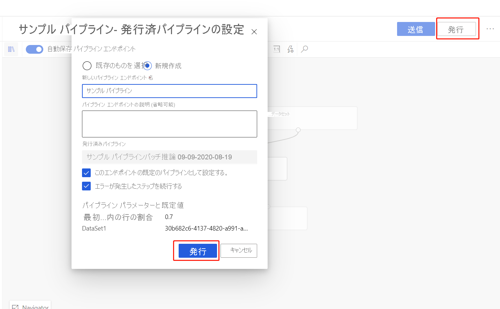
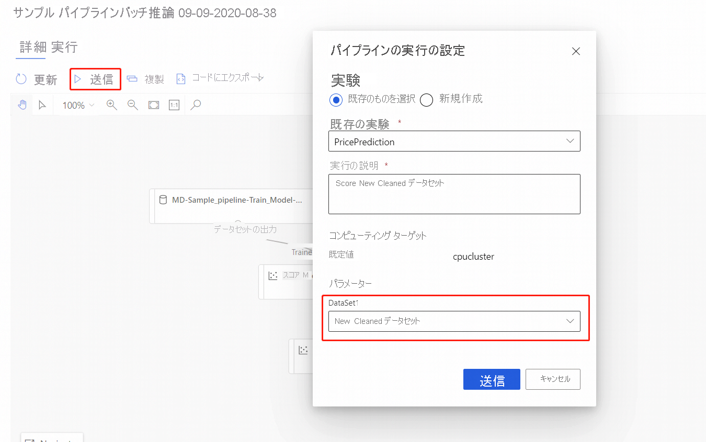

# Azure Machine Learning デザイナーを使用してバッチ予測を実行する

この記事では、デザイナーを使用してバッチ予測パイプラインを作成する方法について説明します。 バッチ予測を使用すると、任意の HTTP ライブラリからトリガーできる Web サービスを使用して、大規模なデータセットをオンデマンドで継続的にスコア付けすることができます。

このガイドでは、次のタスクの実行について学習します。

> [!div class="checklist"]
> * バッチ推論パイプラインを作成して発行する
> * パイプライン エンドポイントを使用する
> * エンドポイントのバージョンを管理する

SDK を使用してバッチ スコアリング サービスを設定する方法については、付属の[ガイド](./tutorial-pipeline-batch-scoring-classification.md)を参照してください。

[!INCLUDE [endpoints-option](../../includes/machine-learning-endpoints-preview-note.md)]

## 前提条件

このガイドは、既にトレーニング パイプラインがあることを前提としています。 デザイナーのガイド付き概要については、[デザイナーのチュートリアルのパート 1](tutorial-designer-automobile-price-train-score.md) を完了してください。 

[!INCLUDE [machine-learning-missing-ui](../../includes/machine-learning-missing-ui.md)]

## バッチ推論パイプラインを作成する

推論パイプラインを作成できるようにするには、トレーニング パイプラインを少なくとも 1 回実行する必要があります。

1. ワークスペースの **[デザイナー]** タブに移動します。

1. 予測の作成に使用するモデルをトレーニングするトレーニング パイプラインを選択します。

1. パイプラインを **送信** します。

    

トレーニング パイプラインを実行したので、バッチ推論パイプラインを作成できます。

1. **[送信]** の横にある新しい **[Create inference pipeline]\(推論パイプラインの作成\)** ドロップダウンを選択します。

1. **[Batch inference pipeline]\(バッチ推論パイプライン\)** を選択します。

    
    
結果的に既定のバッチ推論パイプラインが与えられます。 

### パイプライン パラメーターを追加する

新しいデータで予測を作成するには、このパイプライン ドラフト ビューで別のデータセットを手動で接続するか、データセットのパラメーターを作成します。 パラメーターを使用すると、実行時のバッチ推論プロセスの動作を変更できます。

このセクションでは、予測を行う別のデータセットを指定するためのデータセット パラメーターを作成します。

1. データセット モジュールを選択します。

1. キャンバスの右側にペインが表示されます。 ペインの下部で **[Set as pipeline parameter]\(パイプライン パラメーターとして設定\)** を選択します。
   
    パラメーターの名前を入力するか、既定値をそのまま使用します。

    > [!div class="mx-imgBorder"]
    > 

## バッチ推論パイプラインを発行する

これで、推論パイプラインをデプロイする準備ができました。 これにより、パイプラインをデプロイし、他のユーザーが使用できるようにします。

1. **[発行]** ボタンを選びます。

1. 表示されたダイアログで、**[PipelineEndpoint]** のドロップダウンを展開し、**[New PipelineEndpoint]\(新しい PipelineEndpoint\)** を選択します。

1. エンドポイント名と説明 (省略可能) を指定します。

    ダイアログの下部に、トレーニング時に使用したデータセット ID の既定値を使って構成したパラメーターが表示されます。

1. **[発行]** を選択します。

## エンドポイントを使用する

これで、データセット パラメーターを含む発行済みパイプラインが完成しました。 このパイプラインは、トレーニング パイプラインで作成されたトレーニング済みのモデルを使用して、パラメーターとして指定したデータセットをスコア付けします。

### パイプラインの実行を送信する 

このセクションでは、パイプラインの手動実行を設定し、パイプライン パラメーターを変更して新しいデータをスコア付けします。 

1. デプロイが完了したら、**[エンドポイント]** セクションに移動します。

1. **[Pipeline endpoints]\(パイプライン エンドポイント\)** を選択します。

1. 作成したエンドポイントの名前を選択します。

1. **[Published pipelines]\(発行済みパイプライン\)** を選択します。

    この画面には、このエンドポイントで発行されたすべての発行済みパイプラインが表示されます。

1. 発行したパイプラインを選択します。

    パイプライン詳細ページには、パイプラインの詳細な実行履歴と接続文字列情報が表示されます。 
    
1. **[送信]** を選択し、パイプラインの手動実行を作成します。

    
    
1. 別のデータセットを使用するようにパラメーターを変更します。
    
1. **[送信]** を選択し、パイプラインを実行します。

### REST エンドポイントを使用する

パイプライン エンドポイントと発行されたパイプラインを使用する方法についての情報は、**[エンドポイント]** セクションにあります。

パイプライン エンドポイントの REST エンドポイントは、実行の概要パネルで確認できます。 エンドポイントを呼び出すことにより、既定の発行済みパイプラインを使用します。

発行済みパイプラインは、**[Published pipelines]\(発行済みパイプライン\)** ページでも使用できます。 発行済みパイプラインを選択すると、グラフの右側にある **[Published pipeline overview]\(発行済みパイプラインの概要\)** パネルにそのパイプラインの REST エンドポイントが表示されます。 

REST 呼び出しを行うには、OAuth 2.0 ベアラー型認証ヘッダーが必要です。 ワークスペースの認証を設定し、パラメーター化された REST を呼び出す方法については、次の[チュートリアル セクション](tutorial-pipeline-batch-scoring-classification.md#publish-and-run-from-a-rest-endpoint)をご覧ください。

## エンドポイントのバージョン管理

デザイナーは、エンドポイントに発行する後続の各パイプラインにバージョンを割り当てます。 REST 呼び出しでパラメーターとして実行するパイプライン バージョンを指定できます。 バージョン番号を指定しないと、デザイナーは既定のパイプラインを使用します。

パイプラインを発行するときに、そのエンドポイントの新しい既定のパイプラインにするように選択できます。

エンドポイントの **[Published pipelines]\(発行済みパイプライン\)** タブで新しい既定のパイプラインを設定することもできます。

![[発行済みパイプライン] ページで規定のパイプラインを設定する](./media/how-to-run-batch-predictions-designer/set-new-default-pipeline.png)

## 制限事項

トレーニング パイプラインに何らかの変更を加える場合は、トレーニング パイプラインを再送信し、推論パイプラインを **更新** して、推論パイプラインを再度実行する必要があります。

推論パイプラインではモデルのみが更新され、データ変換は更新されないことに注意してください。

更新された変換を推論パイプラインで使用するには、変換モジュールの変換出力をデータセットとして登録する必要があります。

次に、推論パイプラインの **TD-** モジュールを、登録したデータセットに手動で置き換えます。

その後、更新されたモデルおよび変換と共に推論パイプラインを送信し、公開できます。

## 次のステップ

デザイナー [チュートリアル](tutorial-designer-automobile-price-train-score.md)に従い、回帰モデルをトレーニングし、デプロイします。

SDK を使用して発行対象のパイプラインを発行し、実行する方法については、[こちらの記事](how-to-deploy-pipelines.md)を参照してください。
