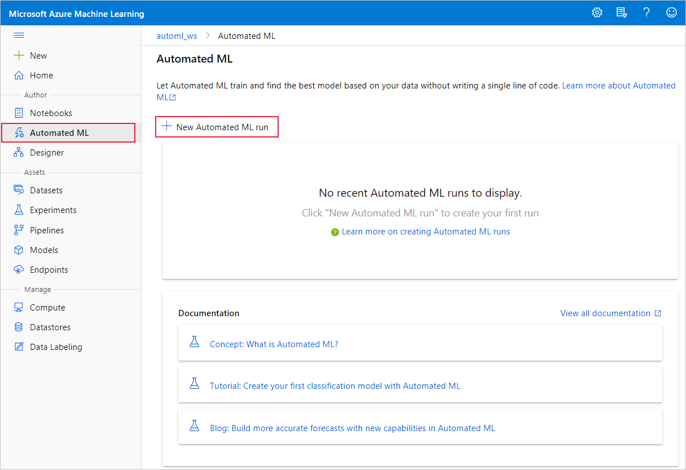

# Azure Machine Learning を使用して自動機械学習モデルを作成、確認、デプロイする

この記事では、Azure Machine Learning Studio で 1 行のコードも使わずに、自動化された機械学習モデルを作成、確認、およびデプロイする方法について説明します。

自動機械学習は、特定のデータに使用する最適な機械学習アルゴリズムを選択するプロセスです。 このプロセスにより、機械学習モデルを迅速に生成できます。 [自動化された機械学習の詳細については、こちらを参照してください](concept-automated-ml.md)。
 
エンド ツー エンドの例については、[Azure Machine Learning の自動 ML インターフェイスでの分類モデルの作成に関するチュートリアル](tutorial-first-experiment-automated-ml.md)をお試しください。 

Python コードベースのエクスペリエンスでは、Azure Machine Learning SDK を使用して、[自動化された機械学習の実験を構成する](how-to-configure-auto-train.md)こともできます。

## 前提条件

* Azure サブスクリプション。 Azure サブスクリプションをお持ちでない場合は、開始する前に無料アカウントを作成してください。 [無料版または有料版の Azure Machine Learning](https://aka.ms/AMLFree) を今すぐお試しください。

* Azure Machine Learning ワークスペース。 [Azure Machine Learning ワークスペースを作成する](how-to-manage-workspace.md)方法に関するページを参照してください。 

## はじめに

1. [Azure Machine Learning Studio](https://ml.azure.com) にサインインします。 

1. サブスクリプションとワークスペースを選択します。 

1. 左ウィンドウに移動します。 **[作成者]** セクションで **[Automated ML]\(自動 ML\)** を選択します。

 これが初めて実行する実験である場合、空のリストとドキュメントへのリンクが表示されます。 

そうではない場合、SDK で作成された実験を含む最近の自動機械学習の実験のリストが表示されます。 

## 実験を作成して実行する

1. **[+新しい自動 ML の実行]** を選択し、フォームを設定します。

1. ストレージ コンテナーからデータセットを作成するか、新しいデータセットを作成します。 データセットは、ローカル ファイル、Web URL、データストア、または Azure Open Datasets から作成できます。 [データセットの作成](how-to-create-register-datasets.md)についてさらに学習してください。  

    >[!Important]
    > トレーニング データの要件:
    >* データは表形式である必要があります。
    >* 予測する値 (ターゲット列) は、データ内に存在する必要があります。

    1. ローカル コンピューター上のファイルから新しいデータセットを作成するには、 **[+データセットの作成]** を選択してから、 **[ローカル ファイルから]** を選択します。 

    1. **[基本情報]** フォームで、データセットに一意の名前を付けて、必要に応じて説明を入力します。 

    1. **[次へ]** を選択して、 **[データストアとファイルの選択] フォーム** を開きます。 このフォームで、データセットのアップロード先を選択します。ワークスペースで自動的に作成される既定のストレージ コンテナーか、実験に使用するストレージ コンテナーを選択します。 
    
        1. データが仮想ネットワークの背後にある場合は、**検証をスキップする** 機能を有効にして、ワークスペースがデータにアクセスできることを確認する必要があります。 詳細については、「[Azure 仮想ネットワークで Azure Machine Learning Studio を使用する](how-to-enable-studio-virtual-network.md)」を参照してください。 
    
    1. **[参照]** を選択してデータセットのデータ ファイルをアップロードします。 

    1. **[Settings and preview]/(設定とプレビュー/)** フォームで入力が正しいか確認します。 フォームはファイルの種類に基づいてインテリジェントに設定されます。 

        フィールド| 説明
        ----|----
        ファイル形式| ファイルに格納されているデータのレイアウトと種類を定義します。
        区切り記号| プレーン テキストまたは他のデータ ストリーム内の個別の独立した領域の間の境界を指定するための 1 つ以上の文字。
        エンコード| データセットの読み取りに使用する、ビットと文字のスキーマ テーブルを識別します。
        列見出し| データセットの見出しがある場合、それがどのように処理されるかを示します。
        行のスキップ | データセット内でスキップされる行がある場合、その行数を示します。
    
        **[次へ]** を選択します。

    1. **[Settings and preview]\(設定とプレビュー\)** フォームでの選択に基づいて、 **[Schema]\(スキーマ\)** フォームがインテリジェントに設定されます。 ここでは、各列のデータ型を構成し、列名を確認し、実験に **含めない** 列を選択します。 
            
        **[次へ]** を選択します。

    1. **[詳細の確認]** フォームは、 **[基本情報]** および **[設定とプレビュー]** のフォームに以前に入力された情報の概要です。 プロファイリングが有効になっているコンピューティングを使用してデータセットのデータ プロファイルを作成するオプションもあります。 [データ プロファイル](how-to-connect-data-ui.md#profile)についてさらに理解を深める。

        **[次へ]** を選択します。
1. 新しく作成したデータセットが表示されたら、それを選択します。 また、データセットとサンプル統計のプレビューを表示することもできます。 

1. **[実行の構成]** フォームで、 **[新規作成]** を選択し、実験名として「**Tutorial-automl-deploy**」と入力します。

1. ターゲット列を選択します。これは、予測を実行する列です。

1. データ プロファイルとトレーニング ジョブのコンピューティングを選択します。 既存のコンピューティングの一覧は、ドロップダウン リストにあります。 新しいコンピューティングを作成するには、ステップ 7 の手順に従います。

1. **[Create a new compute]\(新しいコンピューティングの作成\)** を選択して、この実験のコンピューティング コンテキストを構成します。

    フィールド|説明
    ---|---
    コンピューティング名| コンピューティング コンテキストを識別する一意名を入力します。
    仮想マシンの優先度| 低優先度の仮想マシンは低コストですが、コンピューティング ノードが保証されません。 
    仮想マシンのタイプ| 仮想マシンのタイプとして [CPU] または [GPU] を選択します。
    仮想マシンのサイズ| コンピューティングの仮想マシン サイズを選択します。
    最小/最大ノード| データをプロファイリングするには、1 つ以上のノードを指定する必要があります。 コンピューティングの最大ノード数を入力します。 AML コンピューティングの既定は 6 ノードです。
    詳細設定 | これらの設定を使用すると、ユーザー アカウントと、実験用の既存の仮想ネットワークを構成できます。 
    
    **［作成］** を選択します 新しいコンピューティングの作成には数分かかる場合があります。

    >[!NOTE]
    > コンピューティング名は、選択または作成するコンピューティングで *プロファイルが有効* になっているかどうかを示します (詳細については、[データ プロファイル](how-to-connect-data-ui.md#profile)に関するセクションを参照してください)。

    **[次へ]** を選択します。

1. **[Task type and settings]\(タスクの種類と設定\)** フォームで、[classification]\(分類\)、[regression]\(回帰\)、または [forecasting]\(予測\) のタスクの種類を選択します。 [サポートされるタスクの種類](concept-automated-ml.md#when-to-use-automl-classify-regression--forecast)に関する記事を参照してください。

    1. **[分類]** については、ディープ ラーニングを有効にすることもできます。
    
        ディープ ラーニングが有効になっている場合、検証は _train_validation split_ に制限されます。 [検証オプションの詳細を確認してください](how-to-configure-cross-validation-data-splits.md)。

    1. **予測** のためには、以下が可能です。 
    
        1. ディープ ラーニングを有効にします。
    
        1. *時間列* を選択します。この列には、使用する時間データが含まれています。

        1. *予測期間* を選択します。モデルで将来を予測できる時間単位 (分/時間/日/週/月/年) の数を示します。 モデルで将来を予測する期間が延びるほど、正確性が下がります。 [予測と予測期間の詳細については、こちらを参照してください](how-to-auto-train-forecast.md)。

1. (省略可能) 追加の構成設定の表示: トレーニング ジョブをより細かく制御するのに使用できる追加の設定です。 設定しない場合、実験の選択とデータに基づいて既定値が適用されます。 

    追加の構成|説明
    ------|------
    主要メトリック| モデルをスコアリングするために使用される主なメトリックです。 [モデルのメトリックの詳細については、こちらを参照してください](how-to-configure-auto-train.md#primary-metric)。
    最適なモデルの説明 | 推奨される最適なモデルの説明を表示するために、選択して有効または無効にします。   この機能は、[特定の予測アルゴリズム](how-to-machine-learning-interpretability-automl.md#interpretability-during-training-for-the-best-model)では現在使用できません。 
    Blocked algorithm (ブロックするアルゴリズム)| トレーニング ジョブから除外するアルゴリズムを選択します。    許可するアルゴリズムは、[SDK 実験](how-to-configure-auto-train.md#supported-models)でのみ使用できます。   [各タスクの種類でサポートされているモデル](/python/api/azureml-automl-core/azureml.automl.core.shared.constants.supportedmodels)を参照してください。
    終了条件| これらの基準のどれかが満たされると、トレーニング ジョブが終了します。   *トレーニング ジョブ時間 (時間単位)* :トレーニング ジョブを実行できる時間の長さ。   *Metric score threshold* (メトリック スコアのしきい値): すべてのパイプラインの最小メトリック スコアです。 これにより、達成目標のターゲット メトリックを定義した場合には、必要以上にトレーニング ジョブに時間を費やすことはなくなります。
    検証| トレーニング ジョブで使用するクロス検証オプションをどれか選択します。   [クロス検証の詳細については、こちらを参照してください](how-to-configure-cross-validation-data-splits.md#prerequisites)。   予測では、k 分割交差検証のみがサポートされます。
    コンカレンシー| *コンカレント イテレーションの最大数*:トレーニング ジョブでテストするパイプライン (イテレーション) の最大数。 ジョブは、指定したイテレーションの数より多く実行されることはありません。 自動 ML による[クラスターでの複数回の子実行](how-to-configure-auto-train.md#multiple-child-runs-on-clusters)の方法に関する詳細を説明します。

1. (任意) 特徴量化の設定を表示する: **追加の構成設定** フォームで **自動を特徴量化** を有効にすることを選択した場合、既定の特徴量化手法が適用されます。 **特徴量化の表示設定** でこれらの既定値を変更し、それに応じてカスタマイズすることができます。 [特徴量化をカスタマイズする](#customize-featurization)方法をご覧ください。 

    ![[特徴量化設定の表示] が強調表示された [タスクの種類を選択] ダイアログ ボックスを示すスクリーンショット。](media/how-to-use-automated-ml-for-ml-models/view-featurization-settings.png)

## 特徴量化をカスタマイズする

**特徴量化** フォームでは、自動特徴量化を有効または無効にしたり、実験の自動特徴量化設定をカスタマイズしたりできます。 このフォームを開くには、「[実験を作成して実行する](#create-and-run-experiment)」セクションのステップ 10 を参照してください。 

次の表は、現在、スタジオで使用可能なカスタマイズの概要です。 

列| カスタマイズ
---|---
Included | トレーニングに含める列を指定します。
特徴の種類| 選択された列の値の型を変更します。
次で補完| データの欠損値を補完する値を選択します。

## 実験を実行して結果を表示

**[完了]** を選択して実験を実行します。 実験の準備プロセスには最大で 10 分かかることがあります。 トレーニング ジョブで各パイプラインの実行を完了するには、さらに 2 ～ 3 分かかる場合があります。

> [!NOTE]
> 自動 ML のアルゴリズムには特有のランダム性があり、推奨モデルの最終的なメトリック スコア (精度など) にわずかな変動が生じる可能性があります。 自動 ML によって、トレーニングとテストの分割、トレーニングと検証の分割、クロス検証などのデータに対する操作も必要に応じて実行されます。 そのため、同じ構成設定とプライマリ メトリックを使用して実験を複数回実行した場合、これらの要因により、各実験の最終的なメトリック スコアに変動が見られる可能性があります。 

### 実験の詳細の表示

**[Run Detail]\(実行の詳細\)** 画面が開き、 **[Details]\(詳細\)** タブが表示されます。この画面には、上部の実行番号の横のステータス バーを含む実験実行の概要が表示されます。 

**[Models]\(モデル\)** タブには、メトリック スコアの順で作成されたモデルの一覧が表示されます。 既定では、選択したメトリックに基づいて最高のスコアを付けたモデルが、一覧の先頭になります。 トレーニング ジョブでその他のモデルを試みると、それらが一覧に追加されます。 これを使用すると、これまでに生成されたモデルのメトリックを簡単に比較できます。

### トレーニング実行の詳細の表示

完成したモデルのいずれかをドリルダウンして、 **[モデル]** タブのモデルの概要や、 **[視覚化]** タブのパフォーマンス メトリック グラフなど、トレーニングの実行の詳細を表示します。[グラフの詳細については、こちらを参照してください](how-to-understand-automated-ml.md)。

## モデルの説明 (プレビュー)

モデルについて理解を深めるために、モデルの説明ダッシュボードを使用して、モデルの予測に影響を与えたデータ機能 (未加工または処理適用) を確認できます。 

モデルの説明ダッシュボードには、トレーニングされたモデルの全体的な分析と共にその予測と説明が表示されます。 また、個々のデータ ポイントと個々の特徴量の重要度にドリル ダウンすることもできます。 [説明ダッシュボードの視覚化について詳細を確認してください](how-to-machine-learning-interpretability-aml.md#visualizations)。

特定のモデルの説明を取得するには、次の手順を実行します。 

1. **[モデル]** タブで、理解を深めるモデルを選択します。 
1. **[モデルの説明]** ボタンを選択し、説明の生成に使用できるコンピューティングを提供します。
1. **[子の実行]** タブで状態を確認します。 
1. 完了したら、説明ダッシュボードが含まれている **[説明 (プレビュー)]** タブに移動します。 

    

## モデルをデプロイする

最適なモデルを作成したら、Web サービスとしてデプロイして新しいデータで予測します。

>[!TIP]
> Python SDK が含まれる `automl` パッケージで生成されたモデルをデプロイする場合、ワークスペースに[モデルを登録する](how-to-deploy-and-where.md?tabs=python#register-a-model-from-an-azure-ml-training-run-1)必要があります。 
>
> モデルが登録されたら、左側のウィンドウで **[モデル]** を選択し、スタジオでモデルを見つけます。 モデルを開いたら、画面上部にある **[デプロイ]** ボタンを選択し、「**モデルをデプロイする**」セクションの **手順 2** にある指示に従うことができます。

自動化された ML は、コードを記述せずにモデルをデプロイするのに役立ちます。

1. デプロイ オプションはいくつかあります。 

    + オプション 1: 定義したメトリック条件に従って、最適なモデルをデプロイします。 
        1. 実験が完了したら、画面の上部にある **[実行 1]** を選択して、親の実行ページに移動します。 
        1.  **[Best model summary] (最適なモデルの概要)** セクションに一覧表示されている、目的のモデルを選択します。 
        1. ウィンドウの左上にある **[デプロイ]** を選択します。 

    + オプション 2:この実験から特定のモデル イテレーションをデプロイする場合。
        1. **[モデル]** タブから目的のモデルを選択します
        1. ウィンドウの左上にある **[デプロイ]** を選択します。

1. **[Deploy model]\(モデルのデプロイ\)** ペインにデータを入力します。

    フィールド| 値
    ----|----
    名前| デプロイの一意の名前を入力します。
    説明| このデプロイの目的を識別しやすくするための説明を入力します。
    コンピューティングの種類| デプロイするエンドポイントの種類を選択します。*Azure Kubernetes Service (AKS)* または *Azure Container Instance (ACI)* です。
    コンピューティング名| *AKS にのみ適用されます。* デプロイする AKS クラスターの名前を選択します。
    認証を有効にする | トークンベースまたはキーベースの認証を許可する場合に選択します。
    カスタム デプロイ アセットを使用する| 独自のスコアリング スクリプトと環境ファイルをアップロードする場合は、この特徴量を有効にします。 [スコアリング スクリプトの詳細を確認](how-to-deploy-and-where.md)してください。

    >[!Important]
    > ファイル名の文字数は 32 文字未満にする必要があります。先頭と末尾には英数字を使用してください。 先頭と末尾以外では、ダッシュ、アンダースコア、ピリオド、および英数字を使用できます。 スペースは使用できません。

    "*詳細設定*" メニューには、[データ収集](how-to-enable-app-insights.md)やリソース使用率の設定などの既定のデプロイ特徴量が用意されています。 これらの既定値をオーバーライドする場合は、このメニューでオーバーライドします。

1. **[デプロイ]** を選択します。 デプロイの完了には 20 分程度かかる場合があります。
    デプロイが開始されると、 **[モデルの概要]** タブが表示されます。 **[Deploy status]\(デプロイの状態\)** セクションで、デプロイの進行状況を確認します。 

これで、予測を生成するための運用 Web サービスが作成されました。 予測をテストするには、[Power BI の組み込みの Azure Machine Learning サポート](/power-bi/connect-data/service-aml-integrate?context=azure%2fmachine-learning%2fcontext%2fml-context)からサービスのクエリを実行します。

## 次のステップ

* [Web サービスを使用する方法を学習します](how-to-consume-web-service.md)。
* [自動化された機械学習の結果を解釈します](how-to-understand-automated-ml.md)。
* [自動化された機械学習の詳細](concept-automated-ml.md)と Azure Machine Learning について学習します。