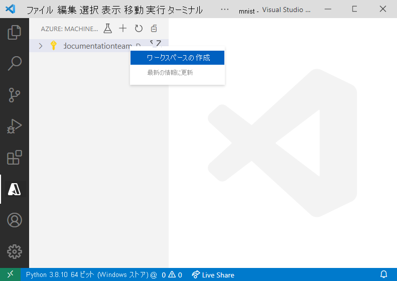
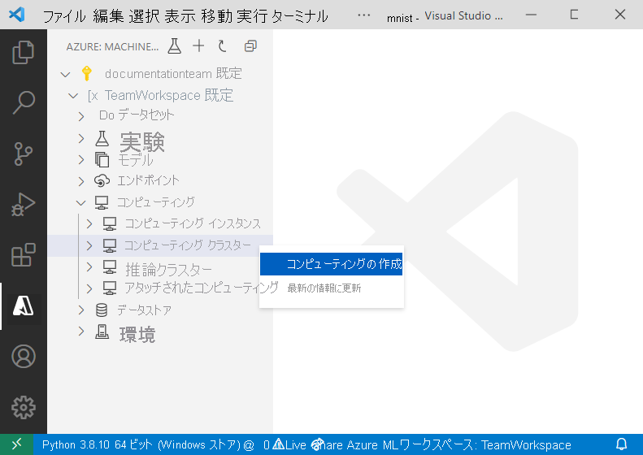

# <a name="train-an-image-classification-tensorflow-model-using-the-azure-machine-learning-visual-studio-code-extension-preview"></a>Azure Machine Learning Visual Studio Code 拡張機能 (プレビュー) を使用して画像分類 TensorFlow モデルをトレーニングする

TensorFlow と Azure Machine Learning Visual Studio Code 拡張機能を使用して、手書きの数字を認識する画像分類モデルをトレーニングおよびデプロイする方法について説明します。

このチュートリアルでは、以下のタスクについて学習します。

> [!div class="checklist"]
> * コードの理解
> * ワークスペースの作成
> * トレーニング用の GPU クラスターを作成する
> * モデルをトレーニングする

## <a name="prerequisites"></a>前提条件

- Azure のサブスクリプション。 お持ちでない場合は、[無料版または有料版の Azure Machine Learning](https://aka.ms/AMLFree) にサインアップしてお試しください。
- 軽量なクロスプラットフォーム コード エディターである [Visual Studio Code](https://code.visualstudio.com/docs/setup/setup-overview) をインストールします。
- Azure Machine Learning Studio Visual Studio Code 拡張機能。 インストール手順については、[Azure Machine Learning Visual Studio Code 拡張機能の設定に関するガイド](./how-to-setup-vs-code.md)を参照してください
- 2.0 CLI (プレビュー)。 インストール手順については、[2.0 CLI (プレビュー) のインストール、設定、および使用](how-to-configure-cli.md)に関する記事を参照してください

## <a name="understand-the-code"></a>コードの理解

このチュートリアルのコードでは、0 から 9 の手書きの数字を分類する画像分類機械学習モデルを TensorFlow を使用してトレーニングします。 それを行うには、28 ピクセル x 28 ピクセルの画像のピクセル値を入力として受け取り、10 個の確率 (分類の対象となる数字ごとに 1 つ) の一覧を出力するニューラル ネットワークを作成します。 以下は、データの体裁を示すサンプルです。  


このチュートリアルのコードを入手するには、お使いのコンピューターの任意の場所に [Azure ML サンプル リポジトリ](https://github.com/Azure/azureml-examples/archive/refs/heads/main.zip)をダウンロードして解凍してください。

## <a name="create-a-workspace"></a>ワークスペースの作成

Azure Machine Learning でアプリケーションを作成する際に最初に行うべきことは、ワークスペースの作成です。 ワークスペースには、モデルをトレーニングするためのリソースのほか、トレーニング済みのモデル自体も含まれます。 詳細については、[ワークスペースの概要](./concept-workspace.md)に関するページを参照してください。

1. Visual Studio Code で、*azureml-examples-main/cli/jobs/train/tensorflow/mnist* ディレクトリを開きます。
1. Visual Studio Code のアクティビティ バーで、**Azure** アイコンを選択して Azure Machine Learning ビューを開きます。
1. Azure Machine Learning ビューで、自分のサブスクリプション ノードを右クリックし、 **[ワークスペースの作成]** を選択します。

    > [!div class="mx-imgBorder"]
    > 

1. 仕様ファイルが表示されます。 次のオプションを使用して、仕様ファイルを構成します。 

    ```yml
    $schema: https://azuremlschemas.azureedge.net/latest/workspace.schema.json
    name: TeamWorkspace
    location: WestUS2
    friendly_name: team-ml-workspace
    description: A workspace for training machine learning models
    tags:
      purpose: training
      team: ml-team
    ```

    この仕様ファイルによって、`WestUS2` リージョン内に `TeamWorkspace` という名前のワークスペースが作成されます。 仕様ファイルに定義されている残りのオプションによって、ワークスペースのフレンドリ名、説明、およびタグが指定されます。

1. 仕様ファイルを右クリックし、 **[Azure ML: Create Resource]\(Azure ML: リソースの作成\)** を選択します。 リソースを作成するには、YAML 仕様ファイルで定義されている構成オプションを使用し、2.0 CLI を使用してジョブを送信します。 この時点で、Azure に対して、新しいワークスペースと依存リソースをアカウントに作成するように要求が行われます。 数分後、ご利用のサブスクリプションのノードに新しいワークスペースが表示されます。
1. `TeamWorkspace` を既定のワークスペースとして設定します。 これにより、作成したリソースとジョブが既定でこのワークスペースに配置されます。 Visual Studio Code ステータス バーの **[Set Azure ML Workspace]\(Azure ML ワークスペースの設定\)** ボタンを選択し、画面の指示に従って `TeamWorkspace` を既定のワークスペースとして設定します。

ワークスペースの詳細については、[VS Code でリソースを管理する方法](how-to-manage-resources-vscode.md)に関する記事を参照してください。

## <a name="create-a-gpu-cluster-for-training"></a>トレーニング用の GPU クラスターを作成する

コンピューティング先は、トレーニング ジョブを実行するコンピューティング リソースまたは環境です。 詳細については、[Azure Machine Learning のコンピューティング先に関するドキュメント](./concept-compute-target.md)を参照してください。

1. Azure Machine Learning ビューで、ワークスペース ノードを展開します。
1. ワークスペースの **[コンピューティング]** ノード内の **[コンピューティング クラスター]** ノードを右クリックし、 **[コンピューティングの作成]** を選択します

    > [!div class="mx-imgBorder"]
    > 

1. 仕様ファイルが表示されます。 次のオプションを使用して、仕様ファイルを構成します。

    ```yml
    $schema: https://azuremlschemas.azureedge.net/latest/compute.schema.json
    name: gpu-cluster
    type: amlcompute
    size: Standard_NC12
    
    min_instances: 0
    max_instances: 3
    idle_time_before_scale_down: 120
    ```

    この仕様ファイルでは、最大 3 つの Standard _NC12 VM ノードを使用して `gpu-cluster` という名前の GPU クラスターが作成されます。これは、非アクティブ状態が 120 秒続くと自動的に 0 ノードにスケールダウンします。

    VM サイズの詳細については、「[Azure の Linux 仮想マシンのサイズ](../virtual-machines/sizes.md)」を参照してください。

1. 仕様ファイルを右クリックし、 **[Azure ML: Create Resource]\(Azure ML: リソースの作成\)** を選択します。

数分後、ワークスペースの *[コンピューティング] > [コンピューティング クラスター]* ノードに新しいコンピューティング先が表示されます。

## <a name="train-image-classification-model"></a><a name="train-the-model"></a> 画像分類モデルをトレーニングする

トレーニング プロセス中は、トレーニング データを処理し、分類の対象となる数字ごとに、データに埋め込まれたパターンを学習することによって TensorFlow モデルがトレーニングされます。

ワークスペースやコンピューティング先と同様に、トレーニング ジョブはリソース テンプレートを使用して定義されます。 このサンプルでは、仕様は次のような *job.yml* ファイルに定義されています。

```yml
$schema: https://azuremlschemas.azureedge.net/latest/commandJob.schema.json
code: 
    local_path: src
command: >
    python train.py
environment: azureml:AzureML-TensorFlow2.4-Cuda11-OpenMpi4.1.0-py36:1
compute:
    target: azureml:gpu-cluster
experiment_name: tensorflow-mnist-example
description: Train a basic neural network with TensorFlow on the MNIST dataset.
```

この仕様ファイルによって、*train.py* Python スクリプト内のコードを実行する、先ほど作成された `gpu-cluster` コンピューティング先に `tensorflow-mnist-example` というトレーニング ジョブが送信されます。 使用される環境は、トレーニング スクリプトの実行に必要な TensorFlow とその他のソフトウェア依存関係を含む、Azure Machine Learning によって提供されるキュレーション環境の 1 つです。 キュレーション環境の詳細については、「[Azure Machine Learning のキュレーションされた環境](resource-curated-environments.md)」を参照してください。

トレーニング ジョブを送信するには:

1. *job.yml* ファイルを開きます。
1. テキスト エディターでファイルを右クリックし、 **[Azure ML: Create Resource]\(Azure ML: リソースの作成\)** を選択します。

> [!div class="mx-imgBorder"]
> 

この時点で、ワークスペースで選択したコンピューティング先で実験を実行するための要求が Azure に送信されます。 このプロセスには数分かかります。 トレーニング ジョブの実行にかかる時間は、コンピューティングの種類やトレーニング データのサイズなど、いくつかの要因によって左右されます。 実験の進行状況を追跡するには、現在の実行ノードを右クリックし、 **[View Run in Azure portal]\(Azure portal で実行を表示する\)** を選択します。

外部の Web サイトを開くよう要求するダイアログが表示されたら、 **[開く]** を選択します。

> [!div class="mx-imgBorder"]
> 

モデルのトレーニングが完了すると、実行ノードの横にある状態ラベルが "完了" に更新されます。

## <a name="next-steps"></a>次の手順

このチュートリアルでは、以下のタスクについて学習します。

> [!div class="checklist"]
> * コードの理解
> * ワークスペースの作成
> * トレーニング用の GPU クラスターを作成する
> * モデルをトレーニングする

次の手順については、以下を参照してください。

* [Visual Studio Code を使用して Azure Machine Learning リソースを作成および管理します](how-to-set-up-vs-code-remote.md)。
* 完全な開発エクスペリエンスを得るために、[Visual Studio Code をコンピューティング インスタンスに接続します](how-to-set-up-vs-code-remote.md)。
* コードをローカルで編集、実行、およびデバッグする方法のチュートリアルについては、[Python hello-world チュートリアル](https://code.visualstudio.com/docs/Python/Python-tutorial)を参照してください。
* リモート Jupyter サーバーを使用して [Visual Studio Code で Jupyter Notebook を実行します](how-to-manage-resources-vscode.md)。
* Visual Studio Code 以外で Azure Machine Learning をトレーニングする方法のチュートリアルについては、[Azure Machine Learning を使用したモデルのトレーニングに関するチュートリアル](tutorial-train-models-with-aml.md)を参照してください。