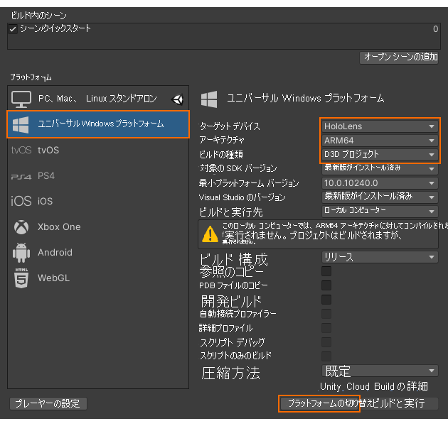

# クイック スタート:Unity のサンプルを HoloLens にデプロイする

このクイックスタートでは、Unity 用のクイックスタート サンプル アプリを HoloLens 2 にデプロイして実行する方法について説明します。

このクイックスタートでは、次の方法について説明します。

> [!div class="checklist"]
>
>* HoloLens 用のクイックスタート サンプル アプリを作成する
>* サンプルをデバイスにデプロイする
>* デバイスでサンプルを実行する

## 前提条件

このクイックスタートでは、「[クイックスタート: Unity によるモデルのレンダリング](render-model.md)」のサンプル プロジェクトをデプロイします。

シーンと共に自分の資格情報が適切に保存されており、Unity エディター内からセッションに接続できることを確認してください。

## サンプル プロジェクトをビルドする

1. *[File]\(ファイル\) > [Build Settings]\(ビルド設定\)* の順に開きます。
1. *[Platform]\(プラットフォーム\)* を **[Universal Windows Platform]\(ユニバーサル Windows プラットフォーム\)** に変更します
1. *[Target Device]\(ターゲット デバイス\)* を **[HoloLens]** に設定します
1. *[Architecture]\(アーキテクチャ\)* を **[ARM64]** に設定します
1. *[Build Type]\(ビルドの種類\)* を **[D3D Project]\(D3D プロジェクト\)** \ に設定します。
    
1. **[Switch Platform]\(プラットフォームに切り替え\)** を選択します
1. **[Build]\(ビルド\)** (または [Build And Run]\(ビルドして実行\)) を押すと、ソリューションを格納するフォルダーを選択するよう求められます
1. 生成された **Quickstart.sln** を Visual Studio で開きます
1. 構成を **[リリース]** と **[ARM64]** に変更します
1. デバッガー モードを **[リモート マシン]** \ に切り替えます。
    
1. ソリューションをビルドする
1. プロジェクト "Quickstart" で、 *[プロパティ] > [デバッグ]* の順に移動します
    1. *[リリース]* という構成がアクティブであることを確認します
    1. *[起動するデバッガー]* を **[リモート マシン]** に設定します
    1. *マシン名*を**使用する HoleLens の IP** に変更します

## サンプル プロジェクトを起動する

1. USB ケーブルで HoloLens をお使いの PC に接続します。
1. Visual Studio のデバッガーを開始します (F5)。 アプリがデバイスに自動的にデプロイされます。

サンプル アプリが起動し、新しいセッションを開始します。 しばらくすると、セッションの準備が完了し、リモートでレンダリングされたモデルが表示されます。
サンプルを後でもう一度起動する場合は、HoloLens の [Start]\(スタート\) メニューでも検索できます。

## 次のステップ

次のクイックスタートでは、カスタム モデルの変換について確認します。

> [!div class="nextstepaction"]
> [クイック スタート: モデルをレンダリング用に変換する](convert-model.md)
