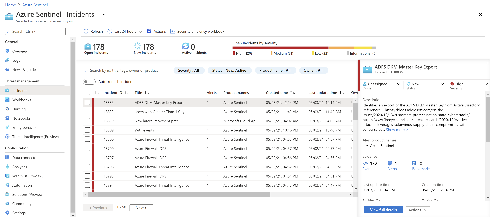

# Azure Sentinel でインシデントを調査する

> [!IMPORTANT]
> 記載されている機能は、現在プレビュー段階です。 [Azure プレビューの追加使用条件](https://azure.microsoft.com/support/legal/preview-supplemental-terms/)には、ベータ版、プレビュー版、またはまだ一般提供されていない Azure 機能に適用される追加の法律条項が含まれています。
>

この記事は、Azure Sentinel でインシデントを調査するためのものです。 Azure Sentinel にデータ ソースを接続した後で、不審な事態が起きたときに通知を受けるようにします。 これを実現するために、Azure Sentinel では、割り当てや調査が可能なインシデントを生成する高度なアラート ルールを作成できます。

この記事には、次の内容が含まれます。
> [!div class="checklist"]
> * インシデントの調査
> * 調査グラフを使用する
> * 脅威に対応する

インシデントには複数のアラートを含めることができます。 ケースは、特定の調査に関連するすべての証拠を集計したものです。 インシデントは、 **[分析]** ページで作成した分析ルールに基づいて作成されます。 重大度や状態など、アラートに関連するプロパティはインシデント レベルで設定されます。 探している脅威の種類とその検出方法が Azure Sentinel に認識された後、インシデントを調査することで検出された脅威を監視できます。

## 前提条件

- インシデントの調査が可能なのは、分析ルールを設定するときにエンティティ マッピング フィールドを使用した場合のみです。 調査グラフでは、元のインシデントにエンティティが含まれている必要があります。

- インシデントを割り当てる必要があるゲスト ユーザーがいる場合は、そのユーザーに Azure AD テナントの[ディレクトリ閲覧者](../active-directory/roles/permissions-reference.md#directory-readers)ロールを割り当てる必要があります。 通常の (ゲスト以外の) ユーザーには、既定でこのロールが割り当てられています。

## インシデントの調査方法

1. **[インシデント]** を選択します。 **[インシデント]** ページには、自分に割り当てられたインシデントの数、開いているインシデントの数、 **[処理中]** に設定したインシデントの数、閉じたインシデントの数が表示されます。 各インシデントについて、その発生時刻とインシデントの状態を確認できます。 重大度を調べて、最初に処理するインシデントを決定します。

    

1. 状態や重要度など、必要に応じてインシデントをフィルター処理できます。 詳細については、「[インシデントを検索する](#search-for-incidents)」を参照してください。

1. 調査を開始するには、特定のインシデントを選択します。 右側に、その重大度、関連するエンティティの数の概要、このインシデントをトリガーした生イベント、インシデントの一意の ID など、インシデントの詳細情報が表示されます。

1. インシデント内のアラートとエンティティの詳細を表示するには、インシデントのページで **[View full details]\(完全な詳細の表示\)** を選択し、インシデントの情報がまとめられている関連タブを確認します。 

    

    次に例を示します。

    - **[タイムライン]** タブで、インシデントのアラートとブックマークのタイムラインを確認します。これは、攻撃者のアクティビティのタイムラインを再構築するのに役立ちます。
    - **[アラート]** タブで、アラート自体を確認します。 アラートをトリガーしたクエリ、クエリごとに返された結果の数、アラートに対してプレイブックを実行する機能といった、アラートに関するすべての関連情報を確認できます。 インシデントをさらにドリルダウンするには、 **[イベント]** の数を選択します。 これにより、結果を生成したクエリと、アラートをトリガーしたイベントが Log Analytics で開きます。 
    - **[エンティティ]** タブで、アラート ルールの定義の一部としてマップしたすべてのエンティティを表示できます。

1. 積極的にインシデントを調査している場合、インシデントを閉じるまではその状態を **[処理中]** に設定することをお勧めします。

1. インシデントは特定のユーザーに割り当てることができます。 インシデントごとに、 **[Incident owner]\(インシデントの所有者\)** フィールドを設定することで、所有者を割り当てることができます。 すべてのインシデントは、開始時点では未割り当ての状態です。 また、調査した内容やインシデントに関する懸念事項を他のアナリストが理解できるように、コメントを追加することもできます。

    

1. **[調査]** を選択して、調査マップを表示します。

## 調査グラフを使用して詳細に調査する

調査グラフを使用すると、アナリストは調査ごとに適切な質問を行うことができます。 調査グラフを使用すると、関連データとすべての関連するエンティティを関連付けることによって、潜在的なセキュリティ脅威の範囲を理解し、根本原因を特定するのに役立ちます。 グラフに表示される任意のエンティティを選択して、さまざまな展開オプションを選択することにより、より詳細に調査できます。  
  
調査グラフには、次のものがあります。

- **生データからのビジュアル コンテキスト**:ライブのビジュアル グラフには、生データから自動的に抽出されたエンティティのリレーションシップが表示されます。 これにより、さまざまなデータ ソース間の接続を簡単に確認できます。

- **調査範囲全体の検出**:組み込みの探索クエリを使用して調査範囲を拡大し、侵害の全範囲を明らかにします。

- **組み込みの調査手順**:定義済みの探索オプションを使用して、脅威の発生時に適切な質問をするようにします。

調査グラフを使用するには:

1. インシデントを選択し、 **[調査]** を選択します。 これにより、調査グラフが表示されます。 グラフには、アラートに直接接続されているエンティティと、さらに接続されている各リソースのイラスト マップが示されます。

    

   > [!IMPORTANT] 
   > - インシデントの調査が可能なのは、分析ルールを設定するときにエンティティ マッピング フィールドを使用した場合のみです。 調査グラフでは、元のインシデントにエンティティが含まれている必要があります。
   >
   > - 現在、Azure Sentinel では、**過去 30 日間まで** のインシデントの調査がサポートされています。

1. エンティティを選択すると、 **[エンティティ]** ウィンドウが開き、そのエンティティに関する情報を確認できます。

    
  
1. 各エンティティの上にカーソルを置くと、エンティティの種類ごとにセキュリティ エクスパートやアナリストによって作成された質問の一覧が表示され、調査を深めることができます。 これらのオプションを **探索クエリ** と呼びます。

    

   たとえば、コンピューターで、関連するアラートを要求できます。 探索クエリを選択すると、結果として得られたエンティティがグラフに追加されます。 この例では、 **[Related alerts]\(関連するアラート\)** を選択すると、グラフに次のアラートが返されます。

    

1. 探索クエリごとに、 **[イベント]\>** を選択して、生イベントの結果と、Log Analytics で使用されるクエリを開くオプションを選択できます。

1. インシデントの理解のために、グラフには平行したタイムラインが表示されます。

    

1. タイムライン上にカーソルを移動して、グラフ上のどの項目がどの時点で発生したかを確認します。

    

## インシデントを閉じる

特定のインシデントを解決した後 (調査が結論に達した場合など)、インシデントの状態を **[Closed]\(終了\)** に設定する必要があります。 この場合、インシデントを閉じる理由を指定して、インシデントを分類するよう求められます。 この手順は必須です。 **[Select classification]\(分類を選択\)** をクリックし、ドロップダウン リストから次のいずれかを選択します。

- [True Positive - suspicious activity]\(真陽性 - 疑わしいアクティビティ\)
- [Benign Positive - suspicious but expected]\(無害な陽性 - 不審だが、予期されている)
- [False Positive - incorrect alert logic]\(偽陽性 - 間違ったアラート ロジック\)
- [False Positive - incorrect data]\(偽陽性 - 不適切なデータ\)
- [Undetermined]\(不明\)

:::image type="content" source="media/tutorial-investigate-cases/closing-reasons-dropdown.png" alt-text="[分類の選択] リストで使用できる分類が強調表示されているスクリーンショット。":::

偽陽性と真陽性について詳しくは、「[Azure Sentinel での偽陽性の処理](false-positives.md)」を参照してください。

適切な分類を選択した後、 **[コメント]** フィールドに説明文を追加します。 これは、このインシデントを参照する必要がある場合に役立ちます。 完了したら **[適用]** をクリックすると、インシデントが閉じられます。

:::image type="content" source="media/tutorial-investigate-cases/closing-reasons-comment-apply.png" alt-text="{alt-text}":::

## インシデントを検索する

特定のインシデントをすばやく検索するには、インシデント グリッドの上にある検索ボックスに検索文字列を入力して **Enter** キーを押し、表示されるインシデントの一覧を適切に変更します。 目的のインシデントが結果に含まれていない場合は、 **[高度な検索]** オプションを使用して検索を絞り込むことができます。

検索パラメーターを変更するには、 **[検索]** ボタンを選択し、検索を実行するパラメーターを選択します。

次に例を示します。

:::image type="content" source="media/tutorial-investigate-cases/advanced-search.png" alt-text="インシデント検索ボックスと、基本的または高度な検索オプションを選択するためのボタンのスクリーンショット。":::

既定では、インシデントの検索は、**インシデント ID**、**タイトル**、**タグ**、**所有者**、および **製品名** の値に対してのみ実行されます。 検索ペインで、一覧を下にスクロールして検索する他のパラメーターを 1 つ以上選択し、 **[適用]** を選択して検索パラメーターを更新します。 **[既定値として設定]** を選択すると、選択されているパラメーターが既定のオプションにリセットされます。

> [!NOTE]
> **[所有者]** フィールドの検索では、名前とメール アドレスの両方がサポートされます。
>

高度な検索オプションを使用すると、検索動作が次のように変更されます。

|検索動作  |説明  |
|---------|---------|
|**検索ボタンの色**     |検索で現在使用されているパラメーターの種類に応じて、検索ボタンの色が変わります。   - 既定のパラメーターだけが選択されている場合、ボタンは灰色になります。  - 高度な検索パラメーターなど、異なるパラメーターが選択されるとすぐに、ボタンは青に変ります。         |
|**自動更新**     | 高度な検索パラメーターを使用すると、結果の自動更新を選択できなくなります。        |
|**エンティティ パラメーター**     |高度な検索では、すべてのエンティティ パラメーターがサポートされています。 任意のエンティティ パラメーターで検索すると、すべてのエンティティ パラメーターで検索が実行されます。         |
|**検索文字列**     |    単語の文字列を検索すると、検索クエリ内のすべての単語が含まれます。 検索文字列では大文字と小文字が区別されます     |
|**クロス ワークスペースのサポート**     |    クロスワークスペース ビューでは、高度な検索はサポートされていません。     |
| **表示される検索結果の数** | 高度な検索パラメーターを使用している場合、一度に表示される結果は 50 件のみです。 |
|     |         |

> [!NOTE]
> 高度な検索は、現在パブリック プレビュー段階です。
>

> [!TIP]
>  探しているインシデントが見つからない場合は、検索パラメーターを削除して検索を広げます。 検索結果の項目が多すぎる場合は、さらにフィルターを追加して結果を絞り込みます。
>

## 次のステップ
この記事では、Azure Sentinel を使用して、インシデントの調査を開始する方法について説明しました。 詳細については、次を参照してください。

- [チュートリアル: Azure Sentinel でオートメーション ルールとプレイブックを使用する](tutorial-respond-threats-playbook.md)
- [UEBA データを使用したインシデントの調査](investigate-with-ueba.md)
