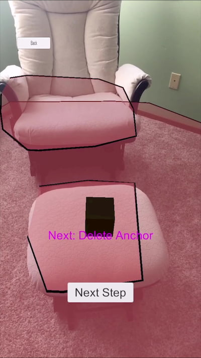

# クイック スタート:Azure Spatial Anchors を使用して Unity iOS アプリを作成する

このクイック スタートでは、[Azure Spatial Anchors](../overview.md) を使用して Unity iOS アプリを作成する方法について説明します。 Azure Spatial Anchors は、クロスプラットフォーム対応の開発者向けサービスです。このサービスを使用すると、時間が経過した後でも複数のデバイス間で位置情報を保持するオブジェクトを使用して複合現実エクスペリエンスを作成できます。 完了すると、Unity でビルドされた、空間アンカーを保存して呼び戻すことができる ARKit iOS アプリが作成されます。

学習内容は次のとおりです。

> [!div class="checklist"]
> * Spatial Anchors アカウントを作成する
> * Unity のビルド設定を準備する
> * Spatial Anchors アカウント識別子とアカウント キーを構成する
> * Xcode プロジェクトをエクスポートする
> * iOS デバイスにデプロイして実行する

[!INCLUDE [quickstarts-free-trial-note](../../../includes/quickstarts-free-trial-note.md)]

## 前提条件

このクイック スタートを実行するには、以下が必要です。

- 最新バージョンの <a href="https://geo.itunes.apple.com/us/app/xcode/id497799835?mt=12" target="_blank">Xcode</a> および <a href="https://unity3d.com/get-unity/download" target="_blank">Unity (LTS)</a> がインストールされた macOS マシン。 **Unity 2020 LTS** を ASA SDK バージョン 2.9 以降 ([Unity XR Plug-in Framework](https://docs.unity3d.com/Manual/XRPluginArchitecture.html) が使用される) で、または **Unity 2019 LTS** を ASA SDK バージョン 2.8 以前で使用します。
- HomeBrew を介してインストールされた Git。 `/usr/bin/ruby -e "$(curl -fsSL https://raw.githubusercontent.com/Homebrew/install/master/install)"` コマンドをターミナルに 1 行で入力します。 続けて、`brew install git` および `brew install git-lfs` を実行します。
- 開発者向けの <a href="https://developer.apple.com/documentation/arkit/verifying_device_support_and_user_permission" target="_blank">ARKit 対応</a> iOS デバイス。

[!INCLUDE [Create Spatial Anchors resource](../../../includes/spatial-anchors-get-started-create-resource.md)]

## Unity のサンプル プロジェクトをダウンロードして開く

[!INCLUDE [Clone Sample Repo](../../../includes/spatial-anchors-clone-sample-repository.md)]

[!INCLUDE [Open Unity Project](../../../includes/spatial-anchors-open-unity-project.md)]

[!INCLUDE [iOS Unity Build Settings](../../../includes/spatial-anchors-unity-ios-build-settings.md)]

[!INCLUDE [Configure Unity Scene](../../../includes/spatial-anchors-unity-configure-scene.md)]

## Xcode プロジェクトをエクスポートする

[!INCLUDE [Export Unity Project](../../../includes/spatial-anchors-unity-export-project-snip.md)]

[!INCLUDE [Configure Xcode](../../../includes/spatial-anchors-unity-ios-xcode.md)]

アプリで矢印を使用して **[BasicDemo]** を選択し、 **[実行]**  ボタンを 押してデモを実行します。 指示に従って、アンカーを配置し、呼び戻します。

完了したら、Xcode で **[Stop]\(停止\)** を押してアプリを停止します。

## トラブルシューティング

### レンダリングに関する問題

アプリを実行したとき、背景としてカメラが表示されない場合は (たとえば、代わりに空白、青、または他のテクスチャが表示される場合)、Unity に資産を再インポートすることが必要な場合があります。 アプリを停止します。 Unity の上部のメニューで、 **[Assets]\(資産\) -> [Re-import all]\(すべて再インポート\)** を選択します。 その後、アプリをもう一度実行します。

[!INCLUDE [Clean-up section](../../../includes/clean-up-section-portal.md)]

[!INCLUDE [Next steps](../../../includes/spatial-anchors-quickstarts-nextsteps.md)]

> [!div class="nextstepaction"]
> [チュートリアル:デバイス間で Spatial Anchors を共有する](../tutorials/tutorial-share-anchors-across-devices.md)

> [!div class="nextstepaction"]
> [方法: Unity プロジェクトで Azure Spatial Anchors を構成する](../how-tos/setup-unity-project.md)
