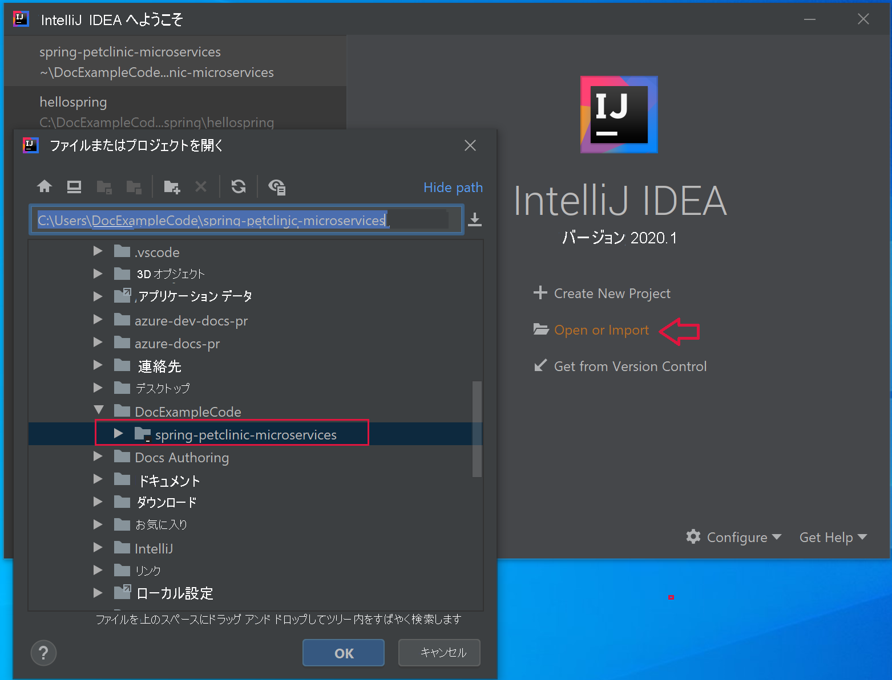
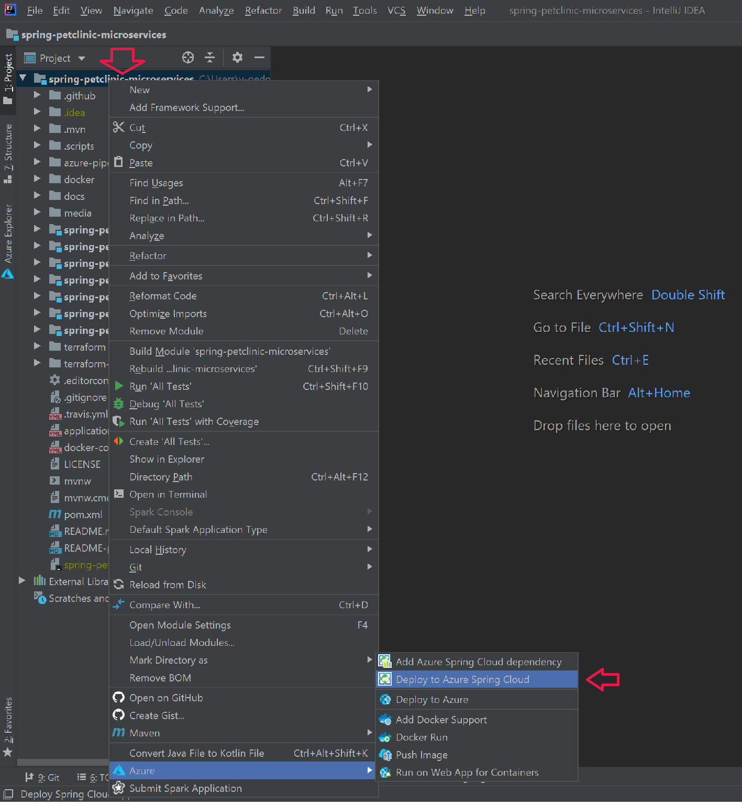

# <a name="quickstart-build-and-deploy-apps-to-azure-spring-cloud"></a>クイック スタート:アプリをビルドして Azure Spring Cloud にデプロイする

::: zone pivot="programming-language-csharp"
このクイックスタートでは、Azure CLI を使用して、マイクロサービス アプリケーションをビルドし、Azure Spring Cloud にデプロイします。

## <a name="prerequisites"></a>前提条件

* このシリーズの先行する次のクイックスタートを完了しておきます。

  * 「[Azure Spring Cloud サービスのプロビジョニング](./quickstart-provision-service-instance.md)」。
  * 「[Azure Spring Cloud の構成サーバーを設定する](./quickstart-setup-config-server.md)」。

## <a name="download-the-sample-app"></a>サンプル アプリ をダウンロードする

この時点まで Azure Cloud Shell を使用している場合は、次の手順に従って、ローカル コマンド プロンプトに切り替えます。

1. 新しいフォルダーを作成し、サンプル アプリ リポジトリを複製します。

   ```console
   mkdir source-code
   ```

   ```console
   cd source-code
   ```

   ```console
   git clone https://github.com/Azure-Samples/Azure-Spring-Cloud-Samples
   ```

1. リポジトリ ディレクトリに移動します。

   ```console
   cd Azure-Spring-Cloud-Samples
   ```

## <a name="deploy-planetweatherprovider"></a>PlanetWeatherProvider をデプロイする

1. PlanetWeatherProvider プロジェクトのアプリを Azure Spring Cloud インスタンスに作成します。

   ```azurecli
   az spring-cloud app create --name planet-weather-provider --runtime-version NetCore_31
   ```

   自動サービス登録を有効にするために、プロジェクトの *appsettings.json* ファイル内の `spring.application.name` の値と同じ名前をアプリに設定しました。

   ```json
   "spring": {
     "application": {
       "name": "planet-weather-provider"
     }
   }
   ```

   このコマンドの実行には数分かかることがあります。

1. ディレクトリを `PlanetWeatherProvider` プロジェクト フォルダーに変更します。

   ```console
   cd steeltoe-sample/src/planet-weather-provider
   ```

1. デプロイするバイナリと *.ZIP* ファイルを作成します。

   ```console
   dotnet publish -c release -o ./publish
   ```

   > [!TIP]
   > プロジェクト ファイルには、バイナリを *./publish* フォルダーに書き込んだ後で *.ZIP* ファイルにパッケージ化するための、以下の XML が含まれています。
   >
   > ```xml
   > <Target Name="Publish-Zip" AfterTargets="Publish">
   >   <ZipDirectory SourceDirectory="$(PublishDir)" DestinationFile="$(MSBuildProjectDirectory)/publish-deploy-planet.zip" Overwrite="true" />
   > </Target>
   > ```

1. Azure にデプロイします。

   次のコマンドを実行する前に、コマンド プロンプトがプロジェクト フォルダーにあることを確認してください。

   ```console
   az spring-cloud app deploy -n planet-weather-provider --runtime-version NetCore_31 --main-entry Microsoft.Azure.SpringCloud.Sample.PlanetWeatherProvider.dll --artifact-path ./publish-deploy-planet.zip
   ```

   `--main-entry` オプションには、 *.ZIP* ファイルのルート フォルダーからアプリケーションのエントリ ポイントを含む *.dll* ファイルへの相対パスを指定します。 サービスは、 *.ZIP* ファイルをアップロードした後、すべてのファイルとフォルダーを抽出し、指定された *.dll* ファイル内のエントリ ポイントを実行しようとします。

   このコマンドの実行には数分かかることがあります。

## <a name="deploy-solarsystemweather"></a>SolarSystemWeather をデプロイする

1. Azure Spring Cloud インスタンスに、別のアプリを作成します。今度は、SolarSystemWeather プロジェクトのアプリです。

   ```azurecli
   az spring-cloud app create --name solar-system-weather --runtime-version NetCore_31
   ```

   `solar-system-weather` は、`SolarSystemWeather` プロジェクトの *appsettings.json* ファイルに指定されている名前です。

   このコマンドの実行には数分かかることがあります。

1. ディレクトリを `SolarSystemWeather` プロジェクトに変更します。

   ```console
   cd ../solar-system-weather
   ```

1. デプロイするバイナリと *.ZIP* ファイルを作成します。

   ```console
   dotnet publish -c release -o ./publish
   ```

1. Azure にデプロイします。

   ```console
   az spring-cloud app deploy -n solar-system-weather --runtime-version NetCore_31 --main-entry Microsoft.Azure.SpringCloud.Sample.SolarSystemWeather.dll --artifact-path ./publish-deploy-solar.zip
   ```

   このコマンドの実行には数分かかることがあります。

## <a name="assign-public-endpoint"></a>パブリック エンドポイントを割り当てる

アプリケーションをテストするには、ブラウザーから `solar-system-weather` アプリケーションに HTTP GET 要求を送信します。  そのためには、要求のためのパブリック エンドポイントが必要です。

1. エンドポイントを割り当てるには、次のコマンドを実行します。

   ```azurecli
   az spring-cloud app update -n solar-system-weather --assign-endpoint true
   ```

1. エンドポイントの URL を取得するには、次のコマンドを実行します。

   Windows:

   ```azurecli
   az spring-cloud app show -n solar-system-weather -o table
   ```

   Linux:

   ```azurecli
   az spring-cloud app show --name solar-system-weather | grep url
   ```

## <a name="test-the-application"></a>アプリケーションをテストする

`solar-system-weather` アプリに GET 要求を送信します。 ブラウザーで、パブリック URL の末尾に `/weatherforecast` を追加し、そこに移動します。 例: `https://servicename-solar-system-weather.azuremicroservices.io/weatherforecast`

出力は JSON です。

```json
[{"Key":"Mercury","Value":"very warm"},{"Key":"Venus","Value":"quite unpleasant"},{"Key":"Mars","Value":"very cool"},{"Key":"Saturn","Value":"a little bit sandy"}]
```

この応答は、両方のマイクロサービス アプリが動作していることを示しています。 `SolarSystemWeather` アプリは、`PlanetWeatherProvider` アプリから取得したデータを返します。
::: zone-end
---
::: zone pivot="programming-language-java"
このドキュメントでは、以下を使用して、マイクロサービス アプリケーションをビルドし、Azure Spring Cloud にデプロイする方法について説明します。
* Azure CLI
* Maven プラグイン
* Intellij

Azure CLI または Maven を使用してデプロイする前に、[Azure Spring Cloud のインスタンスのプロビジョニング](./quickstart-provision-service-instance.md)と[構成サーバーの設定](./quickstart-setup-config-server.md)を行う例を完了してください。

## <a name="prerequisites"></a>前提条件

* [JDK 8 をインストールする](/java/azure/jdk/)
* [Azure サブスクリプションにサインアップする](https://azure.microsoft.com/free/)
* (オプション) [Azure CLI バージョン 2.0.67 以降をインストール](/cli/azure/install-azure-cli)し、`az extension add --name spring-cloud` コマンドを使用して Azure Spring Cloud 拡張機能をインストールする
* (オプション) [Azure Toolkit for IntelliJ をインストール](https://plugins.jetbrains.com/plugin/8053-azure-toolkit-for-intellij/)し、[サインイン](/azure/developer/java/toolkit-for-intellij/create-hello-world-web-app#installation-and-sign-in)する

## <a name="deployment-procedures"></a>デプロイの手順

#### <a name="cli"></a>[CLI](#tab/Azure-CLI)

## <a name="build-the-microservices-applications-locally"></a>マイクロサービス アプリケーションをローカルにビルドする

1. Azure Cloud アカウントにサンプル アプリ リポジトリを複製します。  ディレクトリを変更し、プロジェクトをビルドします。

    ```azurecli
    git clone https://github.com/azure-samples/spring-petclinic-microservices
    cd spring-petclinic-microservices
    mvn clean package -DskipTests -Denv=cloud
    ```

プロジェクトのコンパイルには、5 から 10 分かかります。 完了すると、各サービスのそれぞれのフォルダーに、個別の JAR ファイルができているはずです。

## <a name="create-and-deploy-apps-on-azure-spring-cloud"></a>アプリを作成して Azure Spring Cloud にデプロイする

1. 前のクイックスタートで次のコマンドを実行していない場合は、CLI の既定値を設定します。

    ```azurecli
    az configure --defaults group=<resource group name> spring-cloud=<service name>
    ```

1. PetClinic の 2 つのコア マイクロサービス (API ゲートウェイと顧客サービス) を作成します。

    ```azurecli
    az spring-cloud app create --name api-gateway --instance-count 1 --memory 2 --assign-endpoint
    az spring-cloud app create --name customers-service --instance-count 1 --memory 2
    ```

1. 前の手順で作成された JAR ファイルをデプロイします。

    ```azurecli
    az spring-cloud app deploy --name api-gateway --jar-path spring-petclinic-api-gateway/target/spring-petclinic-api-gateway-2.3.6.jar --jvm-options="-Xms2048m -Xmx2048m"
    az spring-cloud app deploy --name customers-service --jar-path spring-petclinic-customers-service/target/spring-petclinic-customers-service-2.3.6.jar --jvm-options="-Xms2048m -Xmx2048m"
    ```

1. 次のコマンドを使用して、デプロイ後のアプリの状態を照会します。

    ```azurecli
    az spring-cloud app list -o table
    ```

    ```azurecli
        Name               Location    ResourceGroup    Production Deployment    Public Url                                           Provisioning Status    CPU    Memory    Running Instance    Registered Instance    Persistent Storage
    -----------------  ----------  ---------------  -----------------------  ---------------------------------------------------  ---------------------  -----  --------  ------------------  ---------------------  --------------------
    api-gateway        eastus      xxxxxx-sp         default                  https://<service name>-api-gateway.azuremicroservices.io   Succeeded              1      2         1/1                 1/1                    -
    customers-service  eastus      <service name>         default                                                                       Succeeded              1      2         1/1                 1/1                    -
    ```

## <a name="verify-the-services"></a>サービスを確認する

上記の **パブリック URL** (`https://<service name>-api-gateway.azuremicroservices.io` の形式) を使用して、ブラウザーからアプリ ゲートウェイと顧客サービスにアクセスします。


> [!TIP]
> デプロイのトラブルシューティングを行うために、`az spring-cloud app logs --name <app name> -f` コマンドを使用して、アプリが実行されているときにログ ストリーミングをリアルタイムで取得できます。

## <a name="deploy-extra-apps"></a>追加のアプリをデプロイする

管理サーバー、訪問、獣医などのすべての機能を使用して PetClinic アプリを機能させるには、次のコマンドを使用して他のアプリをデプロイします。

```azurecli
az spring-cloud app create --name admin-server --instance-count 1 --memory 2 --assign-endpoint
az spring-cloud app create --name vets-service --instance-count 1 --memory 2
az spring-cloud app create --name visits-service --instance-count 1 --memory 2
az spring-cloud app deploy --name admin-server --jar-path spring-petclinic-admin-server/target/spring-petclinic-admin-server-2.3.6.jar --jvm-options="-Xms2048m -Xmx2048m"
az spring-cloud app deploy --name vets-service --jar-path spring-petclinic-vets-service/target/spring-petclinic-vets-service-2.3.6.jar --jvm-options="-Xms2048m -Xmx2048m"
az spring-cloud app deploy --name visits-service --jar-path spring-petclinic-visits-service/target/spring-petclinic-visits-service-2.3.6.jar --jvm-options="-Xms2048m -Xmx2048m"
```

#### <a name="maven"></a>[Maven](#tab/Maven)

## <a name="build-the-microservices-applications-locally"></a>マイクロサービス アプリケーションをローカルにビルドする

1. Azure Cloud アカウントにサンプル アプリ リポジトリを複製します。  ディレクトリを変更し、プロジェクトをビルドします。

    ```azurecli
    git clone https://github.com/azure-samples/spring-petclinic-microservices
    cd spring-petclinic-microservices
    mvn clean package -DskipTests -Denv=cloud
    ```

プロジェクトのコンパイルには、5 から 10 分かかります。 完了すると、各サービスのそれぞれのフォルダーに、個別の JAR ファイルができているはずです。

## <a name="generate-configurations-and-deploy-to-the-azure-spring-cloud"></a>構成を生成し、Azure Spring Cloud にデプロイする

1. 親 POM を含む PetClinic のルート フォルダー内で次のコマンドを実行して、構成を生成します。 既に Azure CLI でサインインしている場合、コマンドは資格情報を自動的に取得します。 そうでない場合は、プロンプトの指示に従ってサインインします。 詳細については、[wiki ページ](https://github.com/microsoft/azure-maven-plugins/wiki/Authentication)を参照してください。

    ```azurecli
    mvn com.microsoft.azure:azure-spring-cloud-maven-plugin:1.6.0:config
    ```

    選択を求めるメッセージが表示されます。

    * **モジュール:** `api-gateway` と `customers-service` を選択します。
    * **サブスクリプション:** これは、Azure Spring Cloud インスタンスを作成するために使用されるサブスクリプションです。
    * **サービス インスタンス:** これは、自分の Azure Spring Cloud インスタンスの名前です。
    * **パブリック エンドポイント:** 提示されるプロジェクトの一覧で、`api-gateway` に対応する番号を入力します。  これで、パブリック アクセスが与えられます。

1. POM ファイル内の `appName` 要素が正しいことを確認します。

    ```xml
    <build>
        <plugins>
            <plugin>
                <groupId>com.microsoft.azure</groupId>
                <artifactId>azure-spring-cloud-maven-plugin</artifactId>
                <version>1.6.0</version>
                <configuration>
                    <subscriptionId>xxxxxxxxx-xxxx-xxxx-xxxxxxxxxxxx</subscriptionId>
                    <clusterName>v-spr-cld</clusterName>
                    <appName>customers-service</appName>

    ```

    `appName` のテキストが次と一致することを確認し、必要に応じてプレフィックスを削除して、ファイルを保存してください。
    * api-gateway
    * customers-service

1. POM にプラグインの依存関係と構成が含まれるようになりました。 次のコマンドを使用して、アプリをデプロイします。

    ```azurecli
    mvn azure-spring-cloud:deploy
    ```

## <a name="verify-the-services"></a>サービスを確認する

デプロイ コマンドが成功すると、`https://<service name>-spring-petclinic-api-gateway.azuremicroservices.io` の形式で URL が返されます。 これを使用して、実行中のサービスに移動します。


また、Azure portal に移動して URL を検索することもできます。

1. サービスに移動します。
2. **[アプリ]** を選択します。
3. **api-gateway** を選択します。
4. **[api-gateway | Overview]\(api-gateway | 概要\)** ページで、URL を見つけます。

## <a name="deploy-extra-apps"></a>追加のアプリをデプロイする

管理サーバー、訪問、獣医などのすべての機能を使用して PetClinic アプリを機能させるには、他のマイクロサービスをデプロイします。 構成コマンドを再実行し、次のマイクロサービスを選択します。

* admin-server
* vets-service
* visits-service

上記の各モジュールで `pom.xml` 内のアプリ名を修正し、その後 `deploy` コマンドを再度実行します。

#### <a name="intellij"></a>[IntelliJ](#tab/IntelliJ)

## <a name="import-sample-project-in-intellij"></a>IntelliJ でサンプル プロジェクトをインポートする

1. このチュートリアルのソース リポジトリをダウンロードして解凍するか、Git の `git clone https://github.com/azure-samples/spring-petclinic-microservices` を使用して複製します

1. IntelliJ の **[Welcome]\(ようこそ\)** ダイアログを開き、 **[Import Project]\(プロジェクトのインポート\)** を選択してインポート ウィザードを開きます。

1. `spring-petclinic-microservices` フォルダーを選択します。

    

### <a name="deploy-api-gateway-app-to-azure-spring-cloud"></a>api-gateway アプリを Azure Spring Cloud にデプロイする

Azure にデプロイするには、Azure アカウントで Azure Toolkit for IntelliJ にサインインし、自分のサブスクリプションを選択する必要があります。 サインインの詳細については、「[インストールとサインイン](/azure/developer/java/toolkit-for-intellij/create-hello-world-web-app#installation-and-sign-in)」を参照してください。

1. IntelliJ のプロジェクト エクスプローラーでプロジェクトを右クリックし、 **[Azure]**  ->  **[Deploy to Azure Spring Cloud]\(Azure Spring Cloud にデプロイ\)** を選択します。

    

1. **[Name]\(名前\)** フィールドで、既存の **名前** に「 *:api-gateway*」を追加します。
1. **[Artifact]\(成果物\)** ボックスで、 *[spring-petclinic-api-gateway-2.3.6]* を選択します。
1. **[Subscription]\(サブスクリプション\)** ボックスで、自分のサブスクリプションを確認します。
1. **[Spring Cloud]** ボックスで、「[Azure Spring Cloud インスタンスをプロビジョニングする](./quickstart-provision-service-instance.md)」で作成した Azure Spring Cloud のインスタンスを選択します。
1. **[Public Endpoint]\(パブリック エンドポイント\)** を *[Enable]\(有効化\)* に設定します。
1. **[App:]\(アプリ:\)** ボックスで、 **[Create app]\(アプリの作成\)** を選択します。
1. 「*api-gateway*」と入力し、 **[OK]** を選択します。
1. メモリを 2 GB、JVM のオプションを `-Xms2048m -Xmx2048m` に指定します。

    

1. ダイアログの **[Before launch]\(起動前\)** セクションで、 *[Run Maven Goal]\(Maven 目標の実行\)* をダブルクリックします。
1. **[Working directory]\(作業ディレクトリ\)** ボックスで、*spring-petclinic-microservices/gateway* フォルダーに移動します。
1. **[Command line]\(コマンド ライン\)** ボックスに、「*package -DskipTests*」と入力します。 **[OK]** を選択します。

    ![Azure へのデプロイ [OK]](media/spring-cloud-intellij-howto/deploy-to-azure-spring-cloud-2-pet-clinic.png)

1. **[Deploy Azure Spring Cloud app]\(Azure Spring Cloud アプリのデプロイ\)** ダイアログの下部にある **[Run]\(実行\)** ボタンを選択して、デプロイを開始します。 このプラグインは、`api-gateway` アプリに対して `mvn package` コマンドを実行し、`package` コマンドによって生成された jar をデプロイします。

### <a name="deploy-customers-service-and-other-apps-to-azure-spring-cloud"></a>customers-service アプリと他のアプリを Azure Spring Cloud にデプロイする

上記の手順を繰り返して、`customers-service` アプリと他の PetClinic アプリを Azure Spring Cloud にデプロイします。

1. `customers-service` アプリを特定するために、 **[Name]\(名前\)** と **[Artifact]\(成果物\)** を変更します。
1. **[App:]\(アプリ:\)** ボックスで **[Create app]\(アプリの作成\)** を選択して、`customers-service` アプリを作成します。
1. **[Public Endpoint]\(パブリック エンドポイント\)** オプションが *[Disabled]\(無効化\)* に設定されていることを確認します。
1. ダイアログの **[Before launch]\(起動前\)** セクションで、 **[Working directory]\(作業ディレクトリ\)** を *petclinic/customers-service* フォルダーに切り替えます。
1. **[Deploy Azure Spring Cloud app]\(Azure Spring Cloud アプリのデプロイ\)** ダイアログの下部にある **[Run]\(実行\)** ボタンを選択して、デプロイを開始します。

## <a name="verify-the-services"></a>サービスを確認する

`https://<service name>-spring-petclinic-api-gateway.azuremicroservices.io` の形式の URL に移動します。


また、Azure portal に移動して URL を検索することもできます。

1. サービスに移動します
2. **[アプリ]** を選択します
3. **api-gateway** を選択します
4. **[api-gateway | Overview]\(api-gateway | 概要\)** ページで、URL を見つけます

## <a name="deploy-extra-apps"></a>追加のアプリをデプロイする

このサンプルに含まれている他のマイクロサービスも同様にデプロイできます。

* admin-server
* vets-service
* visits-service

::: zone-end

## <a name="next-steps"></a>次のステップ

このクイックスタートでは、サブスクリプションに残っていると課金が継続される Azure リソースを作成しました。 次のクイックスタートに進まない場合は、[リソースのクリーンアップ](./quickstart-logs-metrics-tracing.md#clean-up-resources)に関する記事を参照してください。 それ以外の場合は、次のクイックスタートに進んでください。

> [!div class="nextstepaction"]
> [ログ、メトリック、およびトレース](./quickstart-logs-metrics-tracing.md)
