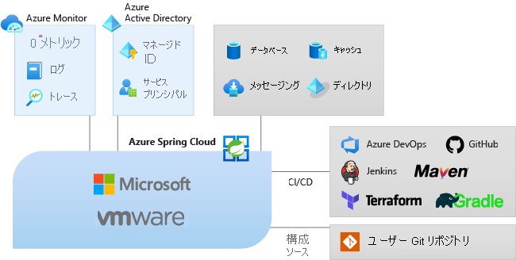

# Azure Spring Cloud とは

Azure Spring Cloud では、コードを変更せずに、Spring Boot マイクロサービス アプリケーションを Azure に簡単にデプロイできます。  Spring Cloud アプリケーションのインフラストラクチャはこのサービスによって管理されるので、開発者はコードに専念できます。  Azure Spring Cloud は、包括的な監視と診断、構成管理、サービス検出、CI/CD 統合、ブルー/グリーン デプロイなどを使用して、ライフサイクル管理を提供します。

## Azure Spring Cloud を使用する理由

Azure Spring Cloud へのアプリケーションのデプロイには多くの利点があります。  次のようにすることができます。
* 既存の Spring アプリを効率的に移行し、クラウドのスケーリングとコストを管理する。
* Spring Cloud のパターンを使用してアプリを最新化することで、俊敏性とデリバリーのスピードを向上させる。
* クラウド規模で Java を実行し、複雑なインフラストラクチャなしで使用率を高める。
* コンテナー化の依存関係なしで迅速に開発およびデプロイする。
* 運用ワークロードを効率的かつ簡単に監視する。

Azure Spring Cloud では、Java [Spring Boot](https://spring.io/projects/spring-boot) と ASP.NET Core [Steeltoe](https://steeltoe.io/) の両方のアプリがサポートされています。 Steeltoe に対するサポートは、現在、パブリック プレビューとして提供されています。 パブリック プレビューの提供では、公式リリースの前に新機能をお試しいただけます。 パブリック プレビューの機能とサービスは、運用環境での使用を目的としたものではありません。 詳細については、[FAQ](https://azure.microsoft.com/support/faq/) をご覧ください。または、[サポート リクエスト](https://docs.microsoft.com/azure/azure-portal/supportability/how-to-create-azure-support-request)を提出してください。

## サービスの概要

Azure エコシステムの一部として、Azure Spring Cloud は、ストレージ、データベース、監視などの他の Azure サービスに簡単にバインドできます。  

  

* Azure Spring Cloud は、Spring Boot アプリ向けのフル マネージド サービスです。ユーザーはインフラストラクチャの管理に煩わされることなく、アプリの構築と実行に集中できます。

* JAR またはコードをデプロイするだけで、Azure Spring Cloud によって、Spring サービス ランタイムと組み込みのアプリ ライフサイクルにアプリが自動的に接続されます。

* 監視は簡単です。 デプロイ後、アプリのパフォーマンスを監視し、エラーを修正して、アプリケーションを迅速に改善できます。 

* Azure のエコシステムとサービスへの完全な統合。

* Azure Spring Cloud はエンタープライズ対応であり、フル マネージド インフラストラクチャ、組み込みのライフサイクル管理、容易な監視を提供します。

## ドキュメントの概要
このドキュメントには、Azure Spring Cloud サービスの使用を開始する方法とサービスを活用する方法を説明するセクションが含まれています。

* はじめに
    * [最初のアプリを起動する](spring-cloud-quickstart.md)
    * [Azure Spring Cloud サービスをプロビジョニングする](spring-cloud-quickstart-provision-service-instance.md)
    * [構成サーバーを設定する]()
    * [アプリをビルドして配置する](spring-cloud-quickstart-deploy-apps.md)
    * [ログ、メトリック、トレースを使用する](spring-cloud-quickstart-logs-metrics-tracing.md)
* 操作方法
    * [開発](spring-cloud-tutorial-prepare-app-deployment.md): Azure Spring Cloud にデプロイするために、既存の Java Spring アプリケーションを準備します。 適切に構成すると、Azure Spring Cloud によって、Java Spring Cloud アプリケーションの監視、スケーリング、更新を行う堅牢なサービスが提供されます。
    * [デプロイ](spring-cloud-howto-staging-environment.md): Azure Spring Cloud でブルー/グリーン デプロイ パターンを使用して、ステージング環境のデプロイを設定します。 ブルー/グリーン デプロイとは、新しい (グリーン) バージョンのデプロイ中に、既存 (ブルー) のバージョンを実行状態のまま保持する、Azure DevOps の継続的デリバリーのパターンです。
    * [アプリの構成](spring-cloud-howto-start-stop-delete.md): Azure Spring Cloud アプリケーションを起動、停止、削除します。 Azure portal または Azure CLI を使用して、Azure Spring Cloud でアプリケーションの状態を変更します。
    * [スケール](spring-cloud-tutorial-scale-manual.md):Azure portal で Azure Spring Cloud ダッシュボードを使用するか、自動スケーリング設定を使用して、マイクロサービス アプリケーションをスケーリングします。 パブリック IP は、データベース、ストレージ、キー コンテナーなど、外部リソースとの通信に使用できます。
    * [アプリの監視](spring-cloud-tutorial-distributed-tracing.md): 分散トレース ツールにより、複雑な問題を簡単にデバッグおよび監視できます。 Azure Spring Cloud は、Spring Cloud Sleuth と Azure の Application Insights を統合します。 この統合により、Azure portal から強力な分散トレース機能を利用できます。
    * [アプリのセキュリティ保護](spring-cloud-howto-enable-system-assigned-managed-identity.md): Azure リソースは、Azure Active Directory で自動的に管理される ID を提供します。 この ID を使用して、コードに資格情報が含まれていなくても、Azure AD の認証をサポートする任意のサービスに認証することができます。
    * [他の Azure サービスとの統合](spring-cloud-tutorial-bind-cosmos.md): Spring Boot アプリケーションを手動で構成するのではなく、選択した Azure サービスをアプリケーションに自動的にバインドできます。たとえば、アプリケーションを Azure Cosmos DB データベースにバインドできます。
    * [自動化](spring-cloud-howto-cicd.md): 継続的インテグレーションと継続的デリバリーのツールを使用すると、最小限の労力とリスクで、既存のアプリケーションにすばやく更新プログラムをデプロイできます。 Azure DevOps は、これらの主要なタスクの整理と制御に役立ちます。 
    * [トラブルシューティング](spring-cloud-howto-self-diagnose-solve.md): Azure Spring Cloud 診断は、アプリのトラブルシューティングに役立つ対話型エクスペリエンスを提供します。 構成は必要ありません。 問題が見つかった場合、Azure Spring Cloud 診断によって問題点が特定され、問題のトラブルシューティングと解決に役立つ情報が示されます。
    * [移行](https://docs.microsoft.com/azure/developer/java/migration/migrate-spring-boot-to-azure-spring-cloud):既存の Spring Cloud アプリケーションまたは Spring Boot アプリケーションを移行して、Azure Spring Cloud で実行します。

## 次のステップ

まず、[Spring Cloud](spring-cloud-quickstart.md) のクイックスタートを完了します。

サンプルは GitHub で入手できます ([Azure Spring Cloud のサンプル](https://github.com/Azure-Samples/Azure-Spring-Cloud-Samples/tree/master/))。
