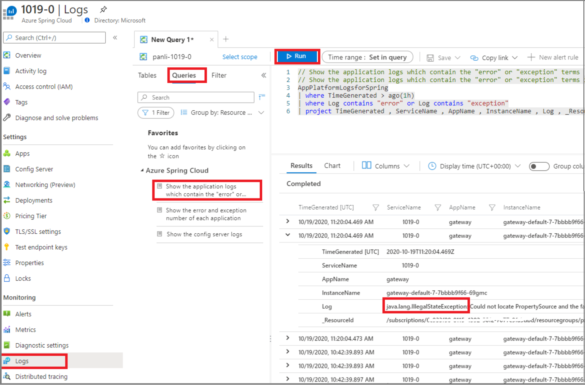

# <a name="quickstart-set-up-azure-spring-cloud-configuration-server"></a>クイック スタート:Azure Spring Cloud の構成サーバーを設定する

Azure Spring Cloud 構成サーバーは、分散システムのための一元化された構成サービスです。 現時点でローカル ストレージ、Git、および Subversion をサポートしている、プラグ可能なリポジトリ レイヤーを使用します。 このクイックスタートでは、Git リポジトリからデータを取得するように構成サーバーを設定します。

::: zone pivot="programming-language-csharp"

## <a name="prerequisites"></a>前提条件

* このシリーズの先行する次のクイックスタートを完了しておきます。「[Azure Spring Cloud サービスのプロビジョニング](spring-cloud-quickstart-provision-service-instance.md)」。

## <a name="azure-spring-cloud-config-server-procedures"></a>Azure Spring Cloud 構成サーバーの手順

次のコマンドを実行し、プロジェクトの git リポジトリの場所を使用して、構成サーバーを設定します。 `<service instance name>` を、以前に作成したサービスの名前に置き換えます。 前のクイックスタートで設定したサービス インスタンス名の既定値は、このコマンドでは機能しません。

```azurecli
az spring-cloud config-server git set -n <service instance name> --uri https://github.com/Azure-Samples/Azure-Spring-Cloud-Samples --search-paths steeltoe-sample/config
```

このコマンドは構成サーバーに、サンプル アプリ リポジトリの [steeltoe-sample/config](https://github.com/Azure-Samples/Azure-Spring-Cloud-Samples/tree/master/steeltoe-sample/config) フォルダー内の構成データを検索するように指示します。 構成データを取得するアプリの名前は `planet-weather-provider` であるため、使用されるファイルは [planet-weather-provider.yml](https://github.com/Azure-Samples/Azure-Spring-Cloud-Samples/blob/master/steeltoe-sample/config/planet-weather-provider.yml) です。

::: zone-end

::: zone pivot="programming-language-java"
Azure Spring Cloud 構成サーバーは、分散システムのための一元化された構成サービスです。 現時点でローカル ストレージ、Git、および Subversion をサポートしている、プラグ可能なリポジトリ レイヤーを使用します。  Azure Spring Cloud にマイクロサービス アプリをデプロイするように、構成サーバーを設定します。

## <a name="prerequisites"></a>前提条件

* [JDK 8 をインストールする](/java/azure/jdk/?preserve-view=true&view=azure-java-stable)
* [Azure サブスクリプションにサインアップする](https://azure.microsoft.com/free/)
* (オプション) [Azure CLI バージョン 2.0.67 以降をインストール](/cli/azure/install-azure-cli?preserve-view=true&view=azure-cli-latest)し、`az extension add --name spring-cloud` コマンドを使用して Azure Spring Cloud 拡張機能をインストールする
* (オプション) [Azure Toolkit for IntelliJ をインストール](https://plugins.jetbrains.com/plugin/8053-azure-toolkit-for-intellij/)し、[サインイン](/azure/developer/java/toolkit-for-intellij/create-hello-world-web-app#installation-and-sign-in)する

## <a name="azure-spring-cloud-config-server-procedures"></a>Azure Spring Cloud 構成サーバーの手順

#### <a name="portal"></a>[ポータル](#tab/Azure-portal)

次の手順では、Azure portal を使用して、[Piggymetrics サンプル](spring-cloud-quickstart-sample-app-introduction.md)をデプロイするように構成サーバーを設定します。

1. サービスの **[概要]** ページに移動し、 **[Config Server]\(構成サーバー\)** を選択します。

2. **[既定のリポジトリ]** セクションで **[URI]** を "https://github.com/Azure-Samples/piggymetrics-config" に設定します。

3. **[適用]** を選択して変更を保存します。

    

#### <a name="cli"></a>[CLI](#tab/Azure-CLI)

次の手順では、Azure CLI を使用して、[Piggymetrics サンプル](spring-cloud-quickstart-sample-app-introduction.md)をデプロイするように構成サーバーを設定します。

次のように、プロジェクトの git リポジトリの場所を使用して、構成サーバーを設定します。

```azurecli
az spring-cloud config-server git set -n <service instance name> --uri https://github.com/Azure-Samples/piggymetrics-config
```
---
::: zone-end

## <a name="troubleshooting-of-azure-spring-cloud-config-server"></a>Azure Spring Cloud Config Server のトラブルシューティング

次の手順では、Config Server の設定のトラブルシューティングを行う方法について説明します。

1. Azure portal でサービスの **[概要]** ページに移動し、 **[ログ]** を選択します。 
1. **[クエリ]** を選択し、 **[Show the application logs that contain the "error" or "exception" terms"]\("エラー" または "例外" という語句を含むアプリケーション ログを表示する\)** を選択します。 
1. **[実行]** をクリックします。 
1. ログで **java.lang.illegalStateException** エラーが見つかった場合、これは Spring Cloud サービスで Config Server からプロパティを見つけることができないことを示します。

    [  ](media/spring-cloud-quickstart-setup-config-server/setup-config-server-query.png)

1. サービスの **[概要]** ページに移動します。
1. **[Diagnose and solve prolems]\(問題の診断と解決\)** を選択します。 
1. **[Config Server]\(Config Server\)** 検出機能を選択します。

    [  ](media/spring-cloud-quickstart-setup-config-server/setup-config-server-diagnose.png)

3. **[Config Server Health Check]\(Config Server の正常性チェック\)** をクリックします。

    [  ](media/spring-cloud-quickstart-setup-config-server/setup-config-server-genie.png)

4. **[Config Server Status]\(Config Server の状態\)** をクリックして、検出機能の詳細を表示します。

    [  ](media/spring-cloud-quickstart-setup-config-server/setup-config-server-health-status.png)

## <a name="next-steps"></a>次のステップ

このクイックスタートでは、サブスクリプションに残っていると課金が継続される Azure リソースを作成しました。 次のクイックスタートに進まない場合は、[リソースのクリーンアップ](spring-cloud-quickstart-logs-metrics-tracing.md#clean-up-resources)に関する記事を参照してください。 それ以外の場合は、次のクイックスタートに進んでください。

> [!div class="nextstepaction"]
> [アプリをビルドして配置する](spring-cloud-quickstart-deploy-apps.md)