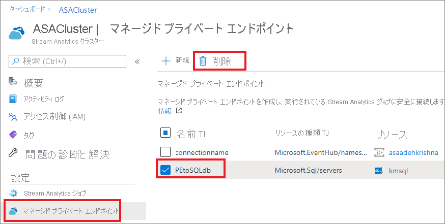

# Azure Stream Analytics クラスターでプライベート エンドポイントを作成および削除する

クラスターで実行されている Azure Stream Analytics ジョブを接続して、ファイアウォールまたは Azure Virtual Network (VNet) の内側にあるリソースの入力と出力を行うことができます。 最初に、Stream Analytics クラスター内のリソース (Azure Event Hub、Azure SQL Database など) 用のプライベート エンドポイントを作成します。 次に、入力または出力からのプライベート エンドポイント接続を承認します。

接続を承認すると、Stream Analytics クラスターで実行されているすべてのジョブが、プライベート エンドポイント経由でリソースにアクセスできるようになります。 この記事では、Stream Analytics クラスターでプライベート エンドポイントを作成および削除する方法を説明します。

## Stream Analytics クラスター内にプライベート エンドポイントを作成する

このセクションでは、Stream Analytics クラスター内にプライベート エンドポイントを作成する方法について説明します。

1. Azure portal 上で、目的の Stream Analytics クラスターを見つけて選択します。

1. **[設定]** で、 **[プライベート エンドポイント]** を選択します。

1. **[プライベート エンドポイントを追加する]** を選択し、次の情報を入力して、プライベート エンドポイント経由で安全にアクセスするリソースを選択します。

   |設定|値|
   |---|---|
   |名前|プライベート エンドポイントの名前を入力します。 この名前を取得する場合は、一意の名前を作成します。|
   |接続方法|**[マイ ディレクトリ内の Azure リソースに接続します]** を選択します。  自分のリソースの 1 つを選択し、プライベート エンドポイントを使用して安全に接続したり、共有されているリソース ID または別名を使用して、他のユーザーのリソースに接続したりすることができます。|
   |サブスクリプション|サブスクリプションを選択します。|
   |リソースの種類|[リソースにマップするリソースの種類](../private-link/private-endpoint-overview.md#private-link-resource)を選択します。|
   |リソース|プライベート エンドポイントを使用して接続するリソースを選択します。|
   |ターゲット サブリソース|プライベート エンドポイントからアクセスできるようになる、上記で選択したリソースのサブリソースの種類。|

   

1. ターゲット リソースからの接続を承認します。 たとえば、前のステップで Azure SQL Database インスタンスへのプライベート エンドポイントを作成した場合、この SQL Database インスタンスに移動し、承認される必要がある保留中の接続を確認する必要があります。 接続要求が表示されるまで、数分かかる場合があります。

    

1. Stream Analytics クラスターに戻り、数分以内に状態が **[保留中の顧客による承認]** から **[保留中の DNS セットアップ]** を経て **[セットアップの完了]** に変わることを確認できます。

## Stream Analytics クラスター内のプライベート エンドポイントを削除する

1. Azure portal 上で、目的の Stream Analytics クラスターを見つけて選択します。

1. **[設定]** で、 **[プライベート エンドポイント]** を選択します。

1. 削除するプライベート エンドポイントを選択し、 **[削除]** を選択します。

   

## 次のステップ

Azure Stream Analytics クラスターでプライベート エンドポイントを管理する方法の概要がわかりました。 次に、クラスターをスケーリングし、クラスターでジョブを実行する方法について学習できます。

* [Azure Stream Analytics クラスターのスケーリング](scale-cluster.md)
* [Stream Analytics クラスター内で Stream Analytics ジョブを管理する](manage-jobs-cluster.md)