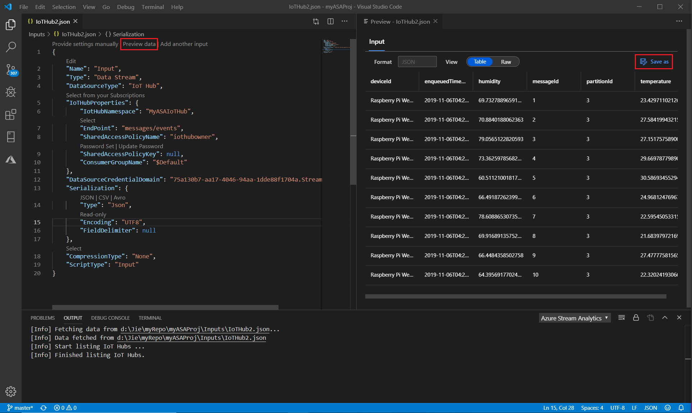

# Visual Studio Code を使用してサンプル データで Stream Analytics クエリをローカルでテストする

Visual Studio Code の Azure Stream Analytics ツールを使用して、Stream Analytics ジョブをサンプル データを使ってローカルでテストすることができます。 クエリの結果は、プロジェクトの **LocalRunOutputs** フォルダー内の JSON ファイルにあります。

## 前提条件

* [.NET Core SDK](https://dotnet.microsoft.com/download) をインストールし、Visual Studio Code を再起動します。

* この[クイックスタート](quick-create-visual-studio-code.md)を使用して、Visual Studio Code を使用して Stream Analytics ジョブを作成する方法を学習します。

## サンプル データの準備

最初に、サンプルの入力データ ファイルを準備する必要があります。 コンピューターにサンプル データ ファイルが既にある場合は、この手順をスキップして次に進むことができます。

1. 入力構成ファイルの一番上の行で **[データのプレビュー]** をクリックします。 一部の入力データが IoT Hub からフェッチされ、プレビュー ウィンドウに表示されます。 これには時間がかかる場合があります。

2. データが表示されたら、 **[名前を付けて保存]** をクリックして、ローカル ファイルにデータを保存します。

 

## ローカル入力の定義

1. Stream Analytics プロジェクトの Inputs フォルダーの **input.json** をクリックします。 次に、一番上の行で **[ローカル入力の追加]** を選択します。

    

    または、**Ctrl + Shift + P** キーを押してコマンド パレットを開き、 **[ASA: 入力の追加]** を入力します。

   

2. **[ローカル入力]** を選択します。

    

3. **[+ New Local Input]\(新規ローカル入力\)** を選択します。

    

4. クエリで使用したのと同じ入力エイリアスを入力します。

    

5. 新しく生成された **LocalInput_Input.json** ファイル内に、ローカル データ ファイルが配置されているファイル パスを入力します。

    

6. **[データのプレビュー]** を選択して入力データをプレビューします。 ご利用のデータに対するシリアル化の種類では、JSON と CSV のいずれであるかが自動的に検出されます。 セレクターを使用して、ご利用のデータを **表** または **未加工** の形式で表示します。 次の表は、**表形式** でのデータの例です。

     

    次の表は、**未加工の形式** でのデータの例です。

    

## ローカルでのクエリの実行

クエリ エディターに戻り、 **[ローカルで実行]** を選択します。 次に、ドロップダウン リストから **[ローカル入力の使用]** を選択します。

![クエリ エディターで [ローカルで実行] を選択](./media/vscode-local-run/run-locally.png)

結果が右側のウィンドウに表示されます。 **[実行]** をクリックして、もう一度テストすることができます。 **[フォルダーで開く]** を選択し、ファイル エクスプローラーで結果ファイルを表示して、他のツールでそのファイルを開くこともできます。 結果ファイルは JSON 形式でのみ使用できることに注意してください。

## 次のステップ

* [Visual Studio Code を使用してライブ入力で Azure Stream Analytics ジョブをローカルでテストする](visual-studio-code-local-run-live-input.md)

* [Visual Studio Code で使用する Azure Stream Analytics ジョブの詳細 (プレビュー)](visual-studio-code-explore-jobs.md)
