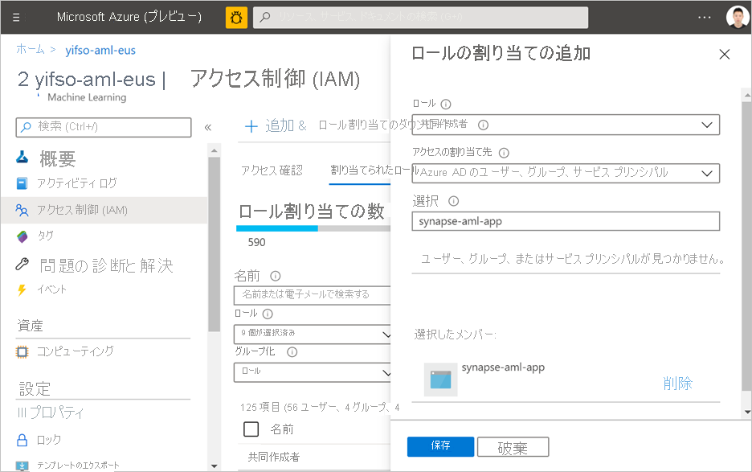

# クイック スタート:Synapse で Azure Machine Learning のリンクされたサービスを新規作成する

このクイックスタートでは、Synapse Analytics ワークスペースを Azure Machine Learning ワークスペースにリンクします。 これらのワークスペースをリンクすると、Synapse のさまざまなエクスペリエンスから Azure Machine Learning を利用できるようになります。

たとえば、Azure Machine Learning ワークスペースにリンクすると、次のようなエクスペリエンスが可能になります。

- Azure Machine Learning パイプラインを Synapse パイプラインのステップとして実行する。 詳細については、[Azure Machine Learning パイプラインの実行](/azure/data-factory/transform-data-machine-learning-service)に関する記事を参照してください。

- Azure Machine Learning モデル レジストリから機械学習モデルをコピーすることで、予測によってデータを強化し、Synapse SQL プールでモデルにスコアを付けます。 詳細については、「[チュートリアル: Synapse SQL プール向けの機械学習モデル スコアリング ウィザード](tutorial-sql-pool-model-scoring-wizard.md)」を参照してください。

## 前提条件

- Azure サブスクリプション - [無料アカウントを作成します](https://azure.microsoft.com/free/)。
- ADLS Gen2 ストレージ アカウントが既定のストレージとして構成されている [Synapse Analytics ワークスペース](../get-started-create-workspace.md)。 使用する ADLS Gen2 ファイル システムの**ストレージ BLOB データ共同作成者**である必要があります。
- [Azure Machine Learning ワークスペース](/azure/machine-learning/how-to-manage-workspace)。
- リンクされたサービスの作成に使用できるサービス プリンシパルとシークレットを作成するには、アクセス許可 (またはアクセス許可を持つユーザーからの要求) が必要です。 このサービス プリンシパルには Azure Machine Learning ワークスペースの共同作成者ロールが割り当てられている必要があることに注意してください。

## Azure portal にサインインする

[Azure ポータル](https://portal.azure.com/)

## サービス プリンシパルの作成

この手順では、新しいサービス プリンシパルを作成します。 既存のサービス プリンシパルを使用する場合は、次の手順をスキップできます。
1. Azure portal を開きます。 

1. **[Azure Active Directory]**  ->  **[アプリの登録]** に移動します。

1. **[新規登録]** をクリックします。 次に、UI の指示に従って、新しいアプリケーションを登録します。

1. アプリケーションが登録された後、 アプリケーションのシークレットを生成します。 **[アプリケーション]**  ->  **[証明書およびシークレット]** の順に移動します。 **[クライアント シークレットを追加]** をクリックして、シークレットを生成します。 シークレットは安全に保管してください。これは後で使用します。

   

1. アプリケーション用にサービス プリンシパルを作成します。 **[アプリケーション]**  ->  **[該当]** の順に移動し、 **[サービス プリンシパルの作成]** をクリックします。 場合によっては、このサービス プリンシパルは自動的に作成されます。

   

1. サービス プリンシパルを Azure Machine Learning ワークスペースの "共同作成者" として追加します。 これは、Azure Machine Learning ワークスペースが属しているリソース グループの所有者である必要があることに注意してください。

   

## リンクされたサービスを作成する

1. 新しい Azure Machine Learning のリンクされたサービスを作成する Synapse ワークスペースで、 **[管理]**  ->  **[リンクされたサービス]** に移動し、タイプを "Azure Machine Learning" として新しいリンクされたサービスを作成します。

   

2. 以下をフォームに入力します。

   - サービス プリンシパル ID: これはアプリケーションの**アプリケーション (クライアント) ID** です。
  
     > [!NOTE]
     > アプリケーションの名前ではありません。 この ID は、アプリケーションの ID の概要ページで確認できます。 これは、"81707eac-ab38-406u-8f6c-10ce76a568d5" のような長い文字列になります。

   - サービス プリンシパルのキー: 前のセクションで生成したシークレットです。

3. **[接続のテスト]** をクリックして、構成が正しいかどうかを確認します。 接続テストが成功した場合は、 **[保存]** をクリックします。

   接続テストが失敗した場合は、サービス プリンシパル ID とシークレットが正しいことを確認してから、もう一度やり直してください。

## 次の手順

- [チュートリアル: 機械学習モデル スコアリング ウィザード - SQL プール](tutorial-sql-pool-model-scoring-wizard.md)
- [Azure Synapse Analytics の Machine Learning 機能 (ワークスペース プレビュー)](what-is-machine-learning.md)
