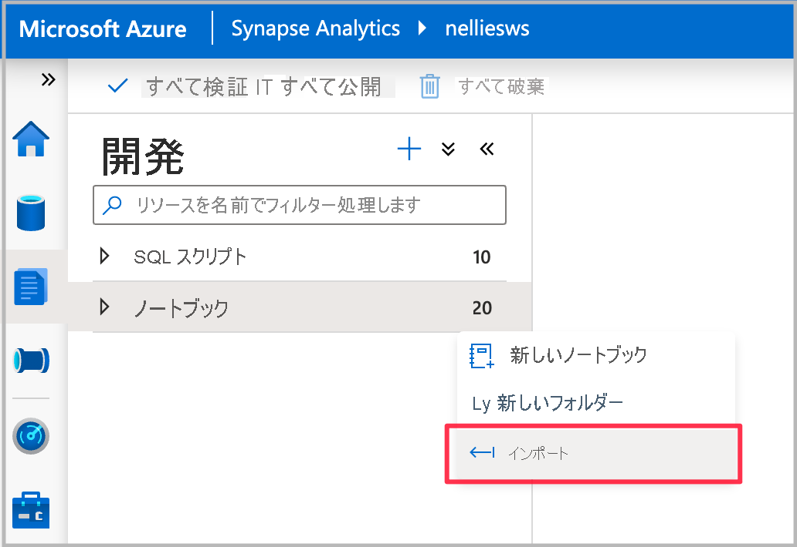
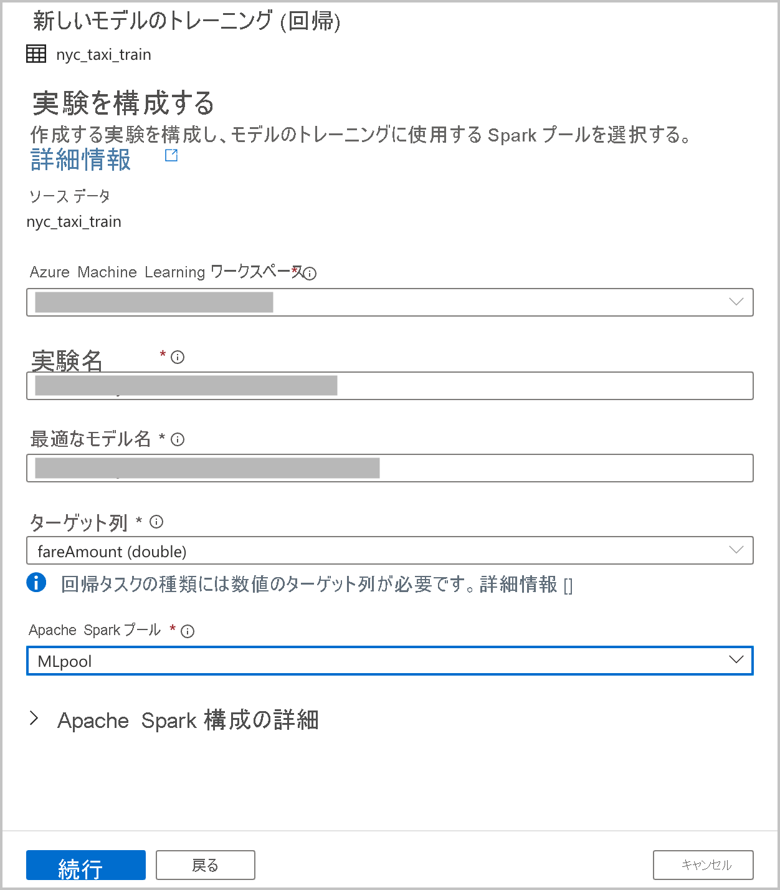

# チュートリアル:AutoML を使用した Azure Synapse でのコード不要の機械学習モデル トレーニング (プレビュー)

[Azure Machine Learning の AutoML](https://docs.microsoft.com/azure/machine-learning/concept-automated-ml) を使用してトレーニングする新しい機械学習モデルを使って、Spark テーブルのデータを簡単にエンリッチする方法について説明します。  Synapse のユーザーは、Azure Synapse ワークスペースで Spark テーブルを選択するだけで、コード不要のエクスペリエンスで機械学習モデルを構築するためのトレーニング データセットとして使用できます。

このチュートリアルでは、次の方法について説明します。

> [!div class="checklist"]
> - Azure ML の自動 ML が使用される Azure Synapse Studio でのコード不要のエクスペリエンスを使って、機械学習モデルをトレーニングします。 トレーニングするモデルの種類は、解決しようとしている問題によって異なります。

Azure サブスクリプションをお持ちでない場合は、[開始する前に無料アカウントを作成](https://azure.microsoft.com/free/)してください。

## 前提条件

- ADLS Gen2 ストレージ アカウントが既定のストレージとして構成されている [Synapse Analytics ワークスペース](../get-started-create-workspace.md)。 使用する ADLS Gen2 ファイル システムの **ストレージ BLOB データ共同作成者** である必要があります。
- Azure Synapse Analytics ワークスペースの Spark プール。 詳細については、[Azure Synapse での Spark プールの作成](../quickstart-create-sql-pool-studio.md)に関する記事を参照してください。
- Azure Synapse Analytics ワークスペースの Azure Machine Learning のリンクされたサービス。 詳細については、[Azure Synapse での Azure Machine Learning のリンクされたサービスの作成](quickstart-integrate-azure-machine-learning.md)に関する記事を参照してください。

## Azure portal にサインインする

[Azure ポータル](https://portal.azure.com/)

## トレーニング データセットの Spark テーブルを作成する

このチュートリアルには Spark テーブルが必要です。 次のノートブックで Spark テーブルが作成されます。

1. ノートブック [Create-Spark-Table-NYCTaxi- Data.ipynb](https://go.microsoft.com/fwlink/?linkid=2149229) をダウンロードします。

1. ノートブックを Azure Synapse Studio にインポートします。

1. 使用したい Spark プールを選択し、`Run all` をクリックします。 このノートブックを実行すると、開いているデータセットからニューヨークのタクシー データが取得され、既定の Spark データベースに保存されます。
![[すべて実行]](media/tutorial-automl-wizard/tutorial-automl-wizard-00b.png)

1. ノートブックの実行が完了すると、既定の Spark データベースの下に新しい Spark テーブルが作成されます。 データ ハブに移動し、`nyc_taxi` という名前のテーブルを見つけます。

## AutoML ウィザードを起動してモデルをトレーニングする

前の手順で作成した Spark テーブルを右クリックします。 [Machine Learning]、[Enrich with new model]\(新しいモデルを使用してエンリッチ\) の順に選択してウィザードを開きます。

構成パネルが表示され、Azure Machine Learning で AutoML 実験実行を作成するための構成の詳細を入力するよう求められます。 この実行により、複数のモデルがトレーニングされます。実行が成功すると、最適なモデルが Azure ML モデル レジストリに登録されます。

- **Azure ML ワークスペース**: AutoML 実験実行を作成するには、Azure ML ワークスペースが必要です。 また、[リンクされたサービス](quickstart-integrate-azure-machine-learning.md)を使用して、Azure Synapse ワークスペースを Azure ML ワークスペースにリンクする必要があります。 すべての前提条件を満たしたら、この AutoML 実行に使用する Azure ML ワークスペースを指定できます。

- **実験名**: 実験名を指定します。 AutoML 実行を送信するときは、実験名を指定します。 実行に関する情報は、Azure ML ワークスペースでその実験に保存されます。 このエクスペリエンスでは、新しい実験が既定で作成され、提案された名前が生成されますが、既存の実験の名前を指定することもできます。

- **最適なモデル**: AutoML 実行での最適なモデルの名前を指定します。 最適なモデルにはこの名前が付けられ、この実行の後に、Azure ML モデル レジストリに自動的に保存されます。 1 つの AutoML 実行で多数の機械学習モデルが作成されます。 後の手順で選択する主要メトリックに基づいて、それらのモデルを比較し、最適なモデルを選択できます。

- **Target column\(ターゲット列\)** : モデルをトレーニングする際の予測対象です。 予測する列を選択します。

- **Spark プール**: AutoML 実験実行に使用する Spark プール。 指定したプールで計算が実行されます。

- **Spark configuration details\(Spark 構成の詳細\)** : Spark プールに加えて、セッション構成の詳細を指定するオプションもあります。

このチュートリアルでは、ターゲット列として数値列の `fareAmount` を選択します。

[続行] をクリックします。

## タスクの種類を選択する

答えようとしている質問に基づいて、実験の機械学習モデルの種類を選択します。 ターゲット列として `fareAmount` を選択しました。これは数値であるため、 *[回帰]* を選択します。

[続行] をクリックして追加設定を構成します。

## 追加の構成

種類として *[分類]* または *[回帰]* を選択した場合、追加の構成は次のとおりです。

- **Primary metric\(主要メトリック\)** : モデルのパフォーマンスの測定に使用されるメトリック。 これは、AutoML 実行で作成されたさまざまなモデルを比較し、パフォーマンスが最も高いモデルを特定するために使用されるメトリックです。

- **トレーニング ジョブ時間 (時間単位)** :実験でモデルを実行してトレーニングするときの最大時間 (時間単位)。 1 未満の値を指定することもできます。 たとえば、「 `0.5` 」のように指定します。

- **コンカレント イテレーションの最大数**:並列で実行されるイテレーションの最大数を表します。

- **ONNX model compatibility\(ONNX モデルの互換性\)** : 有効にすると、AutoML によってトレーニングされたモデルが ONNX 形式に変換されます。 これは、モデルを Azure Synapse SQL プールでのスコアリングに使用する場合に特に関連します。

これらの設定にはすべて、カスタマイズできる既定値があります。

> [時系列予測] を選択した場合は、さらに多くの構成が必要になることに注意してください。 また、予測では、ONNX モデルの互換性はサポートされていません。

必須の構成がすべて完了したら、AutoML 実行を開始できます。

Azure Synapse で AutoML 実行を開始する方法は 2 つあります。 コード不要のエクスペリエンスの場合、 **[Create run]\(実行の作成\)** を直接選択できます。 コードを使用する場合は、 **[Open in notebook]\(ノートブックで開く\)** を選択できます。これにより、実行を作成するコードを確認し、ノートブックを実行できます。

### 実行を直接作成する

AutoML 実行を直接開始するには、[Start Run]\(実行の開始\) をクリックします。 AutoML 実行が開始されることを示す通知が表示されます。

AutoML 実行が正常に開始されたら、別の成功通知が表示されます。 通知ボタンをクリックして、実行の送信の状態を確認することもできます。
成功通知内のリンクをクリックして Azure ML に表示します。

### ノートブックを使用して実行を作成する

*[Open In Notebook]\(ノートブックで開く\)* を選択してノートブックを生成します。 *[すべて実行]* をクリックして、ノートブックを実行します。
これにより、AutoML 実行に設定を追加する機会も得られます。

ノートブックからの実行が正常に送信されたら、ノートブックの出力に、Azure ML ワークスペースでの実験実行へのリンクが表示されます。 このリンクをクリックすると、Azure ML で AutoML 実行を監視できます。
![ノートブックの [すべて実行]](media/tutorial-automl-wizard/tutorial-automl-wizard-configure-run-00f.png)

## 次の手順

- [チュートリアル: Azure Synapse 専用 SQL プールでの機械学習モデルのスコアリング](tutorial-sql-pool-model-scoring-wizard.md)
- [クイック スタート: Azure Synapse で Azure Machine Learning のリンクされたサービスを新規作成する](quickstart-integrate-azure-machine-learning.md)
- [Azure Synapse Analytics の機械学習機能](what-is-machine-learning.md)