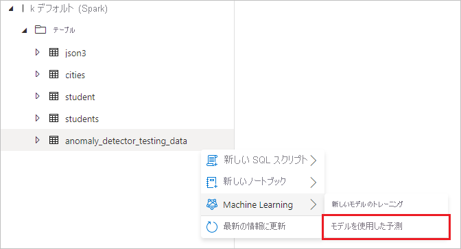
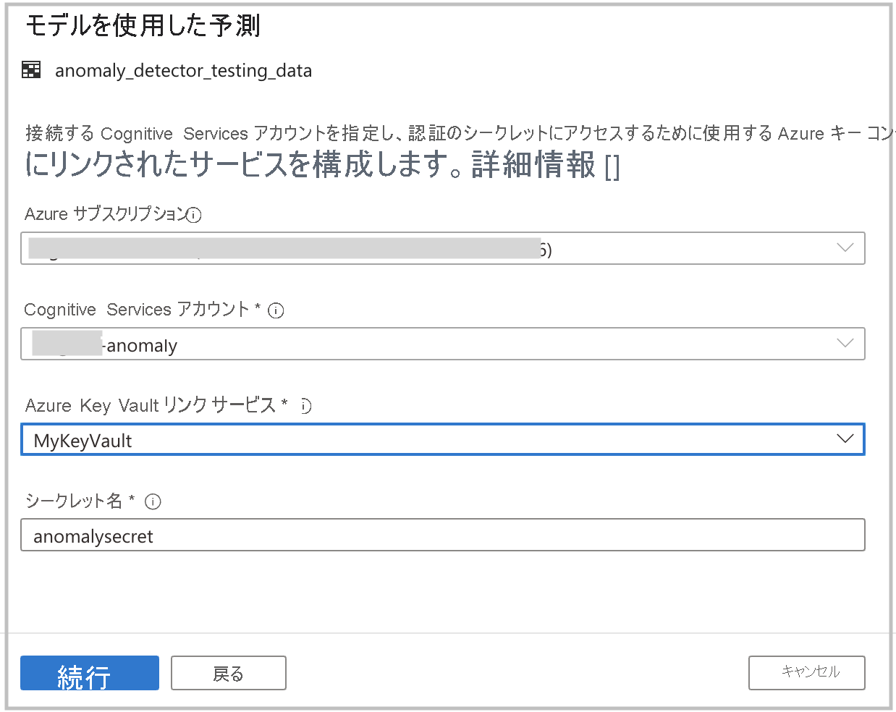

# チュートリアル:Cognitive Services を使用した異常検出 (プレビュー)

このチュートリアルでは、[Cognitive Services](https://go.microsoft.com/fwlink/?linkid=2147492) を使用して Azure Synapse でデータを簡単に強化する方法について学習します。 [Anomaly Detector](https://go.microsoft.com/fwlink/?linkid=2147493) を使用して異常検出を実行します。 Azure Synapse のユーザーは、異常を検出するために強化するテーブルを選択するだけです。

このチュートリアルの内容:

> [!div class="checklist"]
> - 時系列データを含む Spark テーブル データセットを取得するための手順。
> - Azure Synapse のウィザード エクスペリエンスを使用して、Anomaly Detector コグニティブ サービスを使用してデータを強化します。

Azure サブスクリプションをお持ちでない場合は、[開始する前に無料アカウントを作成](https://azure.microsoft.com/free/)してください。

## 前提条件

- ADLS Gen2 ストレージ アカウントが既定のストレージとして構成されている [Azure Synapse Analytics ワークスペース](../get-started-create-workspace.md)。 使用する ADLS Gen2 ファイル システムの **ストレージ BLOB データ共同作成者** である必要があります。
- Azure Synapse Analytics ワークスペースの Spark プール。 詳細については、[Azure Synapse での Spark プールの作成](../quickstart-create-sql-pool-studio.md)に関する記事を参照してください。
- このチュートリアルを使用する前に、次のチュートリアルで説明されている事前構成手順を完了している必要もあります ([Azure Synapse での Cognitive Services の構成](tutorial-configure-cognitive-services-synapse.md))。

## Azure portal にサインインする

[Azure ポータル](https://portal.azure.com/)

## Spark テーブルを作成する

このチュートリアルには Spark テーブルが必要です。

1. Spark テーブルを生成するコードを含むノートブック ファイル ([prepare_anomaly_detector_data.ipynb](https://go.microsoft.com/fwlink/?linkid=2149577)) をダウンロードします。

1. このファイルをご利用の Azure Synapse ワークスペースにアップロードします。

1. ノートブック ファイルを開き、セルを **すべて実行** することを選択します。

1. **anomaly_detector_testing_data** という名前の Spark テーブルが既定の Spark データベースに表示されます。

## Cognitive Services ウィザードを起動する

1. 前の手順で作成した Spark テーブルを右クリックします。 [Machine Learning]\(機械学習\) -> [Enrich with existing model]\(既存のモデルを使用して強化\) を選択してウィザードを開きます。

2. 構成パネルが表示され、Cognitive Services モデルを選択するように求められます。 [Anomaly Detector] を選択します。

## 認証の詳細を指定する

Cognitive Services に対して認証するには、ご利用のキー コンテナーで使用するシークレットを参照する必要があります。 以下の入力は、この手順の前に完了しておく必要がある[前提条件の手順](tutorial-configure-cognitive-services-synapse.md)によって異なります。

- **Azure サブスクリプション**: ご利用のキー コンテナーが属する Azure サブスクリプションを選択します。
- **[Cognitive Services アカウント]** : これは、接続先の Text Analytics リソースです。
- **[Azure Key Vault Linked Service]\(Azure Key Vault のリンクされたサービス\)** : 前提条件の手順の中で、ご利用の Text Analytics リソースへのリンクされたサービスを作成しました。 それをここで選択してください。
- **[シークレット名]** : これは、ご利用の Cognitive Services リソースに対して認証するためのキーを含む、キー コンテナー内のシークレットの名前です。

## 異常検出を構成する

次に、異常検出を構成する必要があります。 以下の詳細を指定してください。

- 細分性: データがサンプリングされる速度。 たとえば、1 分ごとの値がデータに含まれている場合は、[minutely]\(1 分ごと\) の細分性を使用します。 **[monthly]\(月単位\)** を選択します 

- タイムスタンプ:系列の時間を表す列。 **timestamp** 列を選択します

- 時系列値: Timestamp 列で指定された時刻における系列の値を表す列。 **value** 列を選択します

- グループ: 系列をグループ化する列。 つまり、この列に同じ値を含むすべての行は 1 つの時系列を形成します。 **group** 列を選択します

終了したら、 **[Open Notebook]\(ノートブックを開く\)** を選択します。 すると、Azure Cognitive Services を使用して異常検出を実行する PySpark コードを含むノートブックが生成されます。

## ノートブックを開いて実行する

先ほど開いたノートブックでは、[mmlspark ライブラリ](https://github.com/Azure/mmlspark)を使用して Cognitive Services に接続します。

指定した Azure Key Vault の詳細を使用すると、このエクスペリエンスからシークレットを安全に参照できます。シークレットが公開されることはありません。

これで、セルを **すべて実行** して、異常検出を実行できます。 [Cognitive Services - Anomaly Detector](https://go.microsoft.com/fwlink/?linkid=2147493) の詳細を確認してください。

## 次の手順

- [チュートリアル: Azure Cognitive Services を使用した感情分析](tutorial-cognitive-services-sentiment.md)
- [チュートリアル: Azure Synapse 専用 SQL プールでの機械学習モデルのスコアリング](tutorial-sql-pool-model-scoring-wizard.md)
- [Azure Synapse Analytics の機械学習機能](what-is-machine-learning.md)