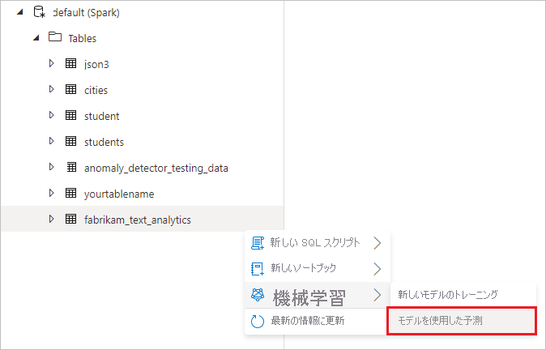

# <a name="tutorial-sentiment-analysis-with-cognitive-services-preview"></a>チュートリアル:Cognitive Services を使用した感情分析 (プレビュー)

このチュートリアルでは、[Cognitive Services](https://go.microsoft.com/fwlink/?linkid=2147492) を使用して Azure Synapse でデータを簡単に強化する方法について学習します。 感情分析を実行するにあたり、[Text Analytics](https://docs.microsoft.com/azure/cognitive-services/text-analytics/) の機能を使用します。 Azure Synapse のユーザーは、センチメントを使用して強化するテキスト列を含むテーブルを選択するだけで済みます。 これらのセンチメントは [positive]\(ポジティブ\)、[negative]\(ネガティブ\)、[mixed]\(混合\)、[neutral]\(ニュートラル\) のいずれかとな、確率も返されます。

このチュートリアルの内容:

> [!div class="checklist"]
> - 感情分析用のテキスト列を含む Spark テーブル データセットを取得するための手順。
> - Azure Synapse のウィザード エクスペリエンスを使用し、Text Analytics Cognitive Services を使ってデータを強化します。

Azure サブスクリプションをお持ちでない場合は、[開始する前に無料アカウントを作成](https://azure.microsoft.com/free/)してください。

## <a name="prerequisites"></a>前提条件

- ADLS Gen2 ストレージ アカウントが既定のストレージとして構成されている [Azure Synapse Analytics ワークスペース](../get-started-create-workspace.md)。 使用する ADLS Gen2 ファイル システムの **ストレージ BLOB データ共同作成者** である必要があります。
- Azure Synapse Analytics ワークスペースの Spark プール。 詳細については、[Azure Synapse での Spark プールの作成](../quickstart-create-sql-pool-studio.md)に関する記事を参照してください。
- このチュートリアルを使用する前に、次のチュートリアルで説明されている事前構成手順を完了している必要もあります ([Azure Synapse での Cognitive Services の構成](tutorial-configure-cognitive-services-synapse.md))。

## <a name="sign-in-to-the-azure-portal"></a>Azure portal にサインインする

[Azure ポータル](https://portal.azure.com/)

## <a name="create-a-spark-table"></a>Spark テーブルを作成する

このチュートリアルには Spark テーブルが必要です。

1. テキスト分析用のデータセットを含む次の CSV ファイルをダウンロードします: [FabrikamComments.csv](https://github.com/Kaiqb/KaiqbRepo0731190208/blob/master/CognitiveServices/TextAnalytics/FabrikamComments.csv)

1. このファイルを自分の Azure Synapse ADLSGen2 ストレージ アカウントにアップロードします。


1. .csv ファイルから Spark テーブルを作成します。そのためには、ファイルを右クリックし、 **[新しいノートブック] -> [Spark テーブルの作成]** を選択します。


1. コード セルでテーブルに名前を付け、Spark プールでノートブックを実行します。 必ず "header = True" を設定してください。


```python
%%pyspark
df = spark.read.load('abfss://default@azuresynapsesa.dfs.core.windows.net/data/FabrikamComments.csv', format='csv'
## If header exists uncomment line below
, header=True
)
df.write.mode("overwrite").saveAsTable("default.YourTableName")
```

## <a name="launch-cognitive-services-wizard"></a>Cognitive Services ウィザードを起動する

1. 前の手順で作成した Spark テーブルを右クリックします。 [Machine Learning]\(機械学習\) -> [Enrich with existing model]\(既存のモデルを使用して強化\) を選択してウィザードを開きます。


2. 構成パネルが表示され、Cognitive Services モデルを選択するように求められます。 [Text analytics - Sentiment Analysis]\(テキスト分析 - 感情分析\) を選択します。


## <a name="provide-authentication-details"></a>認証の詳細を指定する

Cognitive Services に対して認証するには、ご利用のキー コンテナーで使用するシークレットを参照する必要があります。 以下の入力は、この手順の前に完了しておく必要がある[前提条件の手順](tutorial-configure-cognitive-services-synapse.md)によって異なります。

- **Azure サブスクリプション**: ご利用のキー コンテナーが属する Azure サブスクリプションを選択します。
- **[Cognitive Services アカウント]** : これは、接続先の Text Analytics リソースです。
- **[Azure Key Vault Linked Service]\(Azure Key Vault のリンクされたサービス\)** : 前提条件の手順の中で、ご利用の Text Analytics リソースへのリンクされたサービスを作成しました。 それをここで選択してください。
- **[シークレット名]** : これは、ご利用の Cognitive Services リソースに対して認証するためのキーを含む、キー コンテナー内のシークレットの名前です。


## <a name="configure-sentiment-analysis"></a>感情分析を構成する

次に、感情分析を構成する必要があります。 次の詳細を選択してください。
- **言語**: 感情分析の実行対象となるテキストの言語を選択します。 **[EN]** を選択します。
- **[テキスト列]** : これは、センチメントを判断するために分析するデータセット内のテキスト列です。 **comment** テーブル列を選択します。

終了したら、 **[Open Notebook]\(ノートブックを開く\)** をクリックします。 すると、Azure Cognitive Services を使用して感情分析を実行する PySpark コードを含むノートブックが自動的に生成されます。


## <a name="open-notebook-and-run"></a>ノートブックを開いて実行する

先ほど開いたノートブックでは、[mmlspark ライブラリ](https://github.com/Azure/mmlspark)を使用して Cognitive Services に接続します。

指定した Azure Key Vault の詳細を使用すると、このエクスペリエンスからシークレットを安全に参照できます。シークレットが公開されることはありません。

これで、セルを **すべて実行** し、センチメントを使用してデータを強化できます。 センチメントは [Positive]\(ポジティブ\)、[Negative]\(ネガティブ\)、[Neutral]\(ニュートラル\)、または [Mixed]\(混合\) として返され、センチメントごとの確率も取得されます。 [Cognitive Services - 感情分析](https://go.microsoft.com/fwlink/?linkid=2147792)の詳細を確認してください。


## <a name="next-steps"></a>次の手順
- [チュートリアル: Azure Cognitive Services を使用した異常検出](tutorial-cognitive-services-sentiment.md)
- [チュートリアル: Azure Synapse 専用 SQL プールでの機械学習モデルのスコアリング](tutorial-sql-pool-model-scoring-wizard.md)
- [Azure Synapse Analytics の機械学習機能](what-is-machine-learning.md)