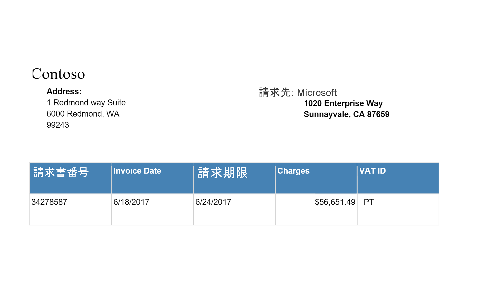

# <a name="tutorial-form-recognizer-with-applied-ai-service"></a>チュートリアル: Applied AI Services での Form Recognizer

[Azure Form Recognizer](../../applied-ai-services/index.yml) は、機械学習テクノロジを利用して自動データ処理アプリケーションを構築することができる [Azure Applied AI Services](../../applied-ai-services/form-recognizer/index.yml) です。 このチュートリアルでは、Azure Synapse Analytics でデータを簡単に強化する方法について説明します。 フォームとドキュメントを分析したり、テキストとデータを抽出したり、構造化された JSON 出力を返したりするために、[Form Recognizer](../../applied-ai-services/form-recognizer/index.yml) を使用します。 過剰な手動操作を行うことなく、広範なデータ サイエンスに関する専門知識なしで、特定のコンテンツに合わせた正確な結果をすばやく得られます。 

このチュートリアルでは、[MMLSpark](https://github.com/Azure/mmlspark) で Form Recognizer を使用して次の処理を行う方法について説明します。

> [!div class="checklist"]
> - 指定したドキュメントからテキストとレイアウトを抽出する
> - 配信確認メッセージからデータを検出して抽出する
> - 名刺からデータを検出して抽出する
> - 請求書からデータを検出して抽出する
> - 身分証明書からデータを検出して抽出する


Azure サブスクリプションをお持ちでない場合は、[開始する前に無料アカウントを作成](https://azure.microsoft.com/free/)してください。


## <a name="prerequisites"></a>前提条件

- Azure Data Lake Storage Gen2 ストレージ アカウントが既定のストレージとして構成されている [Azure Synapse Analytics ワークスペース](../get-started-create-workspace.md)。 使用する Data Lake Storage Gen2 ファイル システムの "*Storage Blob データ共同作成者*" である必要があります。
- Azure Synapse Analytics ワークスペースの Spark プール。 詳細については、[Azure Synapse での Spark プールの作成](../quickstart-create-sql-pool-studio.md)に関する記事を参照してください。
- [Azure Synapse での Cognitive Services の構成](tutorial-configure-cognitive-services-synapse.md)に関するチュートリアルで説明されている事前構成手順。


## <a name="get-started"></a>開始
Synapse Studio を開き、新しいノートブックを作成します。 はじめに、[MMLSpark](https://github.com/Azure/mmlspark) をインポートします。 

```python
import mmlspark
from mmlspark.cognitive import *
```

## <a name="configure-form-recognizer"></a>From Recognizer の構成 

[構成前の手順](tutorial-configure-cognitive-services-synapse.md)で構成した、リンクされた From Recognizer を使用します。 

```python
cognitive_service_name = "<Your linked service for form recognizer>"
```


## <a name="analyze-layout"></a>レイアウトを分析する

指定したドキュメントからテキストとレイアウトの情報を抽出します。 入力ドキュメントは、サポートされているコンテンツの種類のいずれかである必要があります - "application/pdf"、"image/jpeg"、"image/png"、または "image/tiff"。

### <a name="example-input"></a>入力の例


```python
from pyspark.sql.functions import col, flatten, regexp_replace, explode, create_map, lit

imageDf = spark.createDataFrame([
  ("<replace with your file path>/layout.jpg",)
], ["source",])

analyzeLayout = (AnalyzeLayout()
                 .setLinkedService(cognitive_service_name)
                 .setImageUrlCol("source")
                 .setOutputCol("layout")
                 .setConcurrency(5))


display(analyzeLayout
        .transform(imageDf)
        .withColumn("lines", flatten(col("layout.analyzeResult.readResults.lines")))
        .withColumn("readLayout", col("lines.text"))
        .withColumn("tables", flatten(col("layout.analyzeResult.pageResults.tables")))
        .withColumn("cells", flatten(col("tables.cells")))
        .withColumn("pageLayout", col("cells.text"))
        .select("source", "readLayout", "pageLayout"))
```

### <a name="expected-results"></a>予想される結果


## <a name="analyze-receipts"></a>領収書の分析

光学式文字認識 (OCR) と領収書モデルを使用して領収書からデータを検出して抽出します。これらを使用すると、業者名、業者の電話番号、取引日、取引合計など、領収書から構造化データを簡単に抽出できます。

### <a name="example-input"></a>入力の例


```python
imageDf2 = spark.createDataFrame([
  ("<replace with your file path>/receipt1.png",)
], ["image",])

analyzeReceipts = (AnalyzeReceipts()
                 .setLinkedService(cognitive_service_name)
                 .setImageUrlCol("image")
                 .setOutputCol("parsed_document")
                 .setConcurrency(5))


results = analyzeReceipts.transform(imageDf2).cache()
display(results.select("image", "parsed_document"))
```

### <a name="expected-results"></a>予想される結果


## <a name="analyze-business-cards"></a>名刺を分析する
光学式文字認識 (OCR) と名刺モデルを使用して名刺からデータを検出して抽出します。これらを使用すると、連絡先の名前、会社名、電話番号、電子メールなど、名刺から構造化データを簡単に抽出できます。
### <a name="example-input"></a>入力の例


```python
imageDf3 = spark.createDataFrame([
  ("<replace with your file path>/business_card.jpg",)
], ["source",])

analyzeBusinessCards = (AnalyzeBusinessCards()
                 .setLinkedService(cognitive_service_name)
                 .setImageUrlCol("source")
                 .setOutputCol("businessCards")
                 .setConcurrency(5))

display(analyzeBusinessCards
        .transform(imageDf3)
        .withColumn("documents", explode(col("businessCards.analyzeResult.documentResults.fields")))
        .select("source", "documents"))
```

### <a name="expected-results"></a>予想される結果


## <a name="analyze-invoices"></a>請求書を分析する
光学式文字認識 (OCR) と請求書を解釈するディープ ラーニング モデルを使用して、請求書からデータを検出して抽出します。これらを使用すると、顧客、ベンダー、請求書 ID、請求書の期限、合計、請求金額の期限、税額、出荷先、請求先、明細項目など、請求書から構造化データを簡単に抽出できます。
### <a name="example-input"></a>入力の例

```python
imageDf4 = spark.createDataFrame([
  ("<replace with your file path>/invoice.png",)
], ["source",])

analyzeInvoices = (AnalyzeInvoices()
                 .setLinkedService(cognitive_service_name)
                 .setImageUrlCol("source")
                 .setOutputCol("invoices")
                 .setConcurrency(5))

display(analyzeInvoices
        .transform(imageDf4)
        .withColumn("documents", explode(col("invoices.analyzeResult.documentResults.fields")))
        .select("source", "documents"))
```
### <a name="expected-results"></a>予想される結果


## <a name="analyze-id-documents"></a>身分証明書を分析する
光学式文字認識 (OCR) と身分証明書モデルを使用して識別ドキュメントからデータを検出して抽出します。これらを使用すると、姓、名、生年月日、ドキュメント番号など、身分証明書から構造化データを簡単に抽出できます。
### <a name="example-input"></a>入力の例


```python
imageDf5 = spark.createDataFrame([
  ("<replace with your file path>/id.jpg",)
], ["source",])

analyzeIDDocuments = (AnalyzeIDDocuments()
                 .setLinkedService(cognitive_service_name)
                 .setImageUrlCol("source")
                 .setOutputCol("ids")
                 .setConcurrency(5))

display(analyzeIDDocuments
        .transform(imageDf5)
        .withColumn("documents", explode(col("ids.analyzeResult.documentResults.fields")))
        .select("source", "documents"))

```
### <a name="expected-results"></a>予想される結果


## <a name="clean-up-resources"></a>リソースをクリーンアップする
Spark インスタンスがシャットダウンされるようにするには、接続されているセッション (ノートブック) を終了します。 プールは、Apache Spark プールに指定されている **アイドル時間** に達したときにシャットダウンされます。 また、ノートブックの右上にあるステータス バーから **[セッションの停止]** を選択することもできます。

![ステータス バーの [セッションの停止] ボタンを示すスクリーンショット。](./media/tutorial-build-applications-use-mmlspark/stop-session.png)

## <a name="next-steps"></a>次のステップ

* [カスタム Form Recognizer モデルをトレーニングする](../../applied-ai-services/form-recognizer/label-tool.md)
* [Synapse サンプル ノートブックをチェックアウトする](https://github.com/Azure-Samples/Synapse/tree/main/MachineLearning) 
* [MMLSpark GitHub リポジトリ](https://github.com/Azure/mmlspark)
