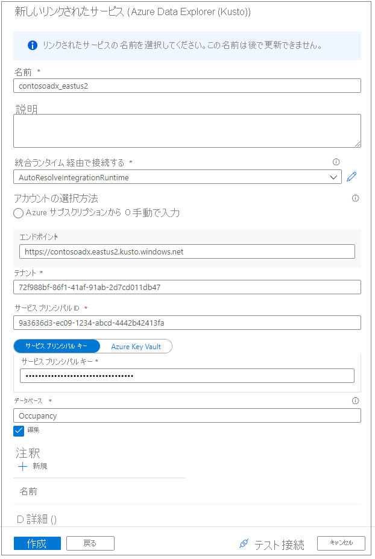
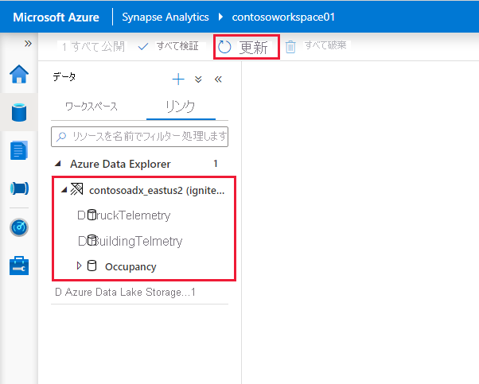
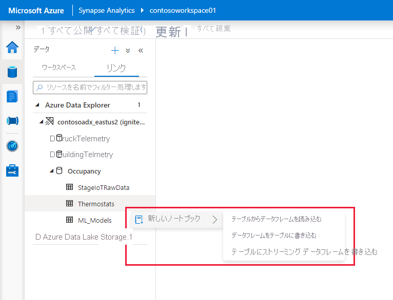

# Synapse Apache Spark を使用して Azure Data Explorer に接続する

この記事では、Synapse Apache Spark を使用して、Synapse Studio から Azure Data Explorer データベースにアクセスする方法について説明します。 

## 前提条件

* [Azure Data Explorer クラスターとデータベースを作成します](/azure/data-explorer/create-cluster-database-portal)。
* 既存の Synapse ワークスペース。または、こちらの[クイックスタート](./quickstart-create-workspace.md)に従って新しいワークスペースを作成します 
* 既存の Synapse Apache Spark プール。または、こちらの[クイックスタート](./quickstart-create-apache-spark-pool-portal.md)に従って新しいプールを作成します。
* [Azure AD アプリをプロビジョニングすることによって、Azure AD アプリを作成します。](/azure/data-explorer/kusto/management/access-control/how-to-provision-aad-app)
* 「[Azure Data Explorer のデータベース アクセス許可を管理する](/azure/data-explorer/manage-database-permissions)」に従って、データベースへのアクセスを Azure AD アプリに許可します。

## Synapse Studio に移動する

Synapse ワークスペースから、 **[Synapse Studio の起動]** を選択します。 Synapse Studio のホーム ページで、 **[データ]** を選択します。これにより、**データ オブジェクト エクスプローラー**に移動します。

## Azure Data Explorer データベースを Synapse ワークスペースに接続する

Azure Data Explorer データベースをワークスペースに接続するには、リンクされたサービスを使用します。 Azure Data Explore のリンクされたサービスを使用すると、ユーザーは、Apache Spark for Azure Synapse Analytics からデータを参照して探索したり、読み書きしたりできます。また、統合ジョブをパイプラインで実行することもできます。

データ オブジェクト エクスプローラーから Azure Data Explorer クラスターに直接接続するには、次の手順に従います。

1. [データ] の近くにある **+** アイコンを選択します
2. 外部データへの **[接続]** を選択します
3. **[Azure Data Explorer (Kusto)]** を選択します
5. **[続行]** を選択します
6. リンクされたサービスに名前を付けます。 この名前は、オブジェクト エクスプローラーに表示され、データベースに接続するために Synapse ランタイムによって使用されます。 フレンドリ名を使用することをお勧めします
7. ご利用のサブスクリプションから Azure Data Explorer クラスターを選択するか、URI を入力します。
8. [サービス プリンシパル ID] と [サービス プリンシパル キー] を入力します (このサービス プリンシパルには、読み取り操作用にデータベースに対する表示アクセス権と、データの取り込み用にインジェスターのアクセス権があることを確認します)
9. Azure Data Explorer データベースの名前を入力します
10. **[Test connection]\(テスト接続\)** をクリックして、適切なアクセス許可があることを確認します
11. **[作成]**

    

    > [!NOTE]
    > (省略可) テスト接続では、書き込みアクセス権が確認されません。Azure Data Explorer データベースに対する書き込みアクセス権がサービス プリンシパル ID にあることを確認してください。

12. **[Linked]\(リンク済み\)** タブの [Azure Data Explorer] セクションに、Azure Data Explorer のクラスターとデータベースが表示されます。 

    

    > [!NOTE] 
    > 最新のリリースでは、Azure Data Explorer データベースに対する AAD アカウントのアクセス許可に基づいて、データベース オブジェクトの内容が設定されます。 Apache Spark ノートブックや統合ジョブを実行すると、リンク サービスにおける資格情報 (サービス プリンシパル) が使用されます。

## コード生成アクションをすばやく操作する

* データベースまたはテーブルを右クリックすると、サンプル Spark ノートブックをトリガーするジェスチャーのリストが表示されます。これらのジェスチャーを使用して、Azure Data Explorer との間でデータの読み取り、データの書き込み、データのストリーム配信を行うことができます。 
    

* 次に、データ読み取りの例を示します。 ノートブックを Spark プールにアタッチし、 セルを実行します

   > [!NOTE] 
   > 初回実行時は、Spark セッションが開始されるまで 3 分以上かかる場合があります。 2 回目以降の実行時間は大幅に短縮されます。  

## 制限事項
Azure Synapse マネージド VNET では現在、Azure Data Explorer コネクタがサポートされません。

## 次のステップ

* [高度なオプションを使用したサンプル コード](https://github.com/Azure/azure-kusto-spark/blob/master/samples/src/main/python/SynapseSample.py)
* [Azure Data Explorer (Kusto) Spark コネクタ](https://github.com/Azure/azure-kusto-spark)