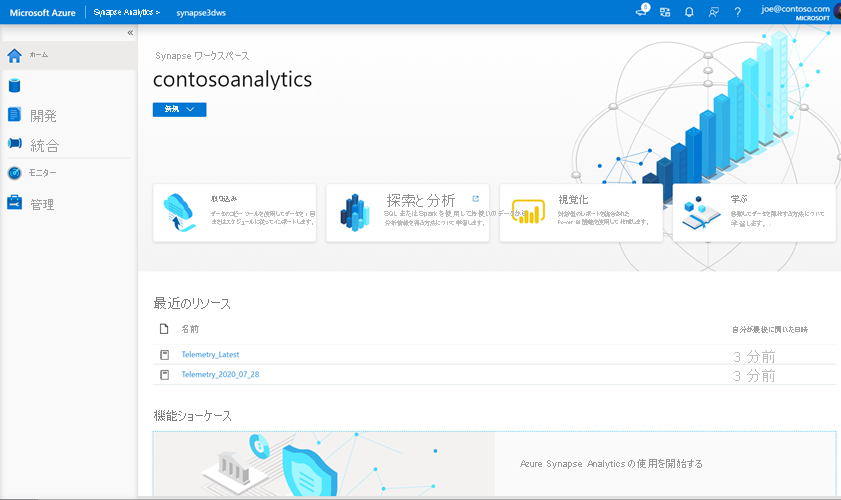
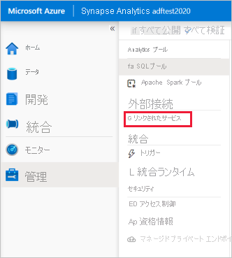
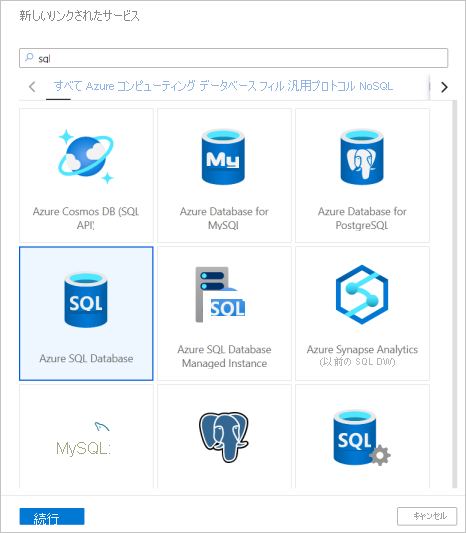
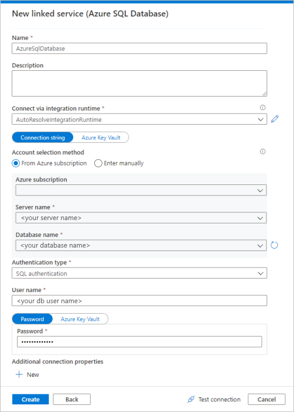
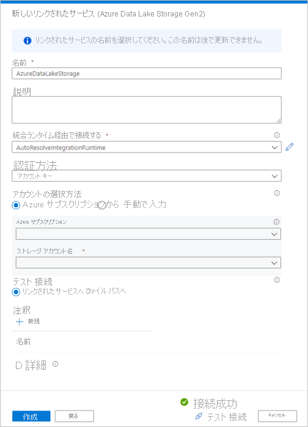
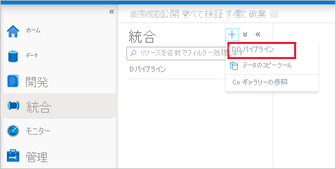
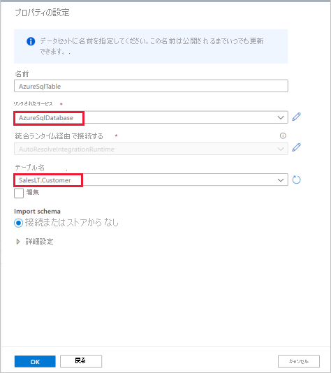
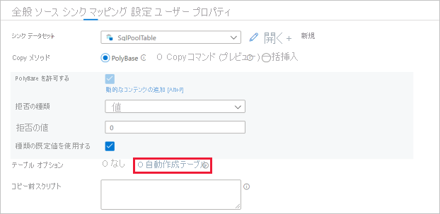
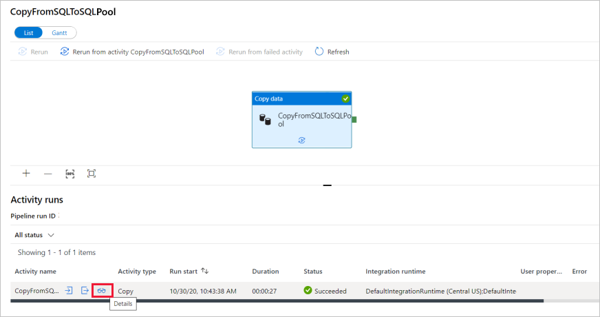

# クイックスタート: コピー アクティビティを使用してデータを専用 SQL プールに読み込む

Azure Synapse Analytics には、データの取り込み、変換、モデル化、分析に役立つさまざまな分析エンジンが用意されています。 専用 SQL プールには、T-SQL ベースのコンピューティングとストレージの機能が用意されています。 お使いの Synapse ワークスペースに専用 SQL プールを作成した後、データを読み込み、モデル化し、処理し、提供して、分析情報を迅速に得ることができます。

このクイックスタートでは、"*Azure SQL Database から Azure Synapse Analytics にデータを読み込む*" 方法について説明します。 その他の種類のデータ ストアからデータをコピーする場合も、同様の手順で実行できます。 この同様のフローが、他のソースとシンクのデータのコピーにも適用されます。

## 前提条件

* Azure サブスクリプション:Azure サブスクリプションをお持ちでない場合は、開始する前に [無料アカウント](https://azure.microsoft.com/free/) を作成してください。
* Azure Synapse ワークスペース:「[クイックスタート: Synapse ワークスペースを作成する](quickstart-create-workspace.md)」の手順に従い、Azure portal を使用して Synapse ワークスペースを作成します。
* Azure SQL Database:このチュートリアルでは、Azure SQL Database 内に Adventure Works LT サンプル データセットからのデータをコピーします。 SQL Database 内にこのサンプル データベースを作成するには、[Azure SQL Database でのサンプル データベースの作成](../azure-sql/database/single-database-create-quickstart.md)に関する記事の手順に従います。 同様の手順に従うことによって、その他のデータ ストアも使用できます。
* Azure ストレージ アカウント:Azure Storage は、コピー操作の "*ステージング*" 領域として使用されます。 Azure ストレージ アカウントがない場合は、「[ストレージ アカウントの作成](../storage/common/storage-account-create.md)」の手順をご覧ください。
* Azure Synapse Analytics:専用 SQL プールを "シンク" データ ストアとして使用します。 Azure Synapse Analytics インスタンスをお持ちでない場合、[専用 SQL プールの作成](quickstart-create-sql-pool-portal.md)に関するページでその作成手順を参照してください。

### Synapse Studio に移動する

Synapse ワークスペースが作成された後、Synapse Studio を開くには、次の 2 つの方法があります。

* [Azure portal](https://ms.portal.azure.com/#home) で Synapse ワークスペースを開きます。 [はじめに] の下の [Synapse Studio を開く] カードで、 **[開く]** を選択します。
* [Azure Synapse Analytics](https://web.azuresynapse.net/) を開き、ワークスペースにサインインします。

このクイックスタートでは、例として "adftest2020" という名前のワークスペースを使用します。 自動的に Synapse Studio のホーム ページに移動します。

## リンクされたサービスを作成します

Azure Synapse Analytics で、リンクされたサービスとは、他のサービスへの接続情報を定義した場所です。 このセクションでは、2 種類のリンクされたサービスを作成します。Azure SQL Database のリンクされたサービスと Azure Data Lake Storage Gen2 (ADLS Gen2) のリンクされたサービスです。

1. Synapse Studio のホーム ページで、左側のナビゲーションから **[管理]** タブを選択します。
1. [外部接続] で、 [リンクされたサービス] を選択します。
  
   

1. リンクされたサービスを追加するには、 **[新規]** を選択します。
1. ギャラリーで **[Azure SQL Database]** を選択し、 **[続行]** を選択します。 検索ボックスに「sql」と入力して、コネクタをフィルター処理できます。

   

1. [New Linked Service]\(新しいリンクされたサービス\) ページで、ドロップダウン リストからご自身のサーバー名と DB を選択し、ユーザー名とパスワードを指定します。 **[テスト接続]** をクリックして設定を検証し、 **[作成]** を選択します。

   

1. 手順 3. から手順 4. を繰り返します。ただし、ギャラリーからは **[Azure Data Lake Storage Gen2]** を選択してください。 [New Linked Service]\(新しいリンクされたサービス\) ページで、ストレージ アカウントの名前をドロップダウン リストから選択します。 **[テスト接続]** をクリックして設定を検証し、 **[作成]** を選択します。 

   
 
## パイプラインを作成する

パイプラインには、一連のアクティビティを実行するための論理フローが含まれています。 このセクションでは、Azure SQL Database から専用 SQL プールにデータを取り込むコピー アクティビティを含んだパイプラインを作成します。

1. **[統合]** タブに移動します。パイプライン ヘッダーの横にあるプラス符号のアイコンを選択し、[パイプライン] を選択します。

   

1. *[アクティビティ]* ペインの *[Move and Transform]\(移動と変換\)* で、 **[データ コピー]** をパイプライン キャンバス上にドラッグします。
1. [コピー アクティビティ] を選択し、 [ソース] タブに移動します。 **[新規]** を選択して、新しいソース データセットを作成します。

   

1. データ ストアとして **[Azure SQL Database]** を選択し、 **[続行]** を選択します。
1. *[プロパティの設定]* ペインで、前の手順で作成した Azure SQL Database のリンクされたサービスを選択します。 
1. 後続のコピー アクティビティで使用するサンプル テーブルを [テーブル名] で選択します。 このクイックスタートでは、例として "SalesLT.Customer" テーブルを使用します。 

   
1. 完了したら、 **[OK]** を選択します。
1. コピー アクティビティを選択し、[シンク] タブに移動します。 **[新規]** を選択して、新しいシンク データセットを作成します。
1. データ ストアとして **[Azure Synapse dedicated SQL pool]\(Azure Synapse 専用 SQL プール\)** を選択し、 **[続行]** を選択します。
1. **[プロパティの設定]** ペインで、前の手順で作成した SQL Analytics プールを選択します。 既存のテーブルに書き込む場合は、 *[テーブル名]* のドロップダウンからテーブルを選択します。 それ以外の場合は、[編集] チェック ボックスをオンにし、新しいテーブル名を入力します。 完了したら、 **[OK]** を選択します。
1. シンク データセットの設定について、[テーブル オプション] フィールドで **[テーブルの自動作成]** を有効にします。

   

1. **[設定]** ページで、 **[Enable staging]\(ステージングの有効化\)** チェック ボックスをオンにします。 このオプションは、ソース データに PolyBase との互換性がない場合に適用されます。 **[Staging settings]\(ステージングの設定\)** セクションで、前の手順で作成した Azure Data Lake Storage Gen2 のリンクされたサービスをステージング ストレージとして選択します。 

    このストレージは、PolyBase を使用して Azure Synapse Analytics に読み込む前に、データをステージングするために使用されます。 コピーの完了後、Azure Data Lake Storage Gen2 内の暫定データは自動的にクリーンアップされます。

   

1. パイプラインを検証するには、ツール バーの **[検証]** を選択します。 パイプラインの検証の出力結果がページの右側に表示されます。 

## パイプラインをデバッグして発行する

パイプラインの構成が完了したら、成果物を発行する前にデバッグを実行することで、すべてが正しいことを確認できます。

1. パイプラインをデバッグするには、ツール バーで **[デバッグ]** を選択します。 ウィンドウ下部の **[出力]** タブにパイプラインの実行の状態が表示されます。 

   

1. パイプラインの実行に成功したら、上部のツール バーで **[すべて発行]** を選択します。 この操作により、作成したエンティティ (データセットとパイプライン) が Synapse Analytics サービスに発行されます。
1. **[正常に発行されました]** というメッセージが表示されるまで待機します。 通知メッセージを表示するには、右上にあるベル ボタンを選択します。 

## パイプラインをトリガーして監視する

このセクションでは、前の手順で発行したパイプラインを手動でトリガーします。 

1. ツール バーの **[トリガーの追加]** を選択し、 **[Trigger Now]\(今すぐトリガー\)** を選択します。 **[Pipeline Run]\(パイプラインの実行\)** ページで **[OK]** を選択します。  
1. 左側のサイドバーにある **[監視]** タブに移動します。 手動トリガーによってトリガーされたパイプラインの実行が表示されます。 
1. パイプラインの実行が正常に完了したら、 **[パイプライン名]** 列のリンクを選択してアクティビティの実行の詳細を表示するか、またはパイプラインを再実行します。 この例では、アクティビティが 1 つだけなので、一覧に表示されるエントリは 1 つのみです。 
1. コピー操作の詳細を確認するには、 **[アクティビティ名]** 列の **[詳細]** リンク (眼鏡アイコン) を選択します。 ソースからシンクにコピーされるデータの量、データのスループット、実行ステップと対応する期間、使用される構成などの詳細を監視できます。

   

1. パイプラインの実行ビューに戻るには、上部の **[すべてのパイプラインの実行]** リンクを選択します。 **[最新の情報に更新]** を選択して、一覧を更新します。
1. データが専用 SQL プールに正しく書き込まれていることを確認します。

## 次のステップ

次の資料に進んで、Azure Synapse Analytics のサポートを確認します。

> [!div class="nextstepaction"]
> [パイプラインとアクティビティ](https://docs.microsoft.com/azure/data-factory/concepts-pipelines-activities?toc=/azure/synapse-analytics/toc.json&bc=/azure/synapse-analytics/breadcrumb/toc.json)
> [コネクタの概要](https://docs.microsoft.com/azure/data-factory/connector-overview?toc=/azure/synapse-analytics/toc.json&bc=/azure/synapse-analytics/breadcrumb/toc.json)
> [コピー アクティビティ](https://docs.microsoft.com/azure/data-factory/copy-activity-overview?toc=/azure/synapse-analytics/toc.json&bc=/azure/synapse-analytics/breadcrumb/toc.json)