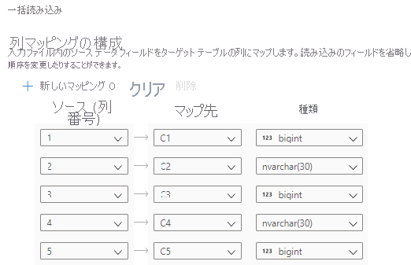

# クイックスタート:Synapse SQL を使用したデータの一括読み込み

Synapse Studio の一括読み込みウィザードを使用すると、データを簡単に読み込むことができます。 一括読み込みウィザードの手順に従うと、[COPY ステートメント](/sql/t-sql/statements/copy-into-transact-sql?view=azure-sqldw-latest&preserve-view=true)を使用してデータを一括で読み込むための T-SQL スクリプトを作成できます。 

## 一括読み込みウィザードへのエントリ ポイント

Synapse Studio 内の次の領域を右クリックするだけで、専用 SQL プールを使用してデータの一括読み込みを簡単に実行できます。

- 自分のワークスペースにアタッチされた Azure ストレージ アカウントのファイルまたはフォルダー 

## 前提条件

- このウィザードでは、Azure AD パススルーを認証に使用する COPY ステートメントが生成されます。 少なくとも ADLS Gen2 アカウントに対するストレージ BLOB データ共同作成者 Azure ロールがある状態で、ワークスペースに [Azure AD ユーザーがアクセスできる必要があります](
./sql-data-warehouse/quickstart-bulk-load-copy-tsql-examples.md#d-azure-active-directory-authentication)。 

- [COPY ステートメントを使用するために必要なアクセス許可](/sql/t-sql/statements/copy-into-transact-sql?view=azure-sqldw-latest&preserve-view=true#permissions)が必要です。さらに、読み込み先のテーブルを新しく作成する場合は、テーブルの作成アクセス許可が必要です。

- ADLS Gen2 アカウントに関連付けられている、リンクされたサービスには、読み込む **ファイル**/または **フォルダーへのアクセス権** が必要です。 たとえば、リンクされたサービスの認証メカニズムがマネージド ID の場合、ワークスペースのマネージド ID には、ストレージ アカウントに対するストレージ BLOB 閲覧者アクセス許可が少なくとも必要です。

- お使いのワークスペースで VNet が有効になっている場合は、ソース データとエラー ファイルの場所に対して ADLS Gen2 アカウントのリンクされたサービスに関連付けられている統合ランタイムで、インタラクティブな作成が有効になっていることを確認してください。 インタラクティブな作成は、ウィザード内での自動スキーマ検出、ソース ファイルの内容のプレビュー、および ADLS Gen2 ストレージ アカウントの参照に必要です。

### 手順

1. [Source storage location]\(ソース ストレージの場所\) パネルで、ストレージ アカウントと、読み込み元のファイルまたはフォルダーを選択します。 ファイルのソース フィールドをターゲットの適切な SQL データ型にマッピングするなど、Parquet ファイルおよび区切りテキスト (CSV) ファイルの検出がウィザードによって自動的に試行されます。 

   

2. 一括読み込み処理中に拒否された行が存在する場合のエラー設定など、ファイル形式の設定を選択します。 また、[データのプレビュー] を選択すると、COPY ステートメントによってファイルがどのように解析されるかを確認できるため、ファイル形式設定を構成する際の参考にすることができます。 ファイル形式設定を変更するたびに [データのプレビュー] を選択して、更新された設定で COPY ステートメントによってファイルがどのように解析されるかを確認します。

    

> [!NOTE]  
>
> - 複数文字のフィールド ターミネータを使用したデータのプレビューは、一括読み込みウィザードではサポートされません。 複数文字のフィールド ターミネータが指定された場合は、1 列内でデータがプレビューされます。 
> - [列名の推論] を選択すると、[先頭行] フィールドによって指定された先頭行から、一括読み込みウィザードによって列名が解析されます。 このヘッダー行を無視するために、COPY ステートメントの FIRSTROW の値が 1 行分、自動的にインクリメントされます。 
> - COPY ステートメントでは、複数文字の行ターミネータを指定できますが、一括読み込みウィザードではサポートされません。指定した場合はエラーがスローされます。

3. 読み込みに使用する専用 SQL プールを選択します (既存のテーブルへの読み込みか、新しいテーブルへの読み込みか)。
4. [列マッピングの構成] を選択して、列マッピングが適切であることを確認します。 [Infer column names]\(列名の推測\) が有効になっている場合は、列名が自動的に検出されます。 新しいテーブルの場合、ターゲット列のデータ型を更新するには、列マッピングを構成することが非常に重要です。

   
5. [スクリプトを開く] を選択すると、COPY ステートメントを使用してデータ レイクから読み込むための T-SQL スクリプトが生成されます。

## 次のステップ

- [COPY ステートメント](/sql/t-sql/statements/copy-into-transact-sql?view=azure-sqldw-latest&preserve-view=true#syntax)に関する記事を参照して COPY 機能の詳細を確認する
- [データ読み込みの概要](./sql-data-warehouse/design-elt-data-loading.md#what-is-elt)に関する記事を参照する
