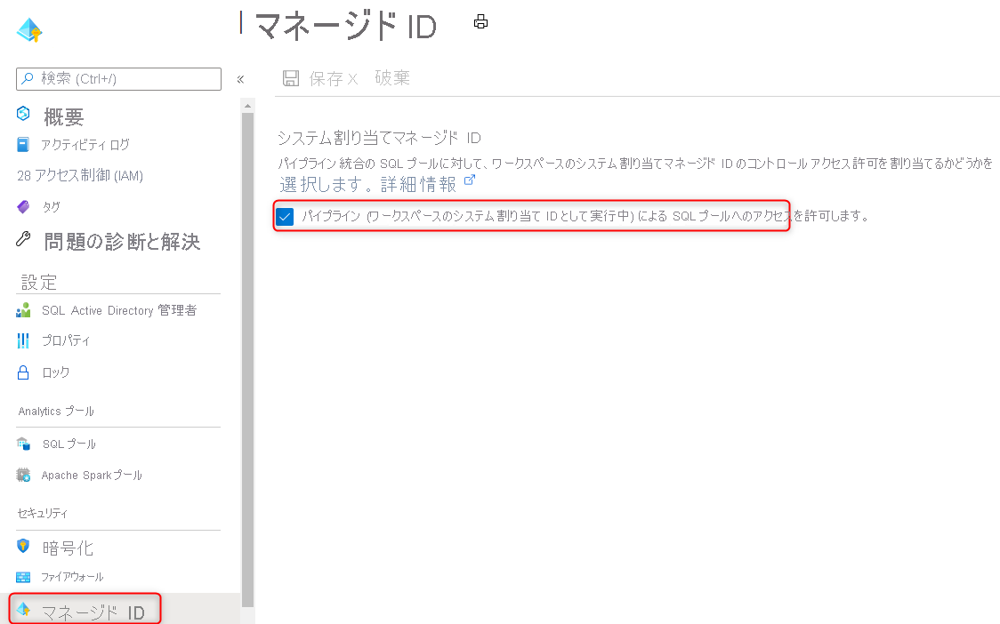

# <a name="securely-load-data-using-synapse-sql"></a>Synapse SQL を使用してデータを安全に読み込む

この記事では、[COPY ステートメント](https://docs.microsoft.com/sql/t-sql/statements/copy-into-transact-sql?view=azure-sqldw-latest)のセキュリティで保護された認証メカニズムについて説明し、例を示します。 COPY ステートメントは、Synapse SQL でデータを一括読み込みするための最も柔軟で安全な方法です。
## <a name="supported-authentication-mechanisms"></a>サポートされている認証メカニズム

次の表は、サポートされている認証方法をファイルの種類別およびストレージ アカウント別にまとめたものです。 これはソース ストレージの場所とエラー ファイルの場所に適用されます。

|                          |                CSV                |                      Parquet                       |                        ORC                         |
| :----------------------: | :-------------------------------: | :------------------------------------------------: | :------------------------------------------------: |
|  **Azure Blob Storage**  | SAS/MSI/サービス プリンシパル/キー/AAD |                      SAS/キー                       |                      SAS/キー                       |
| **Azure Data Lake Gen2** | SAS/MSI/サービス プリンシパル/キー/AAD | SAS (BLOB<sup>1</sup>)/MSI (dfs<sup>2</sup>)/サービス プリンシパル/キー/AAD | SAS (BLOB<sup>1</sup>)/MSI (dfs<sup>2</sup>)/サービス プリンシパル/キー/AAD |

1:この認証方法には、お使いの外部のロケーション パスに .blob エンドポイント ( **.blob**.core.windows.net) が必要です。

2:この認証方法には、お使いの外部のロケーション パスに .dfs エンドポイント ( **.dfs**.core.windows.net) が必要です。

## <a name="a-storage-account-key-with-lf-as-the-row-terminator-unix-style-new-line"></a>A. 行を終止させるものとして LF が与えられたストレージ アカウント キー (Unix スタイルの改行)


```sql
--Note when specifying the column list, input field numbers start from 1
COPY INTO target_table (Col_one default 'myStringDefault' 1, Col_two default 1 3)
FROM 'https://adlsgen2account.dfs.core.windows.net/myblobcontainer/folder1/'
WITH (
    FILE_TYPE = 'CSV'
    ,CREDENTIAL=(IDENTITY= 'Storage Account Key', SECRET='<Your_Account_Key>')
    --CREDENTIAL should look something like this:
    --CREDENTIAL=(IDENTITY= 'Storage Account Key', SECRET='x6RWv4It5F2msnjelv3H4DA80n0QW0daPdw43jM0nyetx4c6CpDkdj3986DX5AHFMIf/YN4y6kkCnU8lb+Wx0Pj+6MDw=='),
    ,ROWTERMINATOR='0x0A' --0x0A specifies to use the Line Feed character (Unix based systems)
)
```
> [!IMPORTANT]
>
> - 16 進数の値 (0x0A) を使用し、改行文字を指定します。 COPY ステートメントでは "\n" 文字列が "\r\n" (復帰改行) として解釈されます。

## <a name="b-shared-access-signatures-sas-with-crlf-as-the-row-terminator-windows-style-new-line"></a>B. 行を終止させるものとして CRLF が与えられた Shared Access Signatures (SAS) (Windows スタイルの改行)
```sql
COPY INTO target_table
FROM 'https://adlsgen2account.dfs.core.windows.net/myblobcontainer/folder1/'
WITH (
    FILE_TYPE = 'CSV'
    ,CREDENTIAL=(IDENTITY= 'Shared Access Signature', SECRET='<Your_SAS_Token>')
    --CREDENTIAL should look something like this:
    --CREDENTIAL=(IDENTITY= 'Shared Access Signature', SECRET='?sv=2018-03-28&ss=bfqt&srt=sco&sp=rl&st=2016-10-17T20%3A14%3A55Z&se=2021-10-18T20%3A19%3A00Z&sig=IEoOdmeYnE9%2FKiJDSFSYsz4AkNa%2F%2BTx61FuQ%2FfKHefqoBE%3D'),
    ,ROWTERMINATOR='\n'-- COPY command automatically prefixes the \r character when \n (newline) is specified. This results in carriage return newline (\r\n) for Windows based systems.
)
```

> [!IMPORTANT]
>
> - ROWTERMINATOR を "\r\n" として指定しないでください。"\r\r\n" として解釈され、構文解析の問題が引き起こされる可能性があります

## <a name="c-managed-identity"></a>C. マネージド ID

ストレージ アカウントが VNet に関連付けられるとき、マネージド ID 認証が必要です。 

### <a name="prerequisites"></a>前提条件

1. この[ガイド](/powershell/azure/install-az-ps?toc=/azure/synapse-analytics/sql-data-warehouse/toc.json&bc=/azure/synapse-analytics/sql-data-warehouse/breadcrumb/toc.json)を使用して、Azure PowerShell をインストールします。
2. 汎用 v1 または BLOB ストレージ アカウントを使用している場合は、この[ガイド](../../storage/common/storage-account-upgrade.md?toc=/azure/synapse-analytics/sql-data-warehouse/toc.json&bc=/azure/synapse-analytics/sql-data-warehouse/breadcrumb/toc.json)を使用して、最初に汎用 v2 にアップグレードする必要があります。
3. Azure ストレージ アカウントの **[Firewalls and Virtual networks]\(ファイアウォールと仮想ネットワーク\)** 設定メニューで、 **[Allow trusted Microsoft services to access this storage account]\(信頼された Microsoft サービスによるこのストレージ アカウントに対するアクセスを許可します\)** をオンにする必要があります。 詳しくは、この[ガイド](../../storage/common/storage-network-security.md?toc=/azure/synapse-analytics/sql-data-warehouse/toc.json&bc=/azure/synapse-analytics/sql-data-warehouse/breadcrumb/toc.json#exceptions)をご覧ください。

#### <a name="steps"></a>手順

1. スタンドアロンの専用 SQL プールがある場合は、PowerShell を使用して SQL サーバーを Azure Active Directory (AAD) に登録します。 

   ```powershell
   Connect-AzAccount
   Select-AzSubscription -SubscriptionId <subscriptionId>
   Set-AzSqlServer -ResourceGroupName your-database-server-resourceGroup -ServerName your-SQL-servername -AssignIdentity
   ```

   Synapse ワークスペース内の専用 SQL プールでは、この手順は必要ありません。

1. Synapse ワークスペースがある場合は、以下のようにワークスペースのシステム マネージド ID を登録します。

   1. Azure portal で Synapse ワークスペースにアクセスする
   2. [マネージド ID] ブレードにアクセスする 
   3. "パイプラインを許可する" オプションを有効にする
   
   

1. この [ガイド](../../storage/common/storage-account-create.md)を使用して、**汎用 v2 ストレージ アカウント** を作成します。

   > [!NOTE]
   >
   > - 汎用 v1 または BLOB ストレージ アカウントを使用している場合は、この [ガイド](../../storage/common/storage-account-upgrade.md)を使用して、**最初に v2 にアップグレードする** 必要があります。
   > - Azure Data Lake Storage Gen2 に関する既知の問題については、この[ガイド](../../storage/blobs/data-lake-storage-known-issues.md)をご覧ください。

1. お使いのストレージ アカウントで、 **[アクセス制御 (IAM)]** に移動し、 **[ロール割り当ての追加]** を選択します。 Azure Active Directory (AAD) に登録した専用 SQL プールをホストしているサーバーまたはワークスペースに、**ストレージ BLOB データ共同作成者** Azure ロールを割り当てます。

   > [!NOTE]
   > 所有者特権を持つメンバーのみが、この手順を実行できます。 さまざまな Azure の組み込みロールについては、こちらの[ガイド](../../role-based-access-control/built-in-roles.md?toc=/azure/synapse-analytics/sql-data-warehouse/toc.json&bc=/azure/synapse-analytics/sql-data-warehouse/breadcrumb/toc.json)を参照してください。
   
    > [!IMPORTANT]
    > **ストレージ** **BLOB データ** 所有者、共同作成者、または閲覧者の Azure ロールを指定します。 これらのロールは、所有者、共同作成者、閲覧者の Azure 組み込みロールとは異なります。 

    

4. これで "マネージド ID" を指定して COPY ステートメントを実行できます。

    ```sql
    COPY INTO dbo.target_table
    FROM 'https://myaccount.blob.core.windows.net/myblobcontainer/folder1/*.txt'
    WITH (
        FILE_TYPE = 'CSV',
        CREDENTIAL = (IDENTITY = 'Managed Identity'),
    )
    ```

## <a name="d-azure-active-directory-authentication"></a>D. Azure Active Directory 認証
#### <a name="steps"></a>手順

1. お使いのストレージ アカウントで、 **[アクセス制御 (IAM)]** に移動し、 **[ロール割り当ての追加]** を選択します。 **ストレージ BLOB データ所有者、共同作成者、または閲覧者** の Azure ロールを Azure AD ユーザーに割り当てます。 

    > [!IMPORTANT]
    > **ストレージ** **BLOB データ** 所有者、共同作成者、または閲覧者の Azure ロールを指定します。 これらのロールは、所有者、共同作成者、閲覧者の Azure 組み込みロールとは異なります。

    

2. 次の[ドキュメント](https://docs.microsoft.com/azure/sql-database/sql-database-aad-authentication-configure?tabs=azure-powershell#create-an-azure-ad-administrator-for-azure-sql-server)を進め、Azure AD 認証を構成します。 

3. Active Directory を使用し、SQL プールに接続します。そこでは資格情報を指定せずに COPY ステートメントを実行できます。

    ```sql
    COPY INTO dbo.target_table
    FROM 'https://myaccount.blob.core.windows.net/myblobcontainer/folder1/*.txt'
    WITH (
        FILE_TYPE = 'CSV'
    )
    ```


## <a name="e-service-principal-authentication"></a>E. サービス プリンシパル認証
#### <a name="steps"></a>手順

1. [Azure Active Directory アプリケーションを作成する](https://docs.microsoft.com/azure/active-directory/develop/howto-create-service-principal-portal#create-an-azure-active-directory-application)
2. [アプリケーション ID を取得する](https://docs.microsoft.com/azure/active-directory/develop/howto-create-service-principal-portal#get-values-for-signing-in)
3. [認証キーを取得する](https://docs.microsoft.com/azure/active-directory/develop/howto-create-service-principal-portal#create-a-new-application-secret)
4. [V1 OAuth 2.0 トークン エンドポイントを取得する](https://docs.microsoft.com/azure/data-lake-store/data-lake-store-service-to-service-authenticate-using-active-directory?toc=/azure/synapse-analytics/sql-data-warehouse/toc.json&bc=/azure/synapse-analytics/sql-data-warehouse/breadcrumb/toc.json#step-4-get-the-oauth-20-token-endpoint-only-for-java-based-applications)
5. ストレージ アカウントで [Azure AD アプリケーションに読み取り、書き込み、実行のアクセス許可を割り当てる](https://docs.microsoft.com/azure/data-lake-store/data-lake-store-service-to-service-authenticate-using-active-directory?toc=/azure/synapse-analytics/sql-data-warehouse/toc.json&bc=/azure/synapse-analytics/sql-data-warehouse/breadcrumb/toc.json#step-3-assign-the-azure-ad-application-to-the-azure-data-lake-storage-gen1-account-file-or-folder)
6. これで COPY ステートメントを実行できます。

    ```sql
    COPY INTO dbo.target_table
    FROM 'https://myaccount.blob.core.windows.net/myblobcontainer/folder0/*.txt'
    WITH (
        FILE_TYPE = 'CSV'
        ,CREDENTIAL=(IDENTITY= '<application_ID>@<OAuth_2.0_Token_EndPoint>' , SECRET= '<authentication_key>')
        --CREDENTIAL should look something like this:
        --,CREDENTIAL=(IDENTITY= '92761aac-12a9-4ec3-89b8-7149aef4c35b@https://login.microsoftonline.com/72f714bf-86f1-41af-91ab-2d7cd011db47/oauth2/token', SECRET='juXi12sZ6gse]woKQNgqwSywYv]7A.M')
    )
    ```

> [!IMPORTANT]
>
> - OAuth 2.0 トークン エンドポイント **V1** バージョンを使用します

## <a name="next-steps"></a>次のステップ

- 詳しい構文については、[COPY ステートメントに関する記事](https://docs.microsoft.com/sql/t-sql/statements/copy-into-transact-sql?view=azure-sqldw-latest#syntax)をご覧ください
- 読み込みのベスト プラクティスについては、[データ読み込みの概要](https://docs.microsoft.com/azure/synapse-analytics/sql-data-warehouse/design-elt-data-loading#what-is-elt)記事をご覧ください
