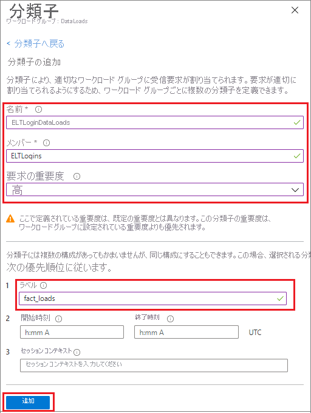

# <a name="quickstart-create-a-dedicated-sql-pool-workload-classifier-using-the-azure-portal"></a>クイックスタート: Azure portal を使用して専用 SQL プールのワークロード分類子を作成する

このクイックスタートでは、ワークロード グループにクエリを割り当てるための[ワークロード分類子](sql-data-warehouse-workload-classification.md)を作成します。  分類子によって、`ELTLogin` SQL ユーザーからの要求が `DataLoads` ワークロード グループに割り当てられます。   [クイックスタート: ワークロードの分離の構成](quickstart-configure-workload-isolation-portal.md)チュートリアルに従って、`DataLoads` ワークロード グループを作成します。  このチュートリアルでは、WLM_LABEL オプションを使用してワークロード分類子を作成し、さらに正確に要求を分類できるようにします。  分類子では、これらの要求に `HIGH` [ワークロードの重要度](sql-data-warehouse-workload-importance.md)も割り当てます。


Azure サブスクリプションをお持ちでない場合は、開始する前に[無料](https://azure.microsoft.com/free/)アカウントを作成してください。


## <a name="sign-in-to-the-azure-portal"></a>Azure portal にサインインする

[Azure portal](https://portal.azure.com/) にサインインします。

> [!NOTE]
> Azure Synapse Analytics に専用 SQL プール インスタンスを作成すると、新しい課金対象サービスが発生する可能性があります。  詳細については、「[Azure Synapse Analytics の価格](https://azure.microsoft.com/pricing/details/sql-data-warehouse/)」を参照してください。

## <a name="prerequisites"></a>前提条件

このクイックスタートは、専用 SQL プール インスタンスが既に用意されていて、CONTROL DATABASE アクセス許可があることを前提としています。 作成する必要がある場合は、[ポータルでの作成と接続](create-data-warehouse-portal.md)に関する記事に従って、**mySampleDataWarehouse** という名前の専用 SQL プールを作成してください。
<br><br>
ワークロード グループ `DataLoads` が存在すること。  ワークロード グループを作成するには、[クイックスタート: ワークロードの分離の構成](quickstart-configure-workload-isolation-portal.md)チュートリアルを参照してください。
<br><br>
>[!IMPORTANT] 
>ワークロード管理を構成するには、専用 SQL プールがオンラインになっている必要があります。 


## <a name="create-a-login-for-eltlogin"></a>ELTLogin 用のログインを作成する

`ELTLogin` に対して [CREATE LOGIN](/sql/t-sql/statements/create-login-transact-sql?toc=/azure/synapse-analytics/sql-data-warehouse/toc.json&bc=/azure/synapse-analytics/sql-data-warehouse/breadcrumb/toc.json&view=azure-sqldw-latest) を使用して、`master` データベースで SQL Server 認証ログインを作成します。

```sql
IF NOT EXISTS (SELECT * FROM sys.sql_logins WHERE name = 'ELTLogin')
BEGIN
CREATE LOGIN [ELTLogin] WITH PASSWORD='<strongpassword>'
END
;
```

## <a name="create-user-and-grant-permissions"></a>ユーザーを作成してアクセス許可を付与する

ログインを作成したら、データベースにユーザーを作成する必要があります。  [CREATE USER](/sql/t-sql/statements/create-user-transact-sql?toc=/azure/synapse-analytics/sql-data-warehouse/toc.json&bc=/azure/synapse-analytics/sql-data-warehouse/breadcrumb/toc.json&view=azure-sqldw-latest) を使用して、**mySampleDataWarehouse** に SQL ユーザー `ELTRole` を作成します。  このチュートリアルでは分類をテストするので、`ELTLogin` に **mySampleDataWarehouse** へのアクセス許可を付与します。 

```sql
IF NOT EXISTS (SELECT * FROM sys.database_principals WHERE name = 'ELTLogin')
BEGIN
CREATE USER [ELTLogin] FOR LOGIN [ELTLogin]
GRANT CONTROL ON DATABASE::mySampleDataWarehouse TO ELTLogin 
END
;
```

## <a name="configure-workload-classification"></a>ワークロード分類を構成する
分類を使用すると、一連のルールに基づいて要求をワークロード グループにルーティングできます。  [クイックスタート: ワークロードの分離の構成](quickstart-configure-workload-isolation-portal.md)チュートリアルでは、`DataLoads` ワークロード グループを作成しました。  ここでは、ワークロード分類子を作成して、`DataLoads` ワークロード グループにクエリをルーティングします。


1.  **mySampleDataWarehouse** 専用 SQL プールのページに移動します。
3.  **[ワークロード管理]** を選択します。

    

4.  `DataLoads` ワークロード グループの右側にある **[設定と分類子]** を選択します。

    

5. [分類子] 列の **[未構成]** を選択します。
6. **[+ 分類子の追加]** を選択します。

    ![[追加] をクリックします。](./media/quickstart-create-a-workload-classifier-portal/add-wc.png)

7.  **[名前]** に「`ELTLoginDataLoads`」と入力します。
8.  **[メンバー]** に「`ELTLogin`」と入力します。
9.  **[要求の重要度]** では `High` を選択します  ("*省略可能*"。既定では通常の重要度になっています)。
10. **[ラベル]** に「`fact_loads`」と入力します。
11. **[追加]** を選択します。
12. **[保存]** を選択します。

    

## <a name="verify-and-test-classification"></a>分類を確認してテストする
`ELTLoginDataLoads` 分類子の存在を確認するには、[sys.workload_management_workload_classifiers](/sql/relational-databases/system-catalog-views/sys-workload-management-workload-classifiers-transact-sql?view=azure-sqldw-latest) カタログ ビューをチェックします。

```sql
SELECT * FROM sys.workload_management_workload_classifiers WHERE name = 'ELTLoginDataLoads'
```

分類子の詳細を確認するには、[sys.workload_management_workload_classifier_details](/sql/relational-databases/system-catalog-views/sys-workload-management-workload-classifier-details-transact-sql?view=azure-sqldw-latest) カタログ ビューをチェックすまし。

```sql
SELECT c.[name], c.group_name, c.importance, cd.classifier_type, cd.classifier_value
  FROM sys.workload_management_workload_classifiers c
  JOIN sys.workload_management_workload_classifier_details cd
    ON cd.classifier_id = c.classifier_id
  WHERE c.name = 'ELTLoginDataLoads'
```

次のステートメントを実行して、分類をテストします。  ``ELTLogin`` として接続していること、およびクエリで ``Label`` が使用されていることを確認します。
```sql
CREATE TABLE factstaging (ColA int)
INSERT INTO factstaging VALUES(0)
INSERT INTO factstaging VALUES(1)
INSERT INTO factstaging VALUES(2)
GO

CREATE TABLE testclassifierfact WITH (DISTRIBUTION = ROUND_ROBIN)
AS
SELECT * FROM factstaging
OPTION (LABEL='fact_loads')
```

`ELTLoginDataLoads` ワークロード分類子を使用して、`CREATE TABLE` ステートメントが `DataLoads` ワークロード グループに分類されていることを確認します。
```sql 
SELECT TOP 1 request_id, classifier_name, group_name, resource_allocation_percentage, submit_time, [status], [label], command 
FROM sys.dm_pdw_exec_requests 
WHERE [label] = 'fact_loads'
ORDER BY submit_time DESC
```

## <a name="clean-up-resources"></a>リソースをクリーンアップする

このチュートリアルで作成した `ELTLoginDataLoads` ワークロード分類子を削除するには、次のようにします。

1. `DataLoads` ワークロード グループの右側にある **[1 Classifier]\(1 分類子\)** をクリックします。

    ![[削除] をクリックする](./media/quickstart-create-a-workload-classifier-portal/delete-wc.png)

2. **[分類子]** をクリックします。
3. `ELTLoginDataLoads` ワークロード分類子の右側にある [ **`...`** ] をクリックします。
4. **[削除]** をクリックします。
5. **[Save]** をクリックします。

    ![[保存] をクリックします。](./media/quickstart-create-a-workload-classifier-portal/delete-save-wc.png)

データ ウェアハウス ユニットと専用 SQL プールに格納されているデータに対して課金されます。 これらのコンピューティングとストレージのリソースは別々に請求されます。

- データをストレージに保持しておく場合は、専用 SQL プールを使わない間、コンピューティング リソースを一時停止できます。 コンピューティングを一時停止すると、データ ストレージに対してのみ課金されます。 データを使用する準備ができたら、コンピューティングを再開します。
- それ以上課金されないようにする場合は、専用 SQL プールを削除できます。

以下の手順に従ってリソースをクリーンアップします。

1. [Azure portal](https://portal.azure.com) にサインインし、専用 SQL プールを選択します。

    

2. コンピューティング リソースを一時停止するには、 **[一時停止]** ボタンを選択します。 専用 SQL プールが一時停止すると、ボタンの表示が **[開始]** になります。  コンピューティング リソースを再開するには、 **[開始]** を選択します。

3. コンピューティング リソースやストレージに課金されないように専用 SQL プールを削除するには、 **[削除]** を選択します。

## <a name="next-steps"></a>次のステップ

Azure portal の監視メトリックを使用して、ワークロードを監視します。  詳細については、[ワークロードの重要度の管理と監視](sql-data-warehouse-how-to-manage-and-monitor-workload-importance.md)に関するページをご覧ください。
