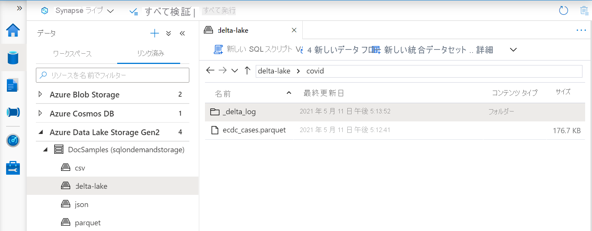

# <a name="create-and-use-views-using-serverless-sql-pool-in-azure-synapse-analytics"></a>Azure Synapse Analytics のサーバーレス SQL プールを使用してビューを作成および使用する

このセクションでは、ビューを作成および使用して、サーバーレス SQL プール クエリをラップする方法を学習します。 ビューを使用すると、これらのクエリを再利用できます。 ビューは、Power BI などのツールをサーバーレス SQL プールと組み合わせて使用する場合にも必要になります。

## <a name="prerequisites"></a>前提条件

最初の手順では、ビューが作成されるデータベースを作成し、そのデータベースで[設定スクリプト](https://github.com/Azure-Samples/Synapse/blob/master/SQL/Samples/LdwSample/SampleDB.sql)を実行して、Azure Storage での認証に必要なオブジェクトを初期化します。 この記事のクエリはすべて、サンプル データベースで実行されます。

## <a name="views-over-external-data"></a>外部データのビュー

ビューは、通常の SQL Server ビューを作成するのと同じ方法で作成できます。 次のクエリによって、*population.csv* ファイルを読み取るビューが作成されます。

> [!NOTE]
> クエリの最初の行 ([mydbname]) は、自分で作成したデータベースを使用するように変更してください。

```sql
USE [mydbname];
GO

DROP VIEW IF EXISTS populationView;
GO

CREATE VIEW populationView AS
SELECT * 
FROM OPENROWSET(
        BULK 'csv/population/population.csv',
        DATA_SOURCE = 'SqlOnDemandDemo',
        FORMAT = 'CSV', 
        FIELDTERMINATOR =',', 
        ROWTERMINATOR = '\n'
    )
WITH (
    [country_code] VARCHAR (5) COLLATE Latin1_General_BIN2,
    [country_name] VARCHAR (100) COLLATE Latin1_General_BIN2,
    [year] smallint,
    [population] bigint
) AS [r];
```

ビューには、`DATA_SOURCE` としてストレージのルート URL を備えた `EXTERNAL DATA SOURCE` が使用され、相対ファイル パスがファイルに追加されます。

### <a name="delta-lake-views"></a>Delta Lake のビュー

Delta Lake フォルダーでビューを作成する場合、`BULK` オプションの後ろに、ファイルのパスの代わりにルート フォルダーの場所を指定する必要があります。

> [!div class="mx-imgBorder"]
>

Delta Lake フォルダーからデータを読み取る `OPENROWSET` 関数では、フォルダーの構造を調べて自動的にファイルの場所を特定します。

```sql
create or alter view CovidDeltaLake
as
select *
from openrowset(
           bulk 'covid',
           data_source = 'DeltaLakeStorage',
           format = 'delta'
    ) with (
           date_rep date,
           cases int,
           geo_id varchar(6)
           ) as rows
```

## <a name="partitioned-views"></a>パーティション ビュー

階層フォルダー構造内にパーティション分割された一連のファイルがある場合は、ファイル パスのワイルドカードを使用してパーティション パターンを記述できます。 `FILEPATH` 関数を使用して、フォルダー パスの一部をパーティション分割列として公開します。

```sql
CREATE VIEW TaxiView
AS SELECT *, nyc.filepath(1) AS [year], nyc.filepath(2) AS [month]
FROM
    OPENROWSET(
        BULK 'parquet/taxi/year=*/month=*/*.parquet',
        DATA_SOURCE = 'sqlondemanddemo',
        FORMAT='PARQUET'
    ) AS nyc
```

パーティション分割列のフィルターを使用してこのビューに対してクエリを実行すると、パーティション分割されたビューで、フォルダー パーティションが除外されます。 これにより、クエリのパフォーマンスが向上する場合があります。

### <a name="delta-lake-partitioned-views"></a>Delta Lake パーティション ビュー

Delta Lake ストレージでパーティション ビューを作成する場合、ルートになる Delta Lake フォルダーを指定するだけでよく、`FILEPATH` 関数で明示的にパーティション分割列を表示する必要はありません。

```sql
CREATE OR ALTER VIEW YellowTaxiView
AS SELECT *
FROM  
    OPENROWSET(
        BULK 'yellow',
        DATA_SOURCE = 'DeltaLakeStorage',
        FORMAT='DELTA'
    ) nyc
```

`OPENROWSET` 関数では、作業を実行している Delta Lake フォルダーの構造を調べ、パーティション分割列を自動的に特定し、表示します。 クエリの `WHERE` 句でパーティション分割列を指定した場合、パーティションの除去が自動的に実行されます。

`OPENROWSET` 関数の中にある、`DeltaLakeStorage` データ ソースに指定された `LOCATION` URI を連結したフォルダー名 (この例では `yellow`) は、`_delta_log` というサブフォルダーを含むルート Delta Lake フォルダーへの参照となっている必要があります。

> [!div class="mx-imgBorder"]
>

## <a name="use-a-view"></a>ビューの使用

ビューは、SQL Server クエリ内でビューを使用するのと同じ方法でクエリ内で使用できます。

次のクエリは、「[ビューの作成](#views-over-external-data)」で作成した *population_csv* ビューの使用方法を示しています。 これにより、国/地域名が 2019 年の人口の降順に返されます。

> [!NOTE]
> クエリの最初の行 ([mydbname]) は、自分で作成したデータベースを使用するように変更してください。

```sql
USE [mydbname];
GO

SELECT
    country_name, population
FROM populationView
WHERE
    [year] = 2019
ORDER BY
    [population] DESC;
```

## <a name="next-steps"></a>次のステップ

さまざまな種類のファイルに対するクエリの実行については、[単一の CSV ファイルに対するクエリの実行](query-single-csv-file.md)、[Parquet ファイルに対するクエリの実行](query-parquet-files.md)、および [JSON ファイルに対するクエリの実行](query-json-files.md)に関するページを参照してください。
