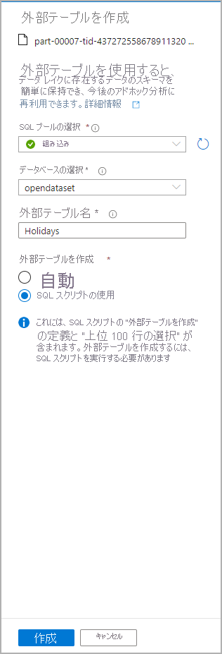
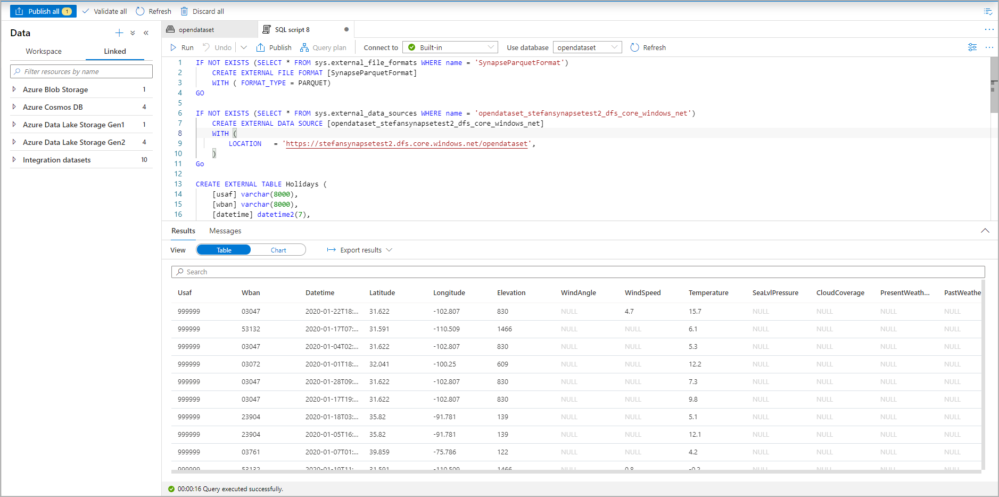
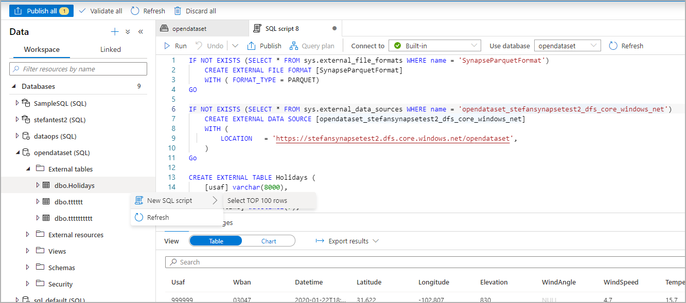

# <a name="use-external-tables-with-synapse-sql"></a>Synapse SQL で外部テーブルを使用する

外部テーブルは、Hadoop、Azure Storage BLOB、または Azure Data Lake Storage にあるデータを参照します。 外部テーブルは、Azure Storage 内のファイルからデータを読み取ったり、ファイルにデータを書き込んだりするために使用されます。 Synapse SQL では、外部テーブルを使用し、専用 SQL プールまたはサーバーレス SQL プールを使って外部データを読み取ることができます。

外部データ ソースの種類に応じて、次の 2 種類の外部テーブルを使用できます。
- Hadoop 外部テーブル。各種データ形式 (CSV、Parquet、ORC など) のデータを読み取ったりエクスポートしたりする際に使用できます。 Hadoop 外部テーブルは、専用 SQL プールでは利用できますが、サーバーレス SQL プールでは利用できません。
- ネイティブ外部テーブル。各種データ形式 (CSV、Parquet など) のデータの読み取りとエクスポートに使用できます。 ネイティブ外部テーブルは、サーバーレス SQL プールで利用可能であり、専用 SQL プールでは **パブリック プレビュー** 段階です。

Hadoop 外部テーブルとネイティブ外部テーブルの主な違いを次の表に示します。

| 外部テーブルの種類 | Hadoop | ネイティブ |
| --- | --- | --- |
| 専用 SQL プール | 利用可能 | Parquet テーブルは、**パブリック プレビュー** で利用可能です。 |
| サーバーレス SQL プール | 使用不可 | 利用可能 |
| サポートされるフォーマット | 区切り形式 (CSV)、Parquet、ORC、Hive RC、RC | サーバーレス SQL プール: 区切り形式 (CSV)、Parquet、[Delta Lake (プレビュー)](query-delta-lake-format.md)<br/>専用 SQL プール: Parquet |
| フォルダー パーティションの除外 | No | Synapse ワークスペースの Apache Spark プールからサーバーレス SQL プールに同期されたパーティション テーブルのみ |
| 場所のカスタム形式 | Yes | Yes (`/year=*/month=*/day=*` などのワイルドカードを使用) |
| 再帰的フォルダー スキャン | No | ロケーション パスの末尾に `/**` で指定されている場合、サーバーレス SQL プールのみ |
| ストレージ フィルター プッシュダウン | No | Yes (サーバーレス SQL プールの場合)。 文字列のプッシュダウンでは、`VARCHAR` 列で `Latin1_General_100_BIN2_UTF8` の照合順序を使用する必要があります。 |
| ストレージ認証 | ストレージ アクセス キー (SAK)、AAD パススルー、マネージド ID、カスタム アプリケーションの Azure AD ID | Shared Access Signature (SAS)、AAD パススルー、マネージド ID |

> [!NOTE]
> Delta Lake 形式のネイティブ外部テーブルは、パブリック プレビュー段階にあります。 詳細については、[Delta Lake ファイルのクエリ (プレビュー)](query-delta-lake-format.md) に関するページを参照してください。 [CETAS](develop-tables-cetas.md) では、Delta Lake 形式でのコンテンツのエクスポートはサポートされていません。

## <a name="external-tables-in-dedicated-sql-pool-and-serverless-sql-pool"></a>専用 SQL プールとサーバーレス SQL プールにおける外部テーブル

外部テーブルを使用して次のことができます。

- Transact-SQL ステートメントを使用して、Azure Blob Storage と Azure Data Lake Gen2 に対するクエリを実行する。
- [CETAS](develop-tables-cetas.md) を使用して、クエリ結果を Azure Blob Storage または Azure Data Lake Storage 内のファイルに格納する。
- Azure Blob Storage や Azure Data Lake Storage からデータをインポートして、専用 SQL プールに格納する (専用プールでは Hadoop テーブルのみ)。

> [!NOTE]
> [CREATE TABLE AS SELECT](../sql-data-warehouse/sql-data-warehouse-develop-ctas.md?context=/azure/synapse-analytics/context/context) ステートメントと組み合わせて使用する場合は、外部テーブルから選択するとデータが **専用** SQL プール内のテーブルにインポートされます。 [COPY ステートメント](/sql/t-sql/statements/copy-into-transact-sql?view=azure-sqldw-latest&preserve-view=true)に加えて、外部テーブルはデータの読み込みにも便利です。 
> 
> 読み込みのチュートリアルについては、[PolyBase を使用した Azure Blob Storage からのデータの読み込み](../sql-data-warehouse/load-data-from-azure-blob-storage-using-copy.md?bc=%2fazure%2fsynapse-analytics%2fbreadcrumb%2ftoc.json&toc=%2fazure%2fsynapse-analytics%2ftoc.json)に関するページを参照してください。

次の手順を通じて、Synapse SQL プールに外部テーブルを作成できます。

1. [CREATE EXTERNAL DATA SOURCE](#create-external-data-source) で、外部 Azure ストレージを参照し、ストレージへのアクセスに使用する資格情報を指定します。
2. [CREATE EXTERNAL FILE FORMAT](#create-external-file-format) で、CSV または Parquet ファイルの形式を記述します。
3. [CREATE EXTERNAL TABLE](#create-external-table) を、データ ソースに配置されているファイル上で、同じファイル形式を使用して実行します。

### <a name="security"></a>セキュリティ

ユーザーは、外部テーブルのデータを読み取る場合、それに対する `SELECT` アクセス許可が必要です。
外部テーブルから、基になる Azure Storage へのアクセスは、次の規則を使用してデータソース内で定義されているデータベース スコープ資格情報を使用して行います。
- 資格情報なしのデータソースの場合、外部テーブルからは、Azure Storage 上の一般公開されているファイルにアクセスできます。
- SAS トークンまたはワークスペースのマネージド ID を使用して外部テーブルが Azure Storage 上のファイルにしかアクセスできないようにするための資格情報をデータソースに含めることができます。例については、[ストレージ ファイルのストレージ アクセス制御の開発](develop-storage-files-storage-access-control.md#examples)に関する記事を参照してください。

## <a name="create-external-data-source"></a>CREATE EXTERNAL DATA SOURCE

外部データ ソースは、ストレージ アカウントへの接続に使用されます。 完全なドキュメントについては、[こちら](/sql/t-sql/statements/create-external-data-source-transact-sql?view=azure-sqldw-latest&preserve-view=true)で概説されています。

### <a name="syntax-for-create-external-data-source"></a>CREATE EXTERNAL DATA SOURCE の構文

#### <a name="hadoop"></a>[Hadoop](#tab/hadoop)

`TYPE=HADOOP` がある外部データ ソースは、専用 SQL プールでのみ利用できます。

```syntaxsql
CREATE EXTERNAL DATA SOURCE <data_source_name>
WITH
(    LOCATION         = '<prefix>://<path>'
     [, CREDENTIAL = <database scoped credential> ]
     , TYPE = HADOOP
)
[;]
```

#### <a name="native"></a>[ネイティブ](#tab/native)

`TYPE=HADOOP` がない外部データ ソースは、サーバーレス SQL プールでは一般公開されており、専用プールではパブリック プレビュー段階です。

```syntaxsql
CREATE EXTERNAL DATA SOURCE <data_source_name>
WITH
(    LOCATION         = '<prefix>://<path>'
     [, CREDENTIAL = <database scoped credential> ]
)
[;]
```

---

### <a name="arguments-for-create-external-data-source"></a>CREATE EXTERNAL DATA SOURCE の引数

#### <a name="data_source_name"></a>data_source_name

データ ソースのユーザー定義の名前を指定します。 名前は、データベース内で一意である必要があります。

#### <a name="location"></a>場所
LOCATION = `'<prefix>://<path>'`: 接続プロトコルと外部データ ソースへのパスを指定します。 場所では、次のパターンを使用できます。

| 外部データ ソース        | 場所プレフィックス | ロケーション パス                                         |
| --------------------------- | --------------- | ----------------------------------------------------- |
| Azure Blob Storage          | `wasb[s]`       | `<container>@<storage_account>.blob.core.windows.net` |
| Azure Blob Storage          | `http[s]`       | `<storage_account>.blob.core.windows.net/<container>/subfolders` |
| Azure Data Lake Store Gen 1 | `http[s]`       | `<storage_account>.azuredatalakestore.net/webhdfs/v1` |
| Azure Data Lake Store Gen 2 | `http[s]`       | `<storage_account>.dfs.core.windows.net/<container>/subfolders`  |

`https:` プレフィックスを使用すると、パスでサブフォルダーを使用できます。

#### <a name="credential"></a>資格情報
CREDENTIAL = `<database scoped credential>` は、Azure Storage 上で認証を受けるために使用される省略可能な資格情報です。 資格情報のない外部データ ソースは、パブリック ストレージ アカウントにアクセスするか、呼び出し元の Azure AD ID を使用してストレージ上のファイルにアクセスできます。 
- 専用 SQL プールでは、データベース スコープ資格情報を使用して、カスタム アプリケーション ID、ワークスのペース マネージド ID、または SAK キーを指定できます。 
- サーバーレス SQL プールでは、データベース スコープ資格情報を使用して、ワークスペースのマネージド ID、または SAS キーを指定できます。 

#### <a name="type"></a>TYPE
TYPE = `HADOOP` は、基になるファイルへのアクセスに Java ベースのテクノロジを使用するよう指定するオプションです。 このパラメーターは、組み込みのネイティブ リーダーを使用するサーバーレス SQL プールでは使用できません。

### <a name="example-for-create-external-data-source"></a>CREATE EXTERNAL DATA SOURCE の例

#### <a name="hadoop"></a>[Hadoop](#tab/hadoop)

次の例では、New York データ セットを参照する Azure Data Lake Gen2 の Hadoop 外部データ ソースを専用 SQL プールに作成します。

```sql
CREATE DATABASE SCOPED CREDENTIAL [ADLS_credential]
WITH IDENTITY='SHARED ACCESS SIGNATURE',  
SECRET = 'sv=2018-03-28&ss=bf&srt=sco&sp=rl&st=2019-10-14T12%3A10%3A25Z&se=2061-12-31T12%3A10%3A00Z&sig=KlSU2ullCscyTS0An0nozEpo4tO5JAgGBvw%2FJX2lguw%3D'
GO

CREATE EXTERNAL DATA SOURCE AzureDataLakeStore
WITH
  -- Please note the abfss endpoint when your account has secure transfer enabled
  ( LOCATION = 'abfss://data@newyorktaxidataset.dfs.core.windows.net' ,
    CREDENTIAL = ADLS_credential ,
    TYPE = HADOOP
  ) ;
```

次の例では、一般公開されている New York データ セットを参照する Azure Data Lake Gen2 の外部データ ソースを作成します。

```sql
CREATE EXTERNAL DATA SOURCE YellowTaxi
WITH ( LOCATION = 'https://azureopendatastorage.blob.core.windows.net/nyctlc/yellow/',
       TYPE = HADOOP)
```

#### <a name="native"></a>[ネイティブ](#tab/native)

次の例では、SAS 資格情報を使用してアクセスできる Azure Data Lake Gen2 のサーバーレスまたは専用 SQL プールに外部データ ソースを作成します。

```sql
CREATE DATABASE SCOPED CREDENTIAL [sqlondemand]
WITH IDENTITY='SHARED ACCESS SIGNATURE',  
SECRET = 'sv=2018-03-28&ss=bf&srt=sco&sp=rl&st=2019-10-14T12%3A10%3A25Z&se=2061-12-31T12%3A10%3A00Z&sig=KlSU2ullCscyTS0An0nozEpo4tO5JAgGBvw%2FJX2lguw%3D'
GO

CREATE EXTERNAL DATA SOURCE SqlOnDemandDemo WITH (
    LOCATION = 'https://sqlondemandstorage.blob.core.windows.net',
    CREDENTIAL = sqlondemand
);
```

次の例では、一般公開されている New York データ セットを参照する Azure Data Lake Gen2 の外部データ ソースを作成します。

```sql
CREATE EXTERNAL DATA SOURCE YellowTaxi
WITH ( LOCATION = 'https://azureopendatastorage.blob.core.windows.net/nyctlc/yellow/')
```
---

## <a name="create-external-file-format"></a>CREATE EXTERNAL FILE FORMAT

Azure Blob Storage または Azure Data Lake Storage に格納される外部データを定義する外部ファイル形式オブジェクトを作成します。 外部ファイル形式の作成は、外部テーブルを作成するための前提条件です。 完全なドキュメントは[こちら](/sql/t-sql/statements/create-external-file-format-transact-sql?view=azure-sqldw-latest&preserve-view=true)にあります。

外部ファイル形式を作成することで、外部テーブルによって参照されるデータの実際のレイアウトを指定します。

### <a name="syntax-for-create-external-file-format"></a>CREATE EXTERNAL FILE FORMAT の構文

```syntaxsql
-- Create an external file format for PARQUET files.  
CREATE EXTERNAL FILE FORMAT file_format_name  
WITH (  
    FORMAT_TYPE = PARQUET  
    [ , DATA_COMPRESSION = {  
        'org.apache.hadoop.io.compress.SnappyCodec'  
      | 'org.apache.hadoop.io.compress.GzipCodec'      }  
    ]);  

--Create an external file format for DELIMITED TEXT files
CREATE EXTERNAL FILE FORMAT file_format_name  
WITH (  
    FORMAT_TYPE = DELIMITEDTEXT  
    [ , DATA_COMPRESSION = 'org.apache.hadoop.io.compress.GzipCodec' ]
    [ , FORMAT_OPTIONS ( <format_options> [ ,...n  ] ) ]  
    );  

<format_options> ::=  
{  
    FIELD_TERMINATOR = field_terminator  
    | STRING_DELIMITER = string_delimiter
    | First_Row = integer
    | USE_TYPE_DEFAULT = { TRUE | FALSE }
    | Encoding = {'UTF8' | 'UTF16'}
    | PARSER_VERSION = {'parser_version'}
}
```

### <a name="arguments-for-create-external-file-format"></a>CREATE EXTERNAL FILE FORMAT の引数

file_format_name: 外部ファイル形式の名前を指定します。

FORMAT_TYPE = [ PARQUET | DELIMITEDTEXT]: 外部データの形式を指定します。

- PARQUET: Parquet 形式を指定します。
- DELIMITEDTEXT: フィールド ターミネータとも呼ばれる、列区切り記号付きのテキスト形式を指定します。

FIELD_TERMINATOR = *field_terminator*: 区切りテキスト ファイルにのみ適用されます。 フィールド ターミネータは、テキスト区切りファイルでの各フィールド (列) の終了を示す 1 つ以上の文字を指定します。 既定値はパイプ文字 (ꞌ|ꞌ) です。

例 :

- FIELD_TERMINATOR = '|'
- FIELD_TERMINATOR = ' '
- FIELD_TERMINATOR = ꞌ\tꞌ

STRING_DELIMITER = *string_delimiter*: テキスト区切りのファイル内の文字列型のデータにはフィールド ターミネータを指定します。 文字列の区切り記号の長さは 1 文字または複数文字とし、単一引用符で囲みます。 既定値は空の文字列 ("") です。

例 :

- STRING_DELIMITER = '"'
- STRING_DELIMITER = '*'
- STRING_DELIMITER = ꞌ,ꞌ

FIRST_ROW = *First_row_int*: 最初に読み取られる行の番号を指定し、すべてのファイルに適用します。 値を 2 に設定すると、データの読み込み時に各ファイルの最初の行 (ヘッダー行) がスキップされます。 行は、行ターミネータ (/r/n、/r、/n) の存在に基づいてスキップされます。

USE_TYPE_DEFAULT = { TRUE | **FALSE** }: テキスト ファイルからデータを取得するときに、区切りテキスト ファイル内の不足値を処理する方法を指定します。

TRUE: テキスト ファイルからデータを取得するときは、外部テーブルの定義内の対応する列に既定値のデータ型を使用して、各不足値を格納します。 たとえば、不足値を次の値に置き換えます。

- 列が numeric 型の列として定義されている場合は 0 decimal 型の列はサポートされておらず、エラーになります。
- 列が string 型の列である場合は空の文字列 ("") です。
- 列が date 列の場合は 1900-01-01 です。

FALSE: すべての不足値を NULL として格納します。 区切りテキスト ファイルで単語 NULL を使って格納されている NULL 値は、文字列 "NULL" としてインポートされます。

Encoding = {'UTF8' | 'UTF16'}: サーバーレス SQL プールでは、UTF8 および UTF16 でエンコードされた区切りテキスト ファイルを読み取ることができます。

DATA_COMPRESSION = *data_compression_method*: この引数では、外部データのデータ圧縮方法を指定します。 

PARQUET ファイル形式の種類では、次の圧縮方法がサポートされています。

- DATA_COMPRESSION = 'org.apache.hadoop.io.compress.GzipCodec'
- DATA_COMPRESSION = 'org.apache.hadoop.io.compress.SnappyCodec'

PARQUET 外部テーブルから読み取る場合に、この引数は無視されます。しかし、[CETAS](develop-tables-cetas.md) を使用して外部テーブルに書き込む場合は使用されます。

DELIMITEDTEXT ファイル形式の種類では、次の圧縮方法がサポートされています。

- DATA_COMPRESSION = 'org.apache.hadoop.io.compress.GzipCodec'

PARSER_VERSION = 'parser_version': CSV ファイルの読み取り時に使用するパーサーのバージョンを指定します。 使用可能なパーサーのバージョンは `1.0` および `2.0` です。 このオプションは、サーバーレス SQL プールでのみ使用できます。

### <a name="example-for-create-external-file-format"></a>CREATE EXTERNAL FILE FORMAT の例

次の例では、国勢調査ファイルの外部ファイル形式を作成します。

```sql
CREATE EXTERNAL FILE FORMAT census_file_format
WITH
(  
    FORMAT_TYPE = PARQUET,
    DATA_COMPRESSION = 'org.apache.hadoop.io.compress.SnappyCodec'
)
```

## <a name="create-external-table"></a>CREATE EXTERNAL TABLE

CREATE EXTERNAL TABLE コマンドでは、Azure Blob Storage または Azure Data Lake Storage 内に格納されたデータにアクセスするために Synapse SQL の外部テーブルを作成します。 

### <a name="syntax-for-create-external-table"></a>CREATE EXTERNAL TABLE の構文

```sql
CREATE EXTERNAL TABLE { database_name.schema_name.table_name | schema_name.table_name | table_name }
    ( <column_definition> [ ,...n ] )  
    WITH (
        LOCATION = 'folder_or_filepath',  
        DATA_SOURCE = external_data_source_name,  
        FILE_FORMAT = external_file_format_name
        [, TABLE_OPTIONS = N'{"READ_OPTIONS":["ALLOW_INCONSISTENT_READS"]}' ]
    )  
[;]  

<column_definition> ::=
column_name <data_type>
    [ COLLATE collation_name ]
```

### <a name="arguments-create-external-table"></a>CREATE EXTERNAL TABLE の引数

*{ database_name.schema_name.table_name | schema_name.table_name | table_name }*

作成するテーブルの 1 つから 3 つの部分で構成される名前。 外部テーブルの場合、Synapse SQL プールではテーブルのメタデータのみが格納されます。 実際のデータは移動されず、Synapse SQL データベースに格納されません。

<column_definition>, ...*n* ]

CREATE EXTERNAL TABLE では、列名、データ型、照合順序を構成できます。 外部テーブルに対して DEFAULT CONSTRAINT を使用することはできません。

>[!IMPORTANT]
>データ型と列の数を含む列の定義は、外部ファイルのデータと一致している必要があります。 不一致がある場合、実際のデータに対してクエリを実行するときに、ファイルの行が拒否されます。

Parquet ファイルからの読み取りの場合は、読み取りたい列だけを指定して、残りをスキップすることができます。

#### <a name="location"></a>LOCATION

LOCATION = '*folder_or_filepath*'

Azure Blob Storage にある実際のデータのフォルダーまたはファイル パスとファイル名を指定します。 ルート フォルダーから、場所を開始します。 ルート フォルダーは、外部データ ソースで指定されたデータの場所です。


Hadoop 外部テーブルとは異なり、ネイティブ外部テーブルでは、パスの最後に /** を指定しない限り、サブフォルダーが返されません。 この例では、LOCATION='/webdata/' である場合、サーバーレス SQL プールのクエリで mydata.txt から行が返されます。 mydata2.txt と mydata3.txt はサブフォルダー内にあるため、これらは返されません。 Hadoop テーブルでは、サブフォルダー内のすべてのファイルが返されます。
 
Hadoop 外部テーブルとネイティブ外部テーブルではどちらも、名前が下線 (_) またはピリオド (.) で始まるファイルはスキップされます。

#### <a name="data_source"></a>DATA_SOURCE

DATA_SOURCE = *external_data_source_name*: 外部データの場所が含まれている外部データ ソースの名前を指定します。 外部データ ソースを作成するには、[CREATE EXTERNAL DATA SOURCE](#create-external-data-source) を使用します。

FILE_FORMAT = *external_file_format_name*: 外部データのファイルの種類と圧縮方法を格納する外部ファイル形式のオブジェクトの名前を指定します。 外部ファイル形式を作成するには、[CREATE EXTERNAL FILE FORMAT](#create-external-file-format) を使用します。

#### <a name="table_options"></a>TABLE_OPTIONS

TABLE_OPTIONS = *json options*: 基になるファイルを読み取る方法を示す一連のオプションを指定します。 現時点で使用できる唯一のオプションは、`"READ_OPTIONS":["ALLOW_INCONSISTENT_READS"]` です。これは、不整合な読み取り操作が発生する可能性がある場合でも、基になるファイルに対して行われた更新を無視するように外部テーブルに指示します。 このオプションは、ファイルが頻繁に追加される特殊な場合にのみ使用してください。 このオプションは、CSV 形式のサーバーレス SQL プールで使用できます。

### <a name="permissions-create-external-table"></a>CREATE EXTERNAL TABLE のアクセス許可

外部テーブルから選択を行うには、適切な資格情報のほか、リストと読み取りのアクセス許可が必要です。

### <a name="example-create-external-table"></a>CREATE EXTERNAL TABLE の例

次の例では、外部テーブルを作成します。 最初の行が返されます。

```sql
CREATE EXTERNAL TABLE census_external_table
(
    decennialTime varchar(20),
    stateName varchar(100),
    countyName varchar(100),
    population int,
    race varchar(50),
    sex    varchar(10),
    minAge int,
    maxAge int
)  
WITH (
    LOCATION = '/parquet/',
    DATA_SOURCE = population_ds,  
    FILE_FORMAT = census_file_format
)
GO

SELECT TOP 1 * FROM census_external_table
```

## <a name="create-and-query-external-tables-from-a-file-in-azure-data-lake"></a>Azure Data Lake 内のファイルから外部テーブルを作成してクエリを実行する

Synapse Studio の Data Lake 探索機能を使用すると、ファイルを右クリックするだけで、Synapse SQL プールを使って外部テーブルを作成してクエリを実行できるようになります。 ADLS Gen2 ストレージ アカウントから外部テーブルを作成するワンクリック ジェスチャーは、Parquet ファイルでのみサポートされます。 

### <a name="prerequisites"></a>前提条件

- 少なくとも、ファイルに対してクエリを実行できるよう、ADLS Gen2 アカウントまたはアクセス制御リスト (ACL) への `Storage Blob Data Contributor` アクセス ロールが設定されたワークスペースにアクセスできる必要があります。

- Synapse SQL プール (専用またはサーバーレス) で外部テーブルを[作成してクエリを実行するためのアクセス許可](/sql/t-sql/statements/create-external-table-transact-sql?view=azure-sqldw-latest#permissions-2&preserve-view=true)が少なくとも必要です。

[データ] パネルで、外部テーブルの作成元にするファイルを選択します。
> [!div class="mx-imgBorder"]
>

ダイアログ ウィンドウが開きます。 専用 SQL プールかサーバーレス SQL プールを選択し、テーブルに名前を付けて [スクリプトを開く] を選択します。

> [!div class="mx-imgBorder"]
>

SQL スクリプトは、ファイルからのスキーマの推論により自動的に生成されます。
> [!div class="mx-imgBorder"]
>

スクリプトを実行します。 このスクリプトでは、Select Top 100 *. が自動的に実行されます。
> [!div class="mx-imgBorder"]
>

外部テーブルが作成されました。今後この外部テーブルの内容を探索するために、ユーザーは [データ] ペインから直接クエリを実行できます。
> [!div class="mx-imgBorder"]
>

## <a name="next-steps"></a>次のステップ

クエリの結果を Azure Storage の外部テーブルに保存する方法については、[CETAS](develop-tables-cetas.md) に関する記事をご覧ください。 また、[Azure Synapse 外部テーブルの Apache Spark](develop-storage-files-spark-tables.md) に対するクエリを開始することもできます。
