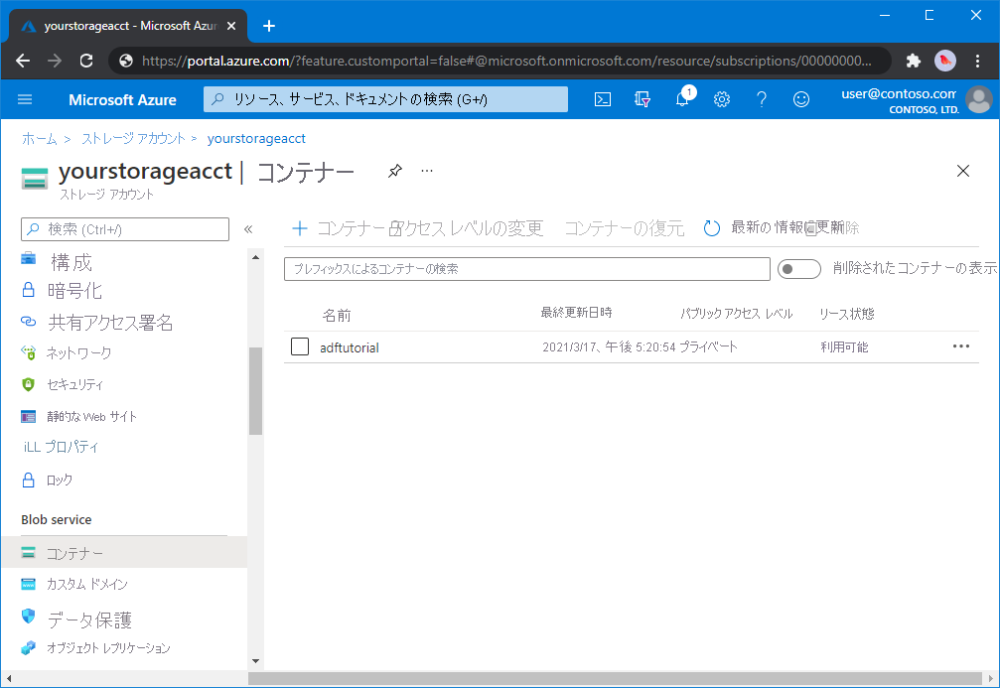

## <a name="prerequisites"></a>前提条件

### <a name="azure-subscription"></a>Azure サブスクリプション

Azure サブスクリプションをお持ちでない場合は、開始する前に [無料アカウント](https://azure.microsoft.com/free/) を作成してください。

### <a name="azure-roles"></a>Azure ロール

Data Factory インスタンスを作成するには、Azure へのサインインに使用するユーザー アカウントが、"*共同作成者*" ロールまたは "*所有者*" ロールのメンバーであるか、Azure サブスクリプションの "*管理者*" である必要があります。 サブスクリプションで自分が持っているアクセス許可を表示するには、[Azure portal](https://portal.azure.com) に移動し、右上にあるユーザー名を選択してください。" **...** " アイコンを選択してその他のオプションを表示し、 **[アクセス許可]** を選択します。 複数のサブスクリプションにアクセスできる場合は、適切なサブスクリプションを選択します。

データセット、リンクされたサービス、パイプライン、トリガー、および統合ランタイムを含む Data Factory の子リソースを作成および管理するには、次の要件が適用されます。

- Azure portal で子リソースを作成および管理するには、リソース グループ レベル以上で **Data Factory 共同作成者**ロールに属している必要があります。
- PowerShell または SDK を使用して子リソースを作成および管理する場合は、リソース レベル以上での**共同作成者**ロールで十分です。

ロールにユーザーを追加する方法に関するサンプル手順については、[ロールの追加](../articles/cost-management-billing/manage/add-change-subscription-administrator.md)に関する記事を参照してください。

詳細については、次の記事を参照してください。

- [Data Factory 共同作成者ロール](../articles/role-based-access-control/built-in-roles.md#data-factory-contributor)
- [Azure Data Factory のロールとアクセス許可](../articles/data-factory/concepts-roles-permissions.md)

### <a name="azure-storage-account"></a>Azure ストレージ アカウント

このクイックスタートでは、"*ソース*" データ ストアと "*コピー先*" データ ストアの両方に汎用の Azure Storage アカウント (具体的には Blob Storage) を使用します。 汎用の Azure Storage アカウントがない場合、作成方法については、[ストレージ アカウントの作成](../articles/storage/common/storage-account-create.md)に関するページを参照してください。 

#### <a name="get-the-storage-account-name"></a>ストレージ アカウント名を取得する

このクイックスタートには、Azure Storage アカウントの名前が必要です。 以下の手順に従って、ご利用のストレージ アカウントの名前を取得してください。 

1. Web ブラウザーで [Azure portal](https://portal.azure.com) にアクセスし、Azure のユーザー名とパスワードを使用してサインインします。
2. [Azure portal] メニューで **[すべてのサービス]** を選択してから、 **[ストレージ]**  >  **[ストレージ アカウント]** の順に選択します。 また、任意のページから検索して、 *[ストレージ アカウント]* を選択することもできます。
3. **[ストレージ アカウント]** ページで、ご利用のストレージ アカウントを (必要に応じて) フィルターで抽出し、該当するストレージ アカウントを選択します。 

また、任意のページから検索して、 *[ストレージ アカウント]* を選択することもできます。

#### <a name="create-a-blob-container"></a>BLOB コンテナーを作成する

このセクションでは、**adftutorial** という名前の BLOB コンテナーを Azure Blob Storage に作成します。

1. ストレージ アカウント ページで、 **[概要]**  >  **[コンテナー]** を選択します。
2. *\<Account name>*  -  **[コンテナー]** ページのツールバーで、 **[コンテナー]** を選択します。
3. **[新しいコンテナー]** ダイアログ ボックスで、名前に「**adftutorial**」と入力し、 **[OK]** を選択します。 *\<Account name>*  -  **[コンテナー]** ページが更新され、コンテナーの一覧に **adftutorial** が含まれるようになります。

   

#### <a name="add-an-input-folder-and-file-for-the-blob-container"></a>BLOB コンテナーの入力フォルダーとファイルを追加する

このセクションでは、作成したコンテナーに **input** という名前のフォルダーを作成し、入力フォルダーにサンプル ファイルをアップロードします。 開始する前に、**メモ帳**などのテキスト エディターを開き、次の内容を含む **emp.txt** という名前のファイルを作成します。

```emp.txt
John, Doe
Jane, Doe
```

**C:\ADFv2QuickStartPSH** フォルダーにファイルを保存します (フォルダーがまだ存在しない場合は作成します)。Azure portal に戻り、次の手順を実行します。

1. 中断した *\<Account name>*  -  **[コンテナー]** ページで、コンテナーの更新された一覧から **[adftutorial]** を選択します。

   1. ウィンドウを閉じた場合、または別のページに移動した場合は、[[Azure portal]](https://portal.azure.com) にもう一度サインインします。
   1. [Azure portal] メニューで **[すべてのサービス]** を選択してから、 **[ストレージ]**  >  **[ストレージ アカウント]** の順に選択します。 また、任意のページから検索して、 *[ストレージ アカウント]* を選択することもできます。
   1. ストレージ アカウントを選択してから、 **[コンテナー]**  >  **[adftutorial]** を選択します。

2. **adftutorial** コンテナー ページのツールバーで、 **[アップロード]** を選択します。
3. **[BLOB のアップロード]** ページで、 **[ファイル]** ボックスを選択し、**emp.txt** ファイルを参照して選択します。
4. **[詳細設定]** の見出しを展開します。 次のようにページが表示されます。

   ![[詳細設定] リンクの選択](media/data-factory-quickstart-prerequisites/upload-blob-advanced.png)
5. **[アップロード先のフォルダー]** ボックスに「**input**」と入力します。
6. **[アップロード]** ボタンを選択します。 一覧に **emp.txt** ファイルとアップロードの状態が表示されます。
7. **[閉じる]** アイコン (**X**) を選択して、 **[BLOB のアップロード]** ページを閉じます。

**adftutorial** コンテナーのページを開いたままにしておきます。 このクイックスタートの最後で、このページを使用して出力を確認します。