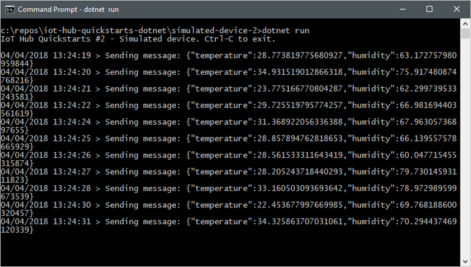

このクイック スタートでは、あらかじめ作成されている次の 2 つの .NET アプリケーションを使います。

* サービス アプリケーションから呼び出されたダイレクト メソッドに応答するシミュレートされたデバイス アプリケーション。 ダイレクト メソッドの呼び出しを受け取るため、このアプリケーションは IoT Hub 上のデバイス固有のエンドポイントに接続します。

* シミュレートされたデバイス上でダイレクト メソッドを呼び出すサービス アプリケーション。 デバイスでダイレクト メソッドを呼び出すため、このアプリケーションは IoT Hub 上のサービス側エンドポイントに接続します。

## <a name="prerequisites"></a>前提条件

* アクティブなサブスクリプションが含まれる Azure アカウント。 [無料で作成できます](https://azure.microsoft.com/free/?ref=microsoft.com&utm_source=microsoft.com&utm_medium=docs&utm_campaign=visualstudio)。

* このクイック スタートで実行する 2 つのサンプル アプリケーションは、C# を使って書かれています。 開発用マシン上に .NET Core SDK 3.1 以上が必要です。

    複数のプラットフォームに対応する .NET Core SDK を [.NET](https://dotnet.microsoft.com/download) からダウンロードできます。

    開発コンピューターに現在インストールされている C# のバージョンは、次のコマンドを使って確認できます。

    ```cmd/sh
    dotnet --version
    ```
* まだ行っていない場合は、https://github.com/Azure-Samples/azure-iot-samples-csharp/archive/master.zip から Azure IoT C# サンプルをダウンロードし、ZIP アーカイブを展開します。

* ポート 8883 がファイアウォールで開放されていることを確認してください。 このクイックスタートのデバイス サンプルでは、ポート 8883 を介して通信する MQTT プロトコルを使用しています。 このポートは、企業や教育用のネットワーク環境によってはブロックされている場合があります。 この問題の詳細と対処方法については、「[IoT Hub への接続 (MQTT)](../articles/iot-hub/iot-hub-mqtt-support.md#connecting-to-iot-hub)」を参照してください。

[!INCLUDE [azure-cli-prepare-your-environment.md](azure-cli-prepare-your-environment-no-header.md)]

[!INCLUDE [iot-hub-cli-version-info](iot-hub-cli-version-info.md)]

## <a name="create-an-iot-hub"></a>IoT Hub の作成

前出の[デバイスから IoT Hub への利用統計情報の送信に関するクイック スタート](../articles/iot-develop/quickstart-send-telemetry-iot-hub.md?pivots=programming-language-csharp)を完了した場合は、この手順を省略できます。

[!INCLUDE [iot-hub-include-create-hub](iot-hub-include-create-hub.md)]

## <a name="register-a-device"></a>デバイスの登録

前の「[クイック スタート: デバイスから IoT Hub への利用統計情報の送信](../articles/iot-develop/quickstart-send-telemetry-iot-hub.md?pivots=programming-language-csharp)」を完了した場合は、この手順を省略できます。

デバイスを IoT Hub に接続するには、あらかじめ IoT Hub に登録しておく必要があります。 このクイック スタートでは、Azure Cloud Shell を使用して、シミュレートされたデバイスを登録します。

1. Azure Cloud Shell で次のコマンドを実行してデバイス ID を作成します。

   **YourIoTHubName**: このプレースホルダーは、実際の IoT Hub に対して選んだ名前に置き換えてください。

   **MyDotnetDevice**: これは、登録するデバイスの名前です。 示されているように、**MyDotnetDevice** を使用することをお勧めします。 デバイスに別の名前を選択した場合は、この記事全体でその名前を使用する必要があります。また、サンプル アプリケーションを実行する前に、アプリケーション内のデバイス名を更新してください。

    ```azurecli-interactive
    az iot hub device-identity create \
      --hub-name {YourIoTHubName} --device-id MyDotnetDevice
    ```

2. Azure Cloud Shell で次のコマンドを実行して、登録したデバイスの "_デバイス接続文字列_" を取得します。

   **YourIoTHubName**: このプレースホルダーは、実際の IoT Hub に対して選んだ名前に置き換えてください。

    ```azurecli-interactive
    az iot hub device-identity connection-string show \
      --hub-name {YourIoTHubName} \
      --device-id MyDotnetDevice \
      --output table
    ```

    次のようなデバイス接続文字列をメモしておきます。

   `HostName={YourIoTHubName}.azure-devices.net;DeviceId=MyNodeDevice;SharedAccessKey={YourSharedAccessKey}`

    この値は、このクイック スタートの後の方で使います。

## <a name="retrieve-the-service-connection-string"></a>サービス接続文字列を取得する

サービス アプリケーションがHub に接続してメッセージを取得できるようにするには、IoT Hub の "_サービス接続文字列_" も必要です。 次のコマンドを実行すると、IoT ハブのサービス接続文字列が取得されます。

```azurecli-interactive
az iot hub connection-string show --policy-name service --hub-name {YourIoTHubName} --output table
```

次のようなサービス接続文字列をメモしておきます。

   `HostName={YourIoTHubName}.azure-devices.net;SharedAccessKeyName=service;SharedAccessKey={YourSharedAccessKey}`

この値は、このクイック スタートの後の方で使います。 このサービス接続文字列は、前の手順でメモしたデバイス接続文字列とは異なります。

## <a name="listen-for-direct-method-calls"></a>ダイレクト メソッドの呼び出しをリッスンする

シミュレートされたデバイス アプリケーションは、IoT Hub 上のデバイス固有エンドポイントに接続し、シミュレートされた利用統計情報を送信して、Hub からのダイレクト メソッド呼び出しをリッスンします。 このクイック スタートでは、Hub からのダイレクト メソッド呼び出しは、利用統計情報の送信間隔を変更するようデバイスに指示します。 シミュレートされたデバイスでは、ダイレクト メソッドを実行した後、ハブに受信確認が返送されます。

1. ローカル ターミナル ウィンドウで、サンプルの C# プロジェクトのルート フォルダーに移動します。 次に、**iot-hub\Quickstarts\SimulatedDeviceWithCommand** フォルダーに移動します。

2. ローカル ターミナル ウィンドウで次のコマンドを実行して、シミュレートされたデバイス アプリケーションに必要なパッケージをインストールします。

    ```cmd/sh
    dotnet restore
    ```

3. ローカル ターミナル ウィンドウで次のコマンドを実行し、シミュレートされたデバイス アプリケーションをビルドして実行します。`{DeviceConnectionString}` を、前に書き留めておいたデバイス接続文字列に置き換えてください。

    ```cmd/sh
    dotnet run -- {DeviceConnectionString}
    ```

    次のスクリーンショットは、シミュレートされたデバイス アプリケーションが IoT Hub にテレメトリを送信したときの出力を示しています。

    

## <a name="call-the-direct-method"></a>ダイレクト メソッドを呼び出す

サービス アプリケーションは、IoT Hub 上のサービス側エンドポイントに接続します。 アプリケーションにより、IoT ハブを通してデバイスへのダイレクト メソッド呼び出しが行われた後、受信確認がリッスンされます。 通常、IoT Hub サービス アプリケーションはクラウドで実行されます。

1. 別のローカル ターミナル ウィンドウで、サンプルの C# プロジェクトのルート フォルダーに移動します。 次に、**iot-hub\Quickstarts\InvokeDeviceMethod** フォルダーに移動します。

2. ローカル ターミナル ウィンドウで次のコマンドを実行して、サービス アプリケーションに必要なライブラリをインストールします。

    ```cmd/sh
    dotnet restore
    ```

3. ローカル ターミナル ウィンドウで次のコマンドを実行し、サービス アプリケーションをビルドして実行します。`{ServiceConnectionString}` を、前に書き留めておいたサービス接続文字列に置き換えてください。

    ```cmd/sh
    dotnet run -- {ServiceConnectionString}
    ```

    次のスクリーンショットは、アプリケーションによりデバイスに対してダイレクト メソッド呼び出しが行われ、受信確認が受診されたときの出力を示します。

    

    サービス アプリケーションの実行後、シミュレートされたデバイスを実行しているコンソール ウィンドウにメッセージが表示され、メッセージの送信速度が変わります。

    
