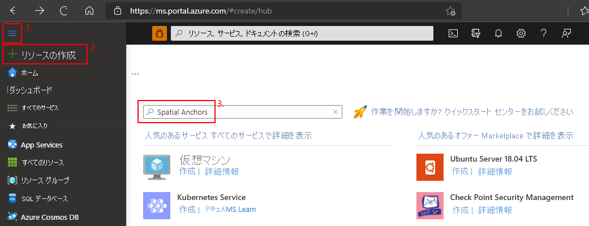

## Spatial Anchors リソースを作成する

<a href="https://portal.azure.com" target="_blank">Azure ポータル</a>にアクセスします。

左側のウィンドウで、 **[リソースの作成]** を選択します。

検索ボックスを使用して、「**Spatial Anchors**」を検索します。

**[Spatial Anchors]** を選択し、 **[作成]** を選択します。

**[Spatial Anchors アカウント]** ウィンドウで次を行います。

* 通常の英数字を使用して一意のリソース名を入力します。  
* リソースをアタッチするサブスクリプションを選択します。  
* **[新規作成]** を選択して、リソース グループを作成します。 「**myResourceGroup**」と名前を付け、 **[OK]** を選択します。  

  [!INCLUDE [resource group intro text](resource-group.md)]
  
* リソースを配置する場所 (リージョン) を選択します。  
* **[新規]** を選択して、リソースの作成を開始します。

![リソースを作成するための [Spatial Anchors] ウィンドウのスクリーンショット。](./media/spatial-anchors-get-started-create-resource/create-resource-form.png)

リソースが作成されると、Azure portal に、デプロイが完了したことが表示されます。 
   

**[リソースに移動]** を選択します。 これでリソースのプロパティを表示できます。 
   
リソースの **[アカウント ID]** 値は後で使用するためにテキスト エディターにコピーしておきます。

![[リソース プロパティ] ウィンドウのスクリーンショット。](./media/spatial-anchors-get-started-create-resource/view-resource-properties.png)

また、リソースの **[アカウント ドメイン]** 値を後で使用するためにテキスト エディターにコピーします。

**[設定]** で **[キー]** を選択します。 **[主キー]** 値の **[アカウント キー]** を後で使用するためにテキスト エディターにコピーします。

![アカウントの [キー] ウィンドウのスクリーンショット。](./media/spatial-anchors-get-started-create-resource/view-account-key.png)
